本文聚焦Prometheus告警体系的核心落地环节，从告警设计理念到Alertmanager部署、配置、告警规则编写，再到多渠道告警接收全流程拆解，适配Prometheus新手从认知到实操的学习路径，学完可独立完成Alertmanager部署、告警规则定义及Email/企业微信/钉钉告警通知配置。

【本篇核心收获】

- 掌握Prometheus告警体系核心设计：Prometheus Server定义规则，Alertmanager独立处理告警，理解分组、抑制、静默三大核心机制
- 独立完成Alertmanager二进制/Docker两种部署方式，配置系统服务实现开机自启
- 精通Alertmanager配置文件结构（global/templates/route/receivers/inhibit_rules），能通过Routing tree editor验证路由配置
- 熟练编写Prometheus告警规则，理解Inactive/Pending/Firing告警状态生命周期
- 落地Email、企业微信、钉钉（Webhook）三种告警通知方式，掌握告警模板自定义方法

## 1. 告警概述

告警是Prometheus监控体系的核心环节，其设计遵循「解耦」原则：Prometheus Server负责定义告警规则并触发告警，Alertmanager负责告警的分组、路由、通知等后续处理。合理的告警配置能精准发现系统异常，避免过度监控导致的告警风暴，是保障业务稳定性的关键。

### 1.1 什么时候应该发出告警？

告警的核心原则：**重要的、可操作的、真实的**，需满足以下条件才触发：

- 系统/服务异常直接影响最终用户体验（如高延迟、高错误率）
- 容量耗尽可能导致停机（如磁盘满、内存溢出）
- 批处理作业长时间未成功执行
- 监控系统自身异常（需优先保障监控可用性）

需避免无意义的误报，减少管理员非必要的夜间告警干扰。

### 1.2 告警应该包含哪些内容？

- 核心异常指标（如延迟数值、错误率、资源使用率）
- 关联的仪表盘/控制台链接（便于快速定位问题）
- 清晰的异常描述（明确影响范围、触发条件）
- 可操作的处理建议（而非仅告知「有问题」）

### 模块小结

本模块明确了告警的核心原则（重要、可操作、真实）和内容规范，是后续配置告警规则的核心指导依据。

## 2. Alertmanager部署

Alertmanager是Prometheus生态中独立的告警处理组件，核心功能包括告警分组、抑制、静默，先理解核心机制，再落地部署。

### 2.1 Alertmanager核心机制

Prometheus告警体系分为两部分：

1. Prometheus Server：采集指标，通过PromQL定义告警规则，触发后推送告警至Alertmanager
2. Alertmanager：接收告警，完成分组、路由、抑制、静默后，推送至指定接收器

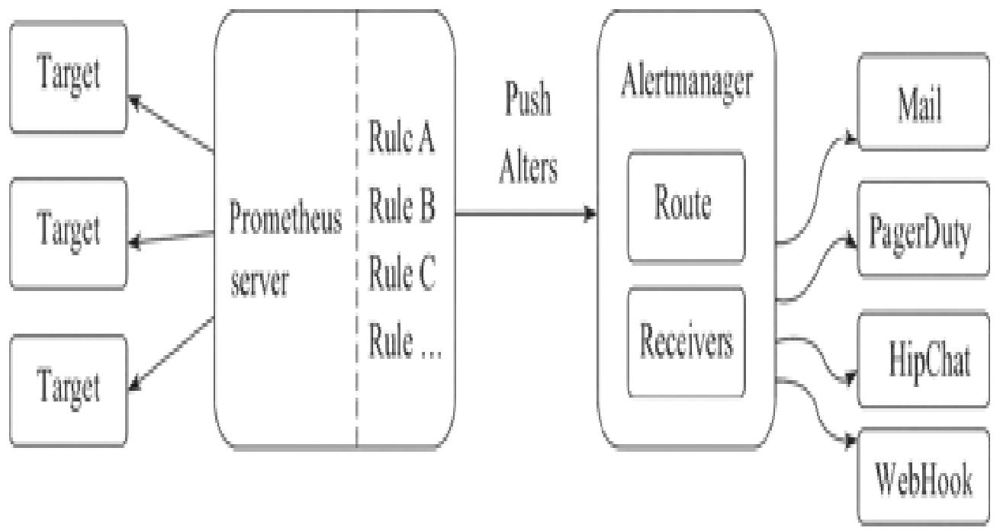

#### 2.1.1 告警分组（Grouping）

将同类型告警合并为一个通知，避免大规模故障时的告警风暴（如K8s集群网络故障导致数百个实例告警）。可按集群、告警名称、服务类型等标签分组，让管理员快速定位故障范围。

#### 2.1.2 告警抑制（Inhibition）

当核心告警触发时，忽略由其引发的衍生告警（如交换机故障导致机柜内服务器不可达，仅告警交换机故障，抑制服务器不可达告警），减少无效告警。

#### 2.1.3 告警静默（Silences）

通过标签匹配临时屏蔽指定告警（如运维窗口内屏蔽升级相关告警），可在Alertmanager Web界面直接配置，无需修改规则。

### 2.2 二进制文件方式安装

#### 环境信息

| 配置项 | 取值 |
|--------|------|
| 操作系统 | CentOS Linux release 7.5.1804 (Core) x86_64 |
| 主机IP | 192.168.186.7 |
| Alertmanager版本 | alertmanager-0.16.2.linux-amd64.tar.gz |

#### 安装步骤

1. 下载并校验软件包

```bash
sha256sum alertmanager-0.16.2.linux-amd64.tar.gz
# 核对输出与官网SHA256 Checksum一致
```

1. 解压缩到指定目录

```bash
tar -zxvf alertmanager-0.16.2-linux-amd64.tar.gz -C /data
cd /data
chown -R root:root alertmanager-0.16.2-linux-amd64
ln -sv alertmanager-0.16.2-linux-amd64 alertmanager
```

1. 配置系统服务（开机自启）
创建`/usr/lib/systemd/system/alertmanager.service`文件：

```ini
[Unit]
Description=Prometheus Alertmanager Service daemon
After=network.target

[Service]
Type=simple
User=root
Group=root
ExecStart=/data/alertmanager/alertmanager \
    --config.file "/data/alertmanager/alertmanager.yml" \
    --storage.path="/data/alertmanager/data/" \
    --data-retention=120h \
    --web.external-url "http://192.168.186.7:9093" \
    --web.listen-address=":9093"
Restart=on-failure

[Install]
WantedBy=multi-user.target
```

| 启动参数 | 说明 |
|----------|------|
| --config.file | 指定Alertmanager配置文件路径 |
| --storage.path | 告警数据存储路径 |
| --data-retention | 历史数据保留时长（默认120h） |
| --web.external-url | 告警通知中跳转的Alertmanager地址 |
| --web.listen-address | Web界面监听端口（默认9093） |

1. 加载并启动服务

```bash
systemctl daemon-reload
systemctl enable alertmanager.service
systemctl start alertmanager.service
systemctl status alertmanager.service  # 确认状态为Active: active (running)
```

1. 验证部署
访问`http://192.168.186.7:9093/#/status`，可查看Alertmanager运行状态、版本、配置信息。


### 2.3 Docker方式安装

1. 拉取镜像

```bash
docker pull prom/alertmanager
```

1. 准备配置文件
复制二进制安装包中的`alertmanager.yml`到`/data/alertmanager/simple.yml`（或使用官方示例配置）。

2. 启动容器

```bash
docker run -d -p 9093:9093 -v /data/alertmanager/simple.yml:/etc/alertmanager/config.yml --name alertmanager prom/alertmanager
```

1. 验证部署

```bash
docker ps  # 确认alertmanager容器运行，9093端口映射正常
```

### 模块小结

本模块完成了Alertmanager两种部署方式（二进制/Docker），并明确了核心启动参数，是后续配置告警处理的基础。

## 3. Alertmanager配置

Alertmanager配置文件基于YAML格式，核心模块包括global、templates、route、receivers、inhibit_rules，需逐一理解并配置。

### 3.1 global（全局配置）

全局配置为其他模块提供默认值，核心参数如下：

```yaml
global:
  [ resolve_timeout: <duration> | default = 5m ]  # 告警恢复判定超时时间
  [ smtp_from: <tmpl_string> ]  # 邮件告警发件人
  [ smtp_smarthost: <string> ]  # SMTP服务器地址
  [ smtp_auth_username: <string> ]  # SMTP认证用户名
  [ smtp_auth_password: <secret> ]  # SMTP认证密码
  [ smtp_require_tls: <bool> | default = true ]  # 是否启用TLS
  [ wechat_api_url: <string> | default = "https://qyapi.weixin.qq.com/cgi-bin/" ]  # 企业微信API地址
  [ wechat_api_corp_id: <string> ]  # 企业微信企业ID
  [ wechat_api_secret: <secret> ]  # 企业微信应用密钥
```

### 3.2 templates（告警模板）

自定义告警通知格式，指定模板文件路径：

```yaml
templates:
  - '/data/alertmanager/template/*.tmpl'  # 加载指定目录下所有模板文件
```

模板基于Go模板语法，可自定义告警标题、内容、格式，后续实战环节会具体演示。

### 3.3 route（告警路由）

定义告警的路由规则，所有告警从根路由进入，按深度优先遍历子路由，匹配后停止（或继续，取决于continue参数）。

#### 路由核心配置项

| 选项 | 说明 |
|------|------|
| receiver | 默认接收器名称 |
| group_by | 告警分组标签（如cluster、alertname） |
| continue | false：匹配后终止遍历；true：继续匹配子路由 |
| match | 精确匹配标签（如team: developers） |
| match_re | 正则匹配标签（如service: mysql|redis） |
| group_wait | 接收告警后等待时间（合并同组告警，默认30s） |
| group_interval | 同组告警再次通知的间隔（默认5m） |
| repeat_interval | 相同告警重复通知间隔（默认4h） |
| routes | 子路由配置 |

#### 路由配置示例

```yaml
route:
  receiver: 'admin-receiver'
  group_wait: 30s
  group_interval: 5m
  repeat_interval: 4h
  group_by: [cluster, alertname]
  routes:
  - match:
      team: developers
    group_by: [product, environment]
    receiver: 'developer-pager'
  - match_re:
      service: mysql|redis
    receiver: 'database-pager'
```

#### Routing tree editor工具验证

1. 访问工具地址：<https://prometheus.io/webtools/alerting/routing-tree-editor/>
2. 粘贴Alertmanager配置文件内容，点击「Draw Routing Tree」生成路由树。
3. 输入标签集（如`{service="mysql"}`），点击「Match Label Set」验证路由匹配结果。


### 3.4 receivers（接收器）

定义告警通知的目标渠道，每个接收器有唯一名称，支持多渠道组合：

```yaml
name: <string>  # 接收器名称
email_configs:  # 邮件通知
  [ - <email_config>, ... ]
wechat_configs:  # 企业微信通知
  [ - <wechat_config>, ... ]
webhook_configs:  # Webhook通知（如钉钉）
  [ - <webhook_config>, ... ]
slack_configs:
  [ - <slack_config>, ... ]
pagerduty_configs:
  [ - <pagerduty_config>, ... ]
```

官方推荐通过webhook实现自定义通知集成，适配个性化需求。

### 3.5 inhibit_rules（抑制规则）

设置告警抑制条件，减少衍生告警，核心配置：

```yaml
target_match:  # 被抑制的告警标签（精确匹配）
  [ <labelname>: <labelvalue>, ... ]
target_match_re:  # 被抑制的告警标签（正则匹配）
  [ <labelname>: <regex>, ... ]
source_match:  # 触发抑制的源告警标签（精确匹配）
  [ <labelname>: <labelvalue>, ... ]
source_match_re:  # 触发抑制的源告警标签（正则匹配）
  [ <labelname>: <regex>, ... ]
equal: ['<labelname>, ...']  # 源/目标告警需相同的标签（如dc、rack）
```

#### 抑制规则示例

```yaml
inhibit_rules:
- source_match:
    alertname: 'TORouterDown'  # 源告警：核心交换机故障
  target_match_re:
    alertname: '.*Unreachable'  # 被抑制告警：所有不可达告警
  equal: ['dc', 'rack']  # 仅抑制同机房/机架的衍生告警
```

> 避坑指南：避免source_match和target_match重叠，否则易导致告警逻辑混乱；仅在大规模故障（如机房中断）时使用，日常告警建议基于症状设计，减少依赖链。

### 模块小结

本模块拆解了Alertmanager配置文件的5大核心模块，掌握路由、接收器、抑制规则的配置是实现告警精准分发的关键。

## 4. Prometheus告警规则

告警规则定义在Prometheus Server端，需先关联Alertmanager，再编写规则，最后验证生效。

### 4.1 关联Alertmanager

修改Prometheus配置文件`prometheus.yml`，添加Alertmanager地址：

```yaml
alerting:
  alertmanagers:
    - static_configs:
        - targets:
          - 192.168.186.7:9093  # Alertmanager地址

# 可选：监控Alertmanager自身状态
- job_name: 'Alertmanager'
  static_configs:
    - targets: ['192.168.186.7:9093']
```

重启Prometheus或热加载配置（`curl -XPOST http://localhost:9090/-/reload`），访问`http://192.168.186.7:9090/targets`，确认Alertmanager状态为UP。

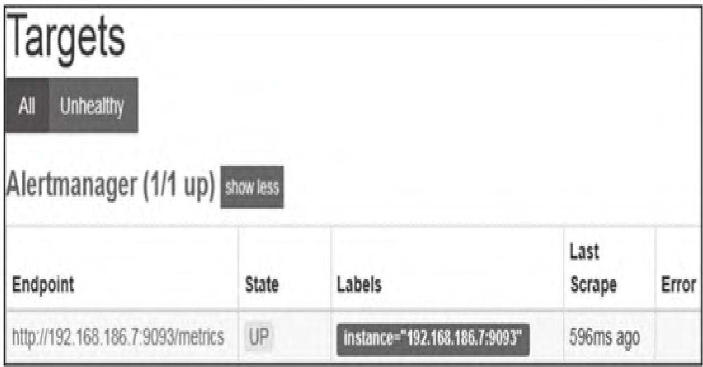

### 4.2 告警规则编写

#### 规则文件加载配置

在`prometheus.yml`中指定告警规则文件路径：

```yaml
global:
  evaluation_interval: 15s  # 规则计算间隔（默认1m）

rule_files:
  - "/data/prometheus/rules/*_rules.yml"  # 加载指定目录下所有规则文件
  - "second_rules.yml"  # 单个规则文件
```

#### 告警规则结构

```yaml
groups:  # 规则组
- name: <string>  # 组名
  rules:  # 具体规则
  - alert: <string>  # 告警名称
    expr: <string>  # PromQL触发条件
    [ for: <duration> | default = 0s ]  # 满足条件持续时间
    labels:  # 自定义标签
      [ <labelname>: <labelvalue> ]
    annotations:  # 告警描述（模板化）
      [ <labelname>: <tmpl_string> ]
```

| 配置项 | 说明 |
|--------|------|
| expr | PromQL表达式，结果为true时触发告警 |
| for | 避免瞬时波动导致误报（如3m：满足条件3分钟后触发） |
| labels | 用于告警分组、路由（如severity: critical） |
| annotations | 告警详情（如description、summary），支持模板变量 |

#### 实战示例：监控node_exporter状态

1. 配置node_exporter监控（`prometheus.yml`）：

```yaml
- job_name: 'node'
  static_configs:
    - targets: ['192.168.186.7:9100']
```

1. 创建规则文件`/data/prometheus/rules/up_rule.yml`：

```yaml
groups:
- name: UP
  rules:
  - alert: node_down
    expr: up{job="node"} == 0  # node_exporter状态为DOWN
    for: 3m  # 持续3分钟触发
    labels:
      severity: critical
    annotations:
      description: "{{ $labels.instance }} of job {{ $labels.job }} has been down for more than 3 minutes."
      summary: "{{ $labels.instance }} down, up == {{ $value }}"
```

1. 验证规则语法：

```bash
./promtool check rules rules/up_rule.yml  # 输出SUCCESS: 1 rules found
```

1. 加载规则：重启Prometheus或热加载配置，访问`http://192.168.186.7:9090/rules`查看规则。

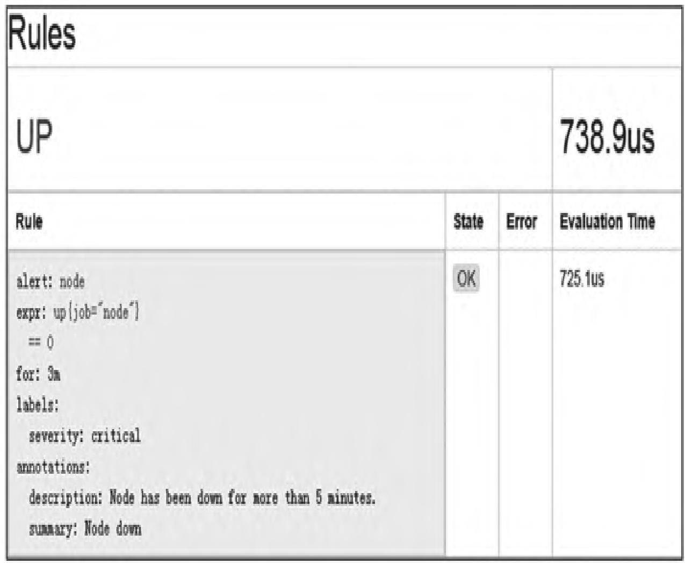

### 4.3 告警状态生命周期

Prometheus告警有三种状态，按触发流程依次转换：

1. **Inactive**：未满足触发条件，初始状态
2. **Pending**：满足触发条件，但未达到`for`指定时长（如node_exporter DOWN不足3分钟）
3. **Firing**：满足触发条件且超过`for`时长，推送至Alertmanager

#### 状态验证

1. 停止node_exporter服务：`systemctl stop node_exporter`
2. 访问`http://192.168.186.7:9090/targets`，确认node_exporter为DOWN。

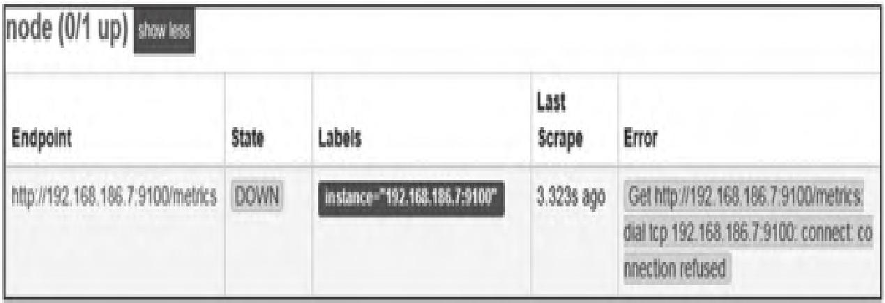

1. 访问`http://192.168.186.7:9090/alerts`，查看状态：
   - 3分钟内：Pending状态

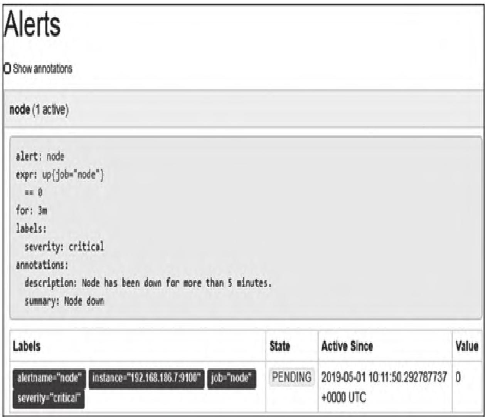

- 3分钟后：Firing状态

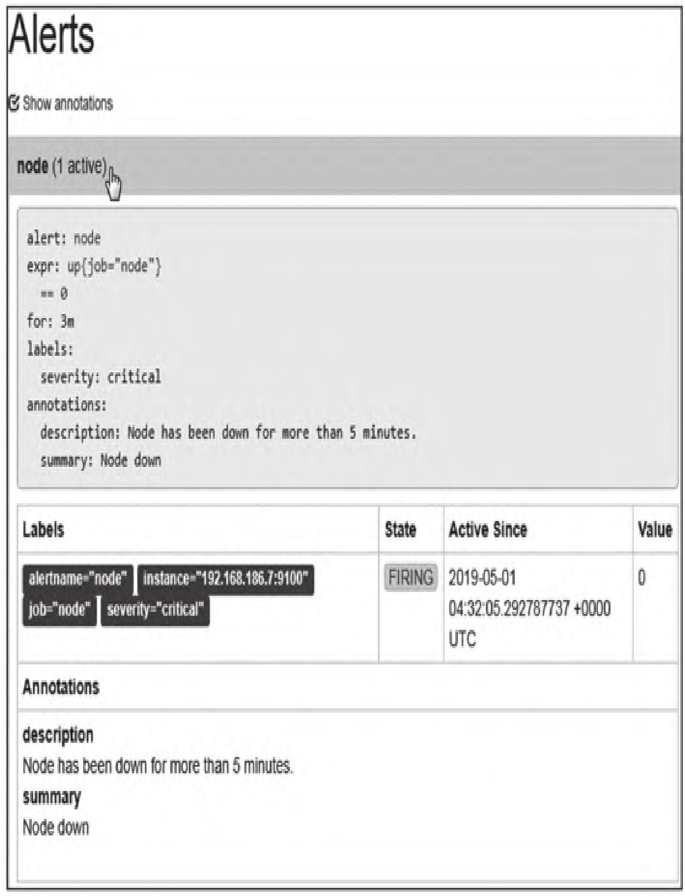

1. 访问Alertmanager：`http://192.168.186.7:9093/#/alerts`，确认接收告警。

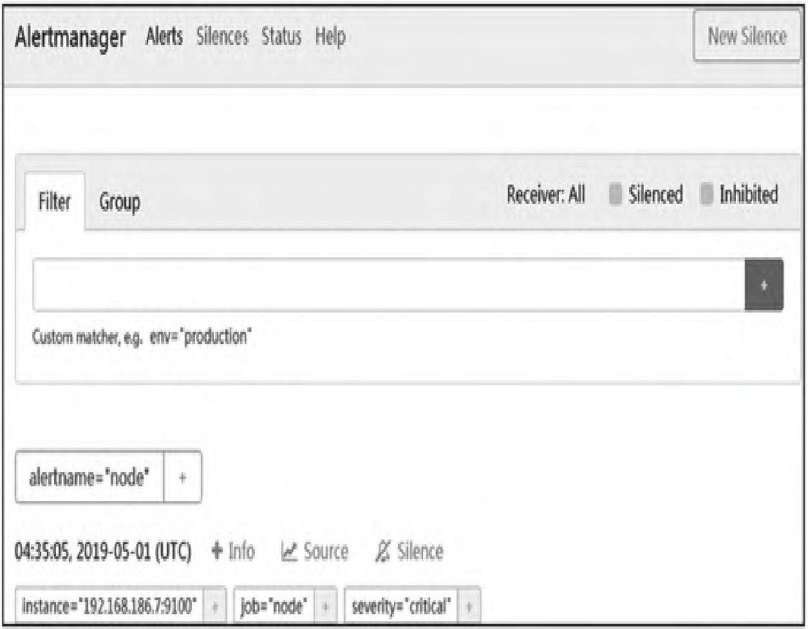

#### ALERTS指标

Prometheus为Pending/Firing状态的告警生成`ALERTS`指标：

```txt
ALERTS{alertname="<告警名>", alertstate="pending|firing", <自定义标签>}  # 取值为1表示激活
```

### 4.4 告警模板使用

模板基于Go语法，可通过变量获取告警标签和值：

- `{{$labels.<labelname>}}`：获取指定标签值（如`{{$labels.instance}}`）
- `{{$value}}`：获取PromQL计算结果（如`up`指标的0/1值）

> 避坑指南：模板仅保留核心信息，避免过度添加调试内容，否则会降低告警处理效率。

### 模块小结

本模块完成了告警规则的编写、验证，理解了告警状态生命周期，是实现精准告警触发的核心环节。

## 5. 告警接收器实战

Alertmanager支持多渠道告警通知，以下落地Email、企业微信、钉钉三种常用方式。

### 5.1 Email接收告警（以163邮箱为例）

#### 配置步骤

1. 修改Alertmanager配置文件`alertmanager.yml`：

```yaml
global:
  resolve_timeout: 5m
  smtp_smarthost: 'smtp.163.com:25'  # 163 SMTP服务器
  smtp_from: 'woxuexiyong@163.com'  # 发件人邮箱
  smtp_auth_username: 'woxuexieyong@163.com'  # 认证用户名
  smtp_auth_password: 'YourStrongPassword'  # 邮箱授权码（非登录密码）

route:
  group_by: ['alertname']
  group_wait: 10s
  group_interval: 10s
  repeat_interval: 1h
  receiver: 'email'  # 默认接收器

receivers:
- name: 'email'
  email_configs:
  - to: 'zhengweila@sohu.com'  # 收件人邮箱
    headers: { Subject: "WARNING-告警邮件" }  # 邮件标题
    send_resolved: true  # 发送恢复通知
```

1. 验证配置：

```bash
cd /data/alertmanager
./amtool check-config alertmanager.yml  # 输出SUCCESS
```

1. 重启Alertmanager：`systemctl restart alertmanager`

#### 测试验证

1. 停止node_exporter服务，等待告警触发。
2. 查看收件邮箱，接收告警邮件。

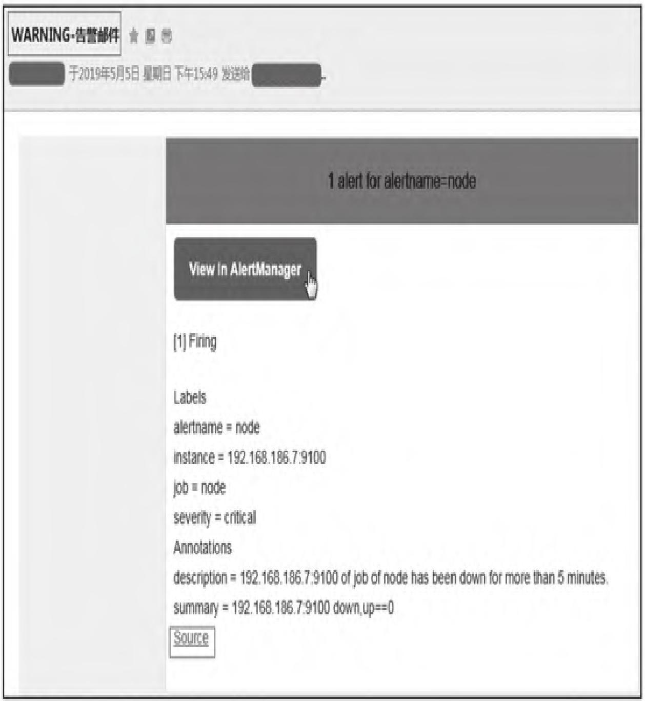

1. 恢复node_exporter服务，接收恢复通知邮件。

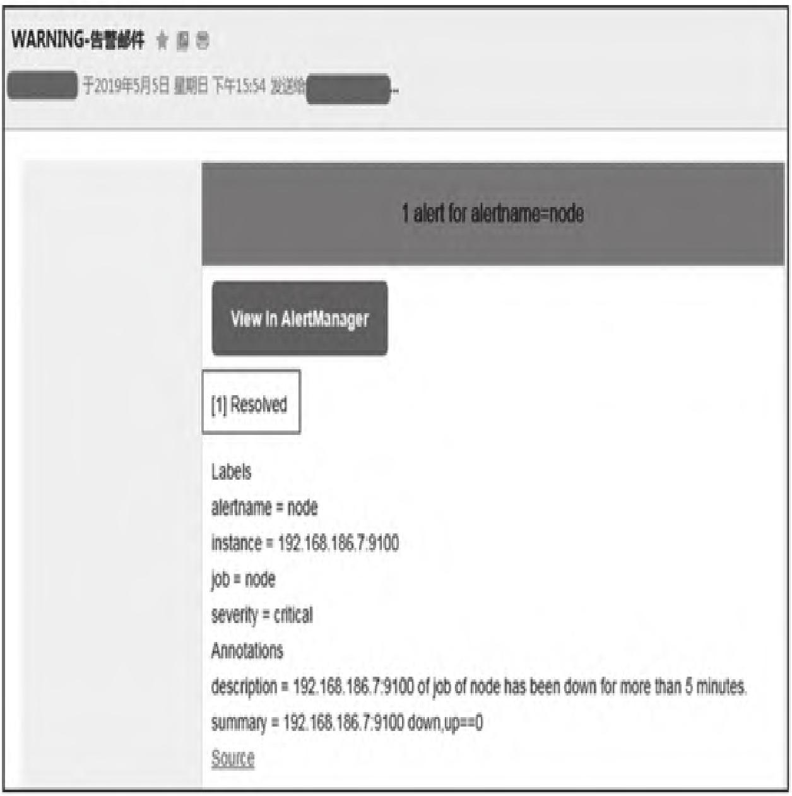

### 5.2 企业微信接收告警

#### 前置准备

1. 注册企业微信：<https://work.weixin.qq.com>
2. 创建应用：「应用与小程序」→「创建应用」，记录：
   - 企业ID（我的企业页面）
   - AgentId（应用详情）
   - Secret（应用详情）
   - 部门ID/成员账号（通讯录页面）

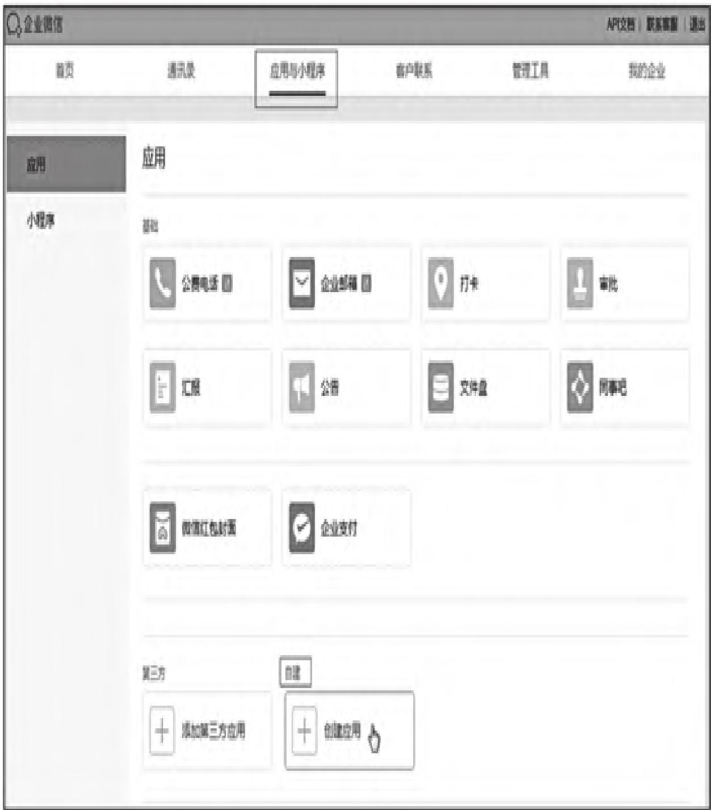

1. 测试应用可用性：

```bash
wget https://raw.githubusercontent.com/OneOaaS/weixin警告/master/weixin_linux_amd64
chmod +x weixin_linux_amd64
./weixin_linux_amd64 --corpid=ww2f9229e0804f8faf --corpsecret=U_HKt5xV7ZPjXTm4aFfDCfAwKguXmyrYhxTJFVTfynU --msg="您好，告警测试" --user=LiuZhengWei --agentid=1000002
```

返回`{"errcode":0,"errmsg":"ok"}`表示测试成功。

#### 配置Alertmanager

修改`alertmanager.yml`：

```yaml
global:
  resolve_timeout: 5m
  wechat_api_url: 'https://qyapi.weixin.qq.com/cgi-bin/'
  wechat_api_corp_id: 'ww2f9229e0804f8faf'  # 企业ID
  wechat_api_secret: 'U_HKt5xV7ZPjXTm4aFfDCfAwKguXmyrYhxTJFVTynU'  # 应用Secret

route:
  group_by: ['alertname']
  group_wait: 10s
  group_interval: 10s
  repeat_interval: 1h
  receiver: 'wechat'

receivers:
- name: 'wechat'
  wechat_configs:
  - send_resolved: true
    to_party: '1'  # 部门ID
    agent_id: '1000002'  # 应用ID
    corp_id: 'ww2f9229e0804f8faf'  # 企业ID
    to_user: 'LiuZhengWei'  # 接收人账号
    api_url: 'https://qyapi.weixin.qq.com/cgi-bin/'
    api_secret: 'U_HKt5xV7ZPjXTm4aFfDCfAwKguXmyrYhxTJFVTynU'  # 应用Secret
```

#### 验证配置并测试

1. 检查配置：`./amtool check-config alertmanager.yml`
2. 重启Alertmanager：`systemctl restart alertmanager`
3. 停止node_exporter，接收企业微信告警通知。

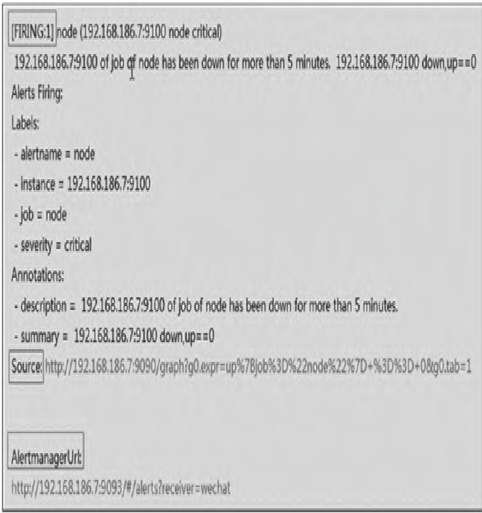

1. 恢复服务，接收恢复通知。

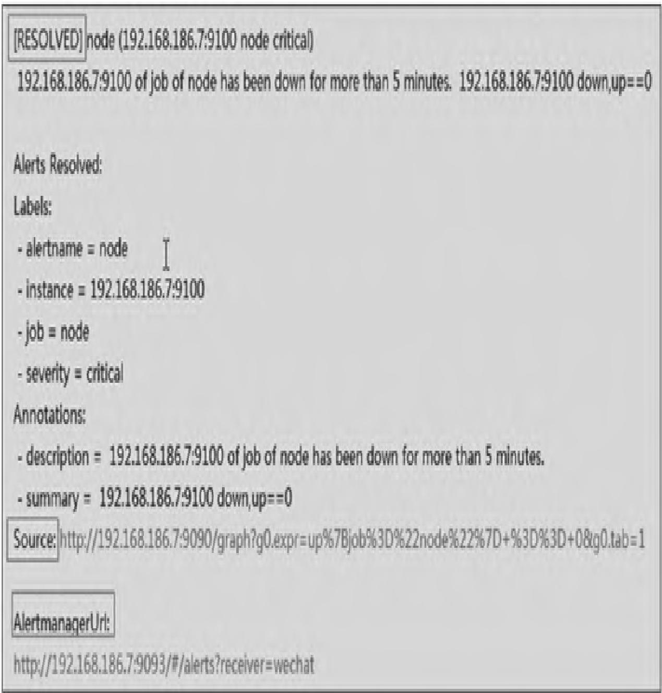

### 5.3 钉钉接收告警（Webhook方式）

#### 前置准备

1. 登录钉钉PC版，创建自定义机器人：
   - 「机器人管理」→「自定义」→「添加机器人」
   - 填写信息，选择接收群组，复制Webhook地址。


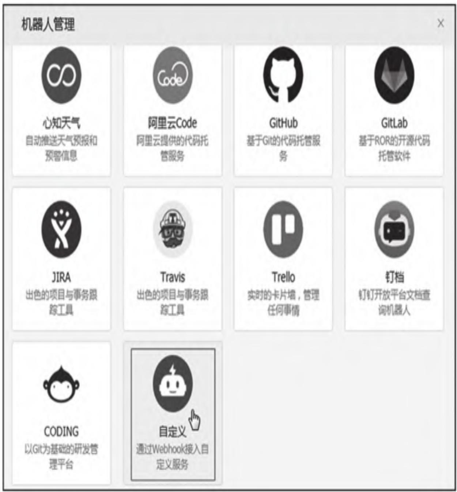

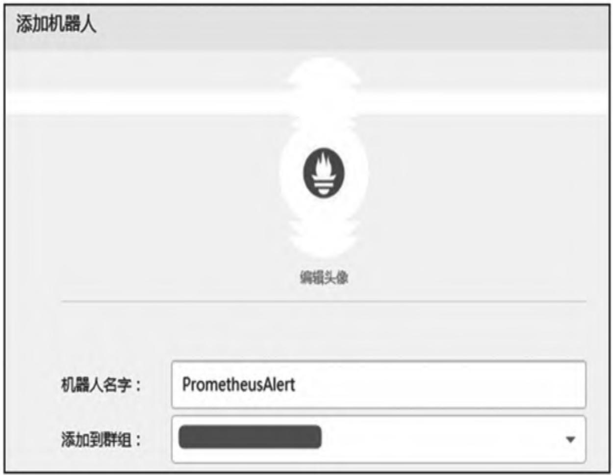

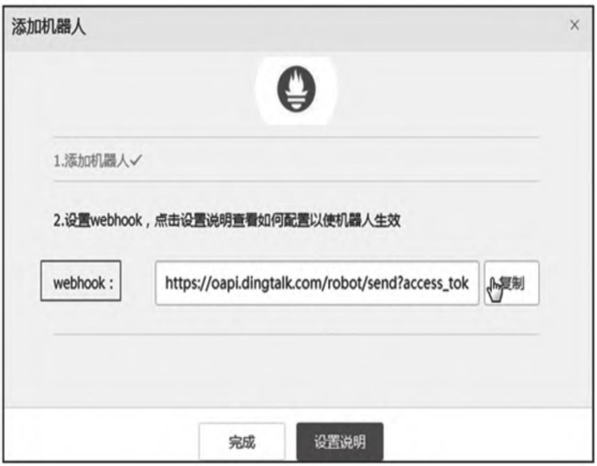

1. 安装`prometheus-webhook-dingtalk`工具：

```bash
wget https://github.com/timonwang/prometheus-webhook-dingtalk/releases/download/v0.3.0/prometheus-webhook-dingtalk-0.3.0-linux-amd64.tar.gz
tar zxvf prometheus-webhook-dingtalk-0.3.0-linux-amd64.tar.gz -C /data
cd /data
ln -sv prometheus-webhook-dingtalk-0.3.0-linux-amd64 prometheus-webhook-dingtalk
cd prometheus-webhook-dingtalk
```

1. 启动工具（后台运行）：

```bash
nohup ./prometheus-webhook-dingtalk \
  --ding.profile="ops_dingding=https://oapi.dingtalk.com/robot/send?access_token=ca001e3def5af95a5f294a34e3cc0b427ef4c0f139c09a414580b766c0767f8b" &
```

工具默认监听8060端口。

#### 配置Alertmanager

修改`alertmanager.yml`：

```yaml
global:
  resolve_timeout: 5m

route:
  receiver: webhook
  group_wait: 30s
  group_interval: 5m
  repeat_interval: 4h
  group_by: [alertname]
  routes:
    - receiver: webhook
      group_wait: 10s
      match:
        team: node

receivers:
- name: webhook
  webhook_configs:
    - url: http://localhost:8060/dingtalk/ops_dingding/send  # 钉钉Webhook地址
      send_resolved: true  # 发送恢复通知
```

#### 验证配置并测试

1. 检查配置：`./amtool check-config alertmanager.yml`
2. 重启Alertmanager：`systemctl restart alertmanager`
3. 停止node_exporter，接收钉钉告警通知。

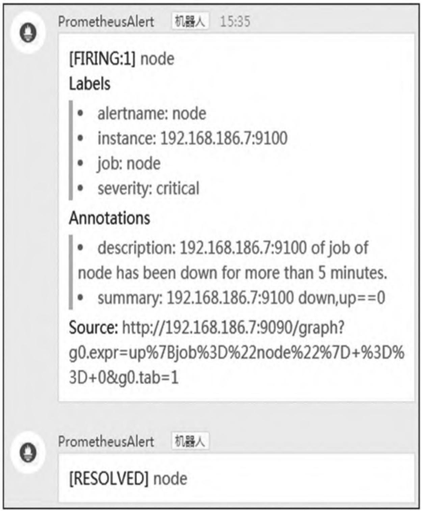

### 5.4 告警通知模板自定义

Alertmanager模板与Prometheus模板不同，基于Go模板系统，自定义方式有两种：

1. 直接在配置文件中使用模板字符串：

   ```yaml
   email_configs:
   - to: 'xxx@xxx.com'
     text: "告警名称：{{ .CommonLabels.alertname }}\n实例：{{ .CommonLabels.instance }}\n描述：{{ .CommonAnnotations.description }}"
   ```

2. 定义模板文件，在配置中指定路径：

   ```yaml
   templates:
     - '/data/alertmanager/template/alert.tmpl'
   ```

> 核心提示：模板仅优化通知格式，需完整保留告警核心信息（标签、值、描述），避免信息缺失。

### 模块小结

本模块落地了三种主流告警通知方式，覆盖邮件、企业微信、钉钉，满足不同场景的告警接收需求，同时明确了模板自定义的核心方法。

## 本篇核心知识点速记

1. 告警原则：重要、可操作、真实，避免无意义误报；
2. Alertmanager核心机制：分组（合并同类型告警）、抑制（屏蔽衍生告警）、静默（临时屏蔽指定告警）；
3. Alertmanager配置核心：global（全局默认）、route（路由规则）、receivers（通知渠道）、inhibit_rules（抑制规则）；
4. 告警规则三状态：Inactive（未触发）→Pending（满足条件未到时长）→Firing（触发并推送）；
5. 告警通知：支持Email、企业微信、钉钉（Webhook），可通过模板自定义通知格式。
