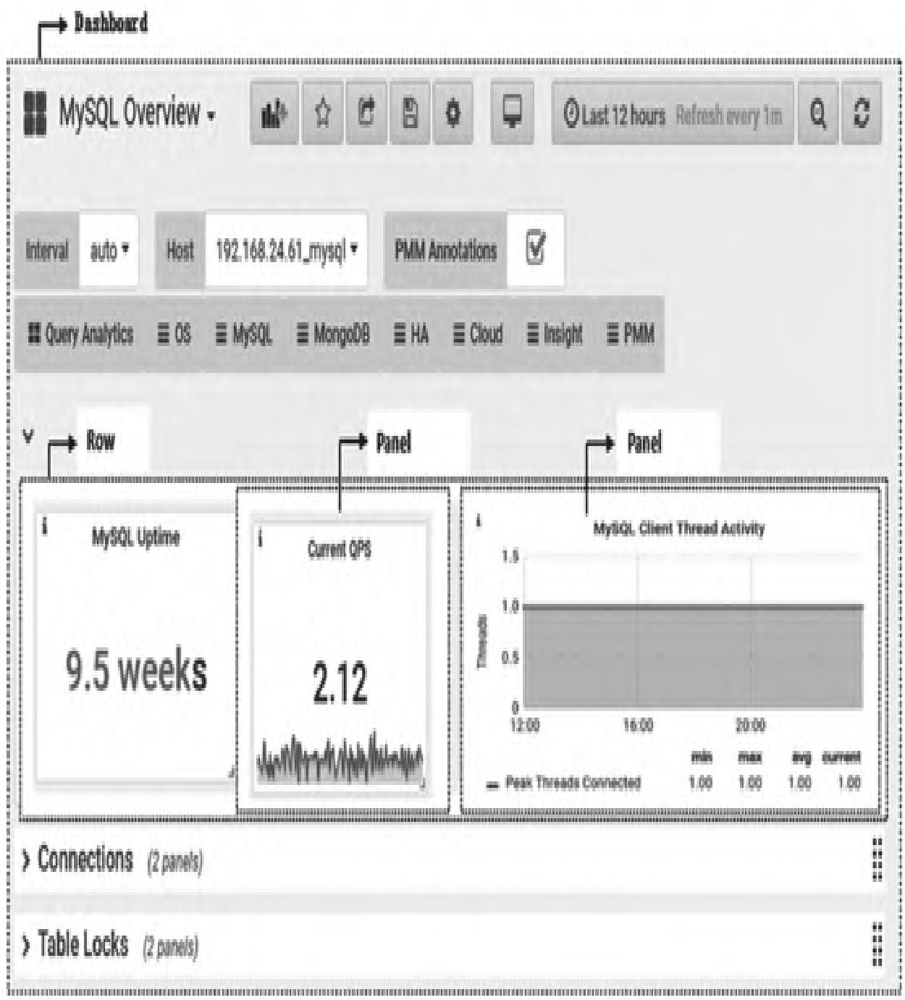
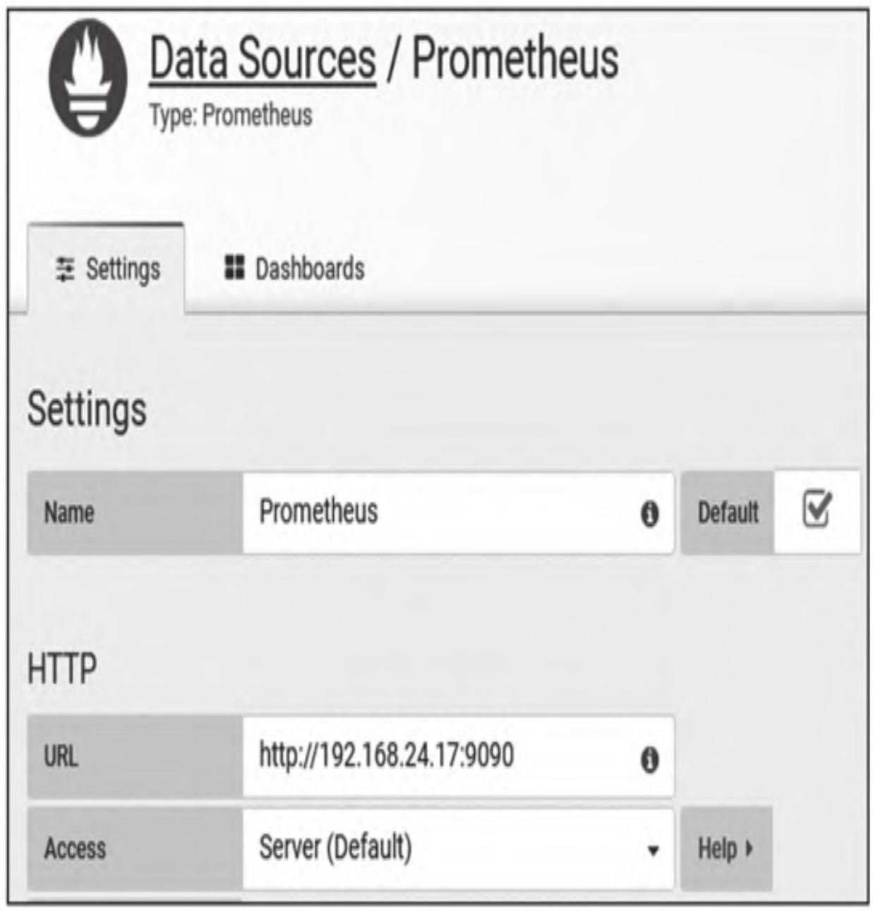
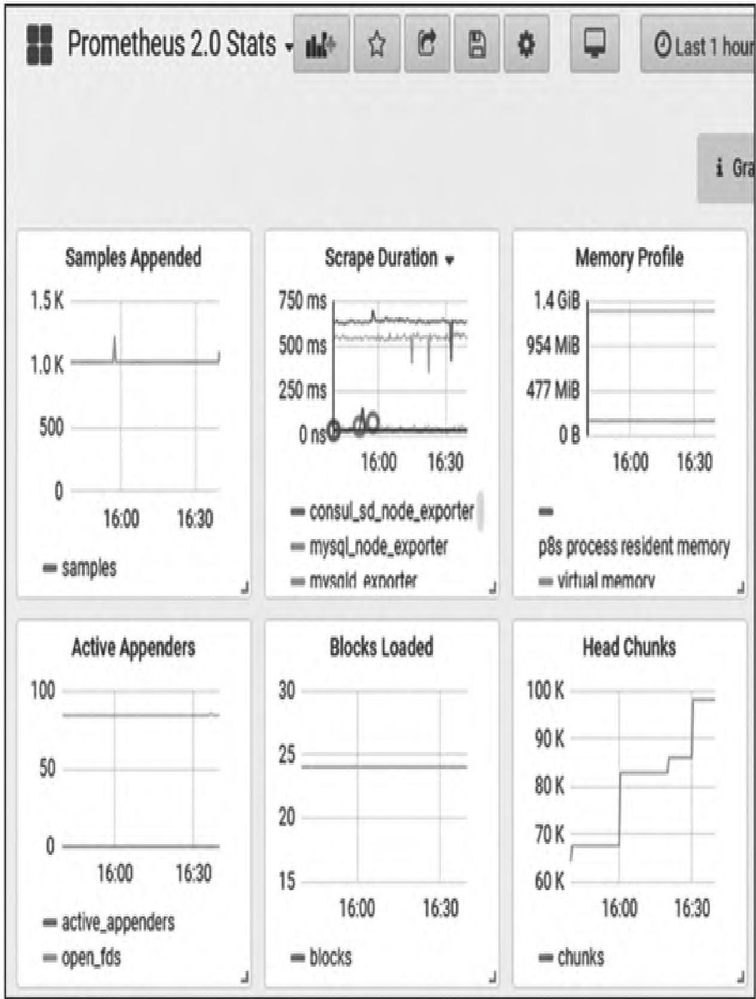
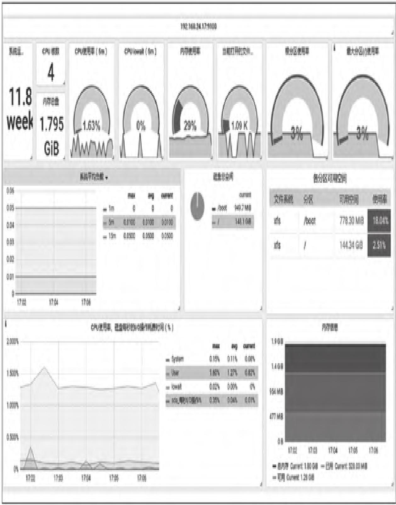
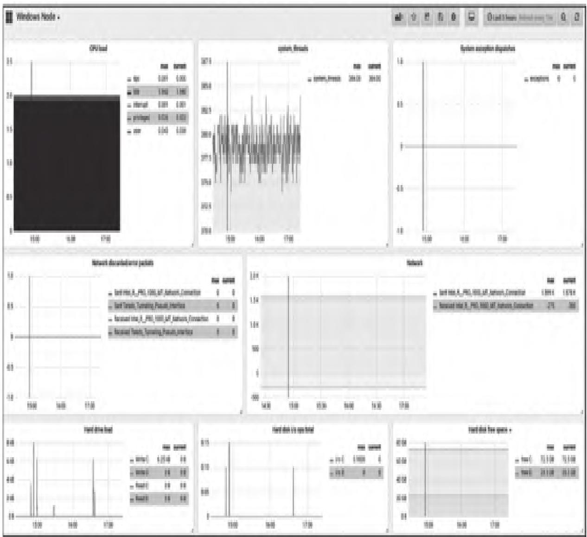
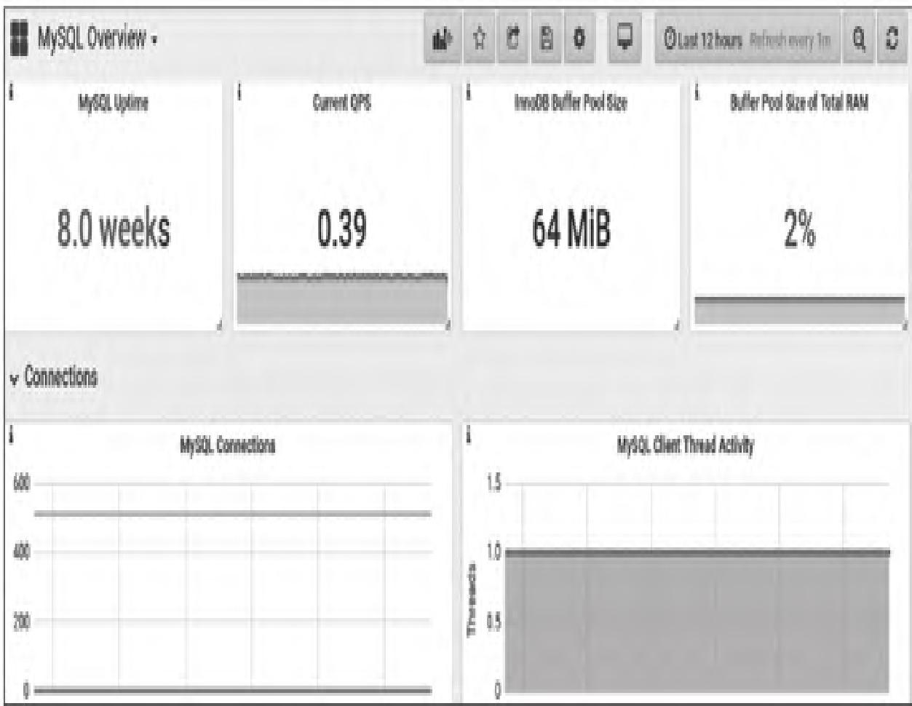

作为Prometheus监控体系中核心的可视化组件，Grafana凭借灵活的定制能力和丰富的可视化形式，成为企业级监控仪表盘搭建的首选工具。本文将从Grafana的核心价值出发，完整覆盖多环境安装、核心概念理解、数据源配置、仪表盘导入与定制全流程，帮助读者从零搭建专业、美观的监控可视化体系。

【本篇核心收获】

- 理解Grafana作为开源可视化工具的核心价值与典型应用场景
- 掌握Grafana在CentOS、Windows及Docker环境下的标准化安装部署方法
- 吃透Grafana核心概念（数据源、组织、用户、面板、仪表盘等）的定义与关联逻辑
- 熟练配置Prometheus数据源，理解Server/Browser两种访问模式的差异与适用场景
- 掌握从Grafana官网导入各类Exporter仪表盘（Node Exporter、MySQL、Windows Node等）的实操步骤
- 了解Grafana仪表盘定制的核心思路，包括变量配置、面板类型选择与关键参数调优

## 1. 可视化概述

Prometheus自带的Web UI仅满足基础的数据查询与PromQL调试需求，界面简单且无法在单页面整合多维度监控数据，难以满足企业级可视化展示的诉求。而Grafana作为一款开源的时间序列分析与可视化工具，完美弥补了这一短板。

Grafana基于GO语言开发，具备跨平台特性，遵循Apache License 2.0开源协议，核心优势包括：

- 支持Graphite、InfluxDB、Prometheus等多类数据源，适配不同数据存储场景
- 高度可定制的可视化界面，支持图表、表格、热力图等多种展示形式，适配大屏展示需求
- 完善的多用户、多组织权限管理体系，满足企业级部署的权限管控要求
- 丰富的插件生态，可按需扩展功能，降低定制化成本

Grafana已被众多知名企业广泛应用：Redhat将其作为OpenStack监控堆栈的核心组件，Percona集成到PMM中监控MySQL/MongoDB性能，eBay用其分析网站实验异常，Gameforge则通过它展示数百万量级的游戏服务器指标。

### 模块小结

本模块核心介绍了Grafana的定位与价值，明确其作为Prometheus可视化补充工具的核心优势，以及在企业级场景中的典型应用案例。

## 2. Grafana安装

Grafana支持Linux、Windows、Mac等主流操作系统，也可通过Docker快速部署。本节聚焦CentOS、Windows、Docker三种主流环境的安装方法，覆盖在线安装、离线安装、数据持久化等关键要点。

### 2.1 版本选择

选择Grafana版本的核心原则：优先参考官方稳定版发行说明，结合自身需求选择（优先选择修复关键Bug、新增核心功能的稳定版本），避免直接使用开发版。

本文选用Grafana v5.3稳定版（2018年11月发布的5.3.4-1版本），该版本核心更新包括：

- 新增Google Stackdriver核心数据源支持
- 优化TV模式，提升大屏展示体验
- 支持Postgres新的图形查询构建器
- 新增Text box变量类型，支持自由文本输入

>Grafana版本说明可参考：
>
>- v5.3.X：<https://community.grafana.com/t/release-notes-v5-3-x/10244>
>- v5.4.X：<https://community.grafana.com/t/release-notes-v5-4-x/12215>

### 2.2 系统软件支撑

本文所用操作系统均为最小化安装，示例操作使用root/管理员用户，且关闭了Selinux/防火墙（生产环境需按需配置端口权限），基础软件包依赖需提前安装（如wget、fontconfig等）。

### 2.3 在CentOS上安装

以CentOS 7.5.1804 x86_64为例，提供YUM在线安装和RPM包离线安装两种方式。

#### 2.3.1 YUM方式安装

YUM安装可自动处理依赖，适合快速部署，核心步骤如下：

**步骤1：配置软件仓库**
编辑`/etc/yum.repos.d/grafana.repo`文件，添加官方仓库配置：

```ini
[grafana]
name=grafana
baseurl=https://packagecloud.io/grafana/stable/el/7/$basearch
repo_gpgcheck=1
enabled=1
gpgcheck=1
gpgkey=https://packagecloud.io/gpg.key https://grafanarel.s3.amazon.com/RPM-GPG-KEY-grafana
sslverify=1
sslcacert=/etc/pki/tls/certs/ca-bundle.crt
```

若网络访问受限，可替换为清华大学镜像源：

```ini
[grafana]
name=grafana
baseurl=https://mirrors.tuna.tsinghua.edu.cn/grafana/yum/el7
repo_gpgcheck=0
gpgcheck=0
enabled=1
```

**步骤2：执行YUM安装**

```bash
yum makecache
yum -y install grafana
```

**步骤3：启动并管理Grafana服务**

```bash
systemctl daemon-reload          # 重新加载systemd配置
systemctl start grafana-server.service   # 启动服务
```

>Grafana安装后关键文件路径：
>
>- 二进制文件：/usr/sbin/grafana-server
>- 配置文件：/etc/grafana/grafana.ini
>- 日志文件：/var/log/grafana/grafana.log
>- 数据库文件：/var/lib/grafana/grafana.db

**步骤4：登录与基础配置**

1. 访问`http://服务器IP:3000`，默认用户名/密码均为admin，首次登录可修改密码（也可点击Skip跳过）。
2. 修改默认主题（以切换为light主题为例）：
   编辑`/etc/grafana/grafana.ini`：

   ```ini
   default_theme = light
   ```

   重启服务生效：

   ```bash
   systemctl restart grafana-server.service
   ```

#### 2.3.2 RPM包方式安装

适合无网络环境的离线部署，核心步骤如下：

**步骤1：下载并校验RPM包**

```bash
# 下载包（需提前安装wget）
wget https://s3-us-west-2.amazonaws.com/grafana-releases/release/grafana-5.3.4-1.x86_64.rpm
# 校验哈希值（官方SHA256：375e85339782cee09066267e3a6cd279d5ff71ce6c90a4ebcb9bd1c91de1d5c0）
sha256sum grafana-5.3.4-1.x86_64.rpm
```

**步骤2：安装并启动服务**

```bash
rpm -Uvh grafana-5.3.4-1.x86_64.rpm
systemctl start grafana-server.service
systemctl status grafana-server.service  # 验证启动状态
```

**步骤3：解决图片/字体异常问题**
若出现图片缺失、字体乱码，安装以下依赖包：

```bash
yum -y install fontconfig
yum -y install freetype*
yum -y install urw-fonts
```

### 2.4 在Windows上安装

以Windows Server 2008 R2 Enterprise为例，核心步骤如下：

**步骤1：下载并校验安装包**
下载地址：<https://s3-us-west-2.amazonaws.com/grafana-releases/release/grafana-5.3.4.windows-amd64.zip>
下载后校验哈希值，确保文件完整性。

**步骤2：解压到指定目录**
将压缩包解压到目标安装路径（如`D:\grafana`），解压后可见bin、conf等子目录。

**步骤3：启动Grafana服务**
运行`bin\grafana-server.exe`，默认加载`conf\defaults.ini`配置文件，启动后会自动在安装目录生成data文件夹（包含日志、插件、数据库等文件）。

**步骤4：访问验证**
浏览器访问`http://127.0.0.1:3000`，登录流程与CentOS环境一致。

### 2.5 使用Docker安装

Docker部署分为快速测试版和数据持久化版，推荐生产环境使用持久化部署。

#### 快速测试部署（无数据持久化）

```bash
docker run -d -p 3000:3000 grafana/grafana
```

#### 数据持久化部署（推荐）

**步骤1：创建宿主机挂载目录**

```bash
mkdir -p /data/docker/grafana_db
```

**步骤2：启动容器（指定版本+挂载目录）**

```bash
docker run \
  -d \
  -p 3000:3000 \
  --name=grafana \
  --user root \
  -v /data/docker/grafana_db:/var/lib/grafana \
  grafana/grafana:5.3.4
```

**步骤3：验证部署**

```bash
# 查看容器状态
docker ps
# 查看宿主机挂载目录文件
ls -l /data/docker/grafana_db
```

>Grafana Docker容器默认环境变量：
>
>- GF_PATHS_CONFIG：/etc/grafana/grafana.ini
>- GF_PATHS_DATA：/var/lib/grafana
>- GF_PATHS_LOGS：/var/log/grafana

若需自定义配置（如修改管理员密码、服务器域名），可通过环境变量覆盖：

```bash
docker run \
  -d \
  -p 3000:3000 \
  --name=grafana \
  -e "GF_SERVER_ROOT_URL=http://grafana.server.name" \
  -e "GF_SECURITY_ADMIN_PASSWORD=newsecret" \
  grafana/grafana:5.3.4
```

### 模块小结

本模块完整覆盖了Grafana在CentOS（YUM/RPM）、Windows、Docker三种环境的安装步骤，明确了各环境的关键配置文件、依赖要求与数据持久化方案，满足不同部署场景的需求。

## 3. Grafana基本概念

理解Grafana核心概念是后续配置与定制的基础，以下是关键概念的定义与关联逻辑：

| 概念 | 核心定义 | 关键特性 |
|------|----------|----------|
| 数据源（Data Source） | Grafana获取监控数据的来源，每种数据源对应专属查询编辑器 | 支持Prometheus、InfluxDB等多类型，每个面板绑定一个数据源 |
| 组织（Organization） | Grafana的权限隔离单元，支持多组织部署 | 每个组织独立管理数据源和仪表盘，组织内用户共享资源 |
| 用户（User） | Grafana的访问主体，可隶属多个组织 | 支持多角色权限分配，适配不同级别的操作权限 |
| 面板（Panel） | Grafana最基础的可视化单元，对应一个查询结果的展示 | 支持Graph、Singlestat、Heatmap等类型，可拖拽调整布局 |
| 行（Row） | 仪表盘的逻辑分区，用于分组管理面板 | 默认12个单位宽度，适配不同分辨率屏幕的自动缩放 |
| 查询编辑器（Query Editor） | 面板内编写查询语句的工具，控制面板展示的数据 | 支持多查询组合，可通过#A/#B引用其他查询结果 |
| 仪表盘（Dashboard） | 由多个行和面板组成的可视化集合，核心展示载体 | 支持模板变量、快照分享，可动态交互式展示数据 |

仪表盘的核心结构可参考图1：


### 模块小结

本模块通过表格形式清晰梳理了Grafana的7个核心概念，明确了各概念的定义、特性与关联关系，为后续数据源配置和仪表盘操作奠定基础。

## 4. Prometheus数据源

Grafana需配置数据源才能获取Prometheus的监控数据，本节完整覆盖Prometheus数据源的添加、访问模式选择、基础验证与仪表盘快速创建流程。

### 4.1 数据源添加

**步骤1：进入数据源添加页面**
登录Grafana后，点击左侧导航栏的“Configuration”→“Data Sources”→“Add data source”。

**步骤2：配置Prometheus数据源参数**
核心参数配置如下（参考图2）：

- Name：自定义名称（如Prometheus）
- Type：选择“Prometheus”
- URL：Prometheus的访问地址（如<http://192.168.24.18:9090）>
- Access：选择访问模式（默认Server模式）



>访问模式说明：
>
>- Server模式（默认）：请求从Grafana后端转发到Prometheus，规避CORS跨域问题，需保证Grafana后端可访问Prometheus
>- Browser模式：请求从浏览器直接发送到Prometheus，受CORS约束，需保证浏览器可访问Prometheus

**步骤3：验证数据源**
点击“Save & Test”按钮，若提示“Data source is working”则配置成功。

**步骤4：快速创建Prometheus仪表盘**

1. 进入已配置的Prometheus数据源页面，切换到“Dashboards”标签；
2. 点击“Prometheus 2.0 Stats”对应的“Import”按钮，导入官方预置仪表盘；
3. 导入成功后可直接查看Prometheus监控面板（参考图3）。



### 4.2 页面UI说明

#### 左侧导航栏（通用）

左侧导航栏是Grafana的核心操作入口，各按钮功能如下（参考图4）：


- ①：创建新仪表盘、文件夹，或导入仪表盘
- ②：返回系统首页
- ③：创建告警规则、配置告警通知
- ④：管理数据源、用户、插件等系统配置

#### 顶部工具（仪表盘页面）

仪表盘页面顶部工具是日常操作的核心入口，各按钮功能如下（参考图5）：


- ①：仪表盘切换/创建/导入/播放列表管理
- ②：添加新面板
- ③：标记/取消星标（星标仪表盘展示在首页）
- ④：分享仪表盘（生成链接/快照）
- ⑤：保存当前仪表盘配置
- ⑥：仪表盘设置（模板、注释等）
- ⑦：视图模式切换（适配不同展示场景）
- ⑧：时间范围选择/刷新频率配置（可覆盖全局时间设置）
- ⑨：快速调整时间范围（步进式增加）
- ⑩：手动刷新仪表盘

### 模块小结

本模块完整讲解了Prometheus数据源的配置步骤，明确了两种访问模式的差异，同时梳理了Grafana核心UI的操作逻辑，帮助读者快速完成数据源对接并熟悉界面操作。

## 5. 仪表盘导入

Grafana官网提供了丰富的预置仪表盘（<https://grafana.com/dashboards），可直接导入适配不同Exporter的监控面板，本节覆盖Node> Exporter、Windows Node、MySQL三类常用仪表盘的导入流程。

### 5.1 Node Exporter仪表盘

Node Exporter仪表盘用于展示Linux服务器的CPU、内存、磁盘IO等核心指标，以下是具体导入步骤：

#### 步骤1：安装饼图插件（前置依赖）

```bash
# 安装插件
grafana-cli plugins install grafana-piechart-panel
# 重启Grafana加载插件
systemctl restart grafana-server.service
# 验证插件安装
ls /var/lib/grafana/plugins | grep grafana-piechart-panel
```

#### 步骤2：配置仪表盘变量（可选）

根据实际监控环境，可在仪表盘编辑页的“Variables”中配置以下变量：

```yaml
# 环境变量（对应prometheus.yml中的labels）
$env: label_values(node_exporter_build_info, env)
# 主机名称（关联$env）
$name: label_values(node_exporter_build_info{env='$env'}, name)
# 节点实例（关联$name，IP+端口格式）
$node: label_values(node_exporter_build_info{name='$name'}, instance)
# 最大分区挂载点（关联$node）
$maxmount: query_result(topk(1, sort_desc(max(node_filesystem_size_bytes{instance=~'$node', fstype=~"ext4|xfs"}) by (mountpoint))))
```

#### 步骤3：导入仪表盘

Grafana支持三种导入方式（推荐ID在线导入）：

1. 访问Grafana官网，搜索“Node Exporter 0.16+”，获取仪表盘ID：8919；
2. 登录Grafana，点击左侧“+”→“Import”，在输入框粘贴ID 8919；
3. 选择已配置的Prometheus数据源，点击“Import”完成导入。

导入成功后可看到Node Exporter监控面板（参考图6）：


>其他常用Node Exporter仪表盘：
>
>- Node Exporter Full（ID：1860）：覆盖所有Node Exporter默认指标，详情参考<https://grafana.com/dashboards/1860>
>- Node Exporter Server Metrics（ID：405）：单仪表盘展示多服务器指标，详情参考<https://grafana.com/dashboards/405>

#### 仪表盘导出/删除

- 导出：点击仪表盘右上角“Share dashboard”→“Export”，可下载JSON文件或复制JSON内容；
- 删除：进入“Dashboards”→“Manage”，搜索目标仪表盘，选中后点击“Delete”。

### 5.2 Windows Node仪表盘

适配wmi_exporter的Windows服务器监控仪表盘，核心步骤如下：

**步骤1：下载仪表盘JSON文件**
访问<https://grafana.com/dashboards/2129，下载Windows> Node仪表盘的JSON文件。

**步骤2：上传导入**

1. 登录Grafana，点击左侧“+”→“Import”→“Upload .json File”；
2. 选择下载的JSON文件，确认后选择Prometheus数据源，点击“Import”。

导入成功后可看到Windows服务器监控面板（参考图7）：


### 5.3 MySQL仪表盘

MySQL仪表盘需配合mysqld_exporter和Node Exporter使用，以下是两款常用仪表盘的导入流程：

#### 前置配置（关键）

在Prometheus的`prometheus.yml`中添加MySQL相关监控任务，确保instance标签一致：

```yaml
- job_name: mysql_node_exporter
  static_configs:
    - targets: ['192.168.24.61:9100']
      labels:
        instance: 192.168.24.61_mysql
- job_name: mysqld_exporter
  static_configs:
    - targets: ['192.168.24.61:9104']
      labels:
        instance: 192.168.24.61_mysql
```

配置后重启Prometheus或热加载配置。

#### 1. MySQL Overview（ID：7362）

**步骤1：导入仪表盘**
登录Grafana，通过ID 7362在线导入（地址：<https://grafana.com/dashboards/7362）。>

**步骤2：验证展示效果**
导入成功后可查看MySQL的核心指标面板（参考图8）：


#### 2. MySQL InnoDB Metrics

（原文未完整展示，核心思路：需从Grafana官网获取对应ID/JSON文件，导入前确认数据源为Prometheus，且mysqld_exporter已采集InnoDB相关指标）

>避坑指南：
>
>- 部分MySQL仪表盘需要特定插件支持，导入前需确认插件依赖；
>- 高开销的仪表盘（如全量指标监控）建议仅在故障排查时启用，避免增加服务器性能损耗；
>- 若仪表盘出现“No data points”，需检查Prometheus是否正常采集MySQL指标，以及instance标签是否匹配。

### 模块小结

本模块完整覆盖了Node Exporter、Windows Node、MySQL三类核心仪表盘的导入流程，明确了前置依赖、变量配置、避坑要点，同时讲解了仪表盘的导出/删除操作，帮助读者快速落地不同类型的服务器/应用监控可视化。

## 本篇核心知识点速记

1. Grafana核心价值：弥补Prometheus可视化短板，支持多数据源、高定制化、企业级权限管理；
2. 安装方式：CentOS（YUM/RPM）、Windows（解压启动）、Docker（推荐持久化部署）；
3. 核心概念：数据源（绑定面板）、组织（权限隔离）、仪表盘（面板集合）是核心关联逻辑；
4. Prometheus数据源：Server模式规避跨域问题，是生产环境首选；
5. 仪表盘导入：需匹配对应Exporter，部分仪表盘依赖插件/变量配置，导入前需验证数据源连通性；
6. 关键避坑点：MySQL仪表盘需保证instance标签一致，高开销仪表盘避免长期启用。
