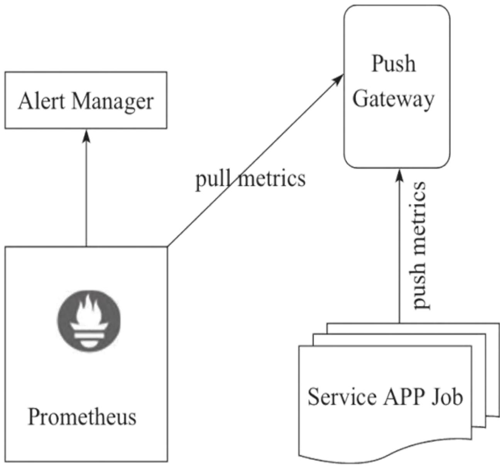
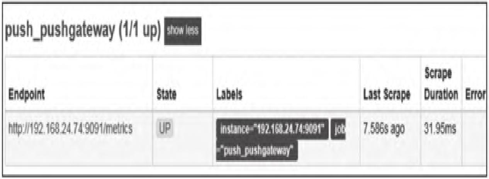
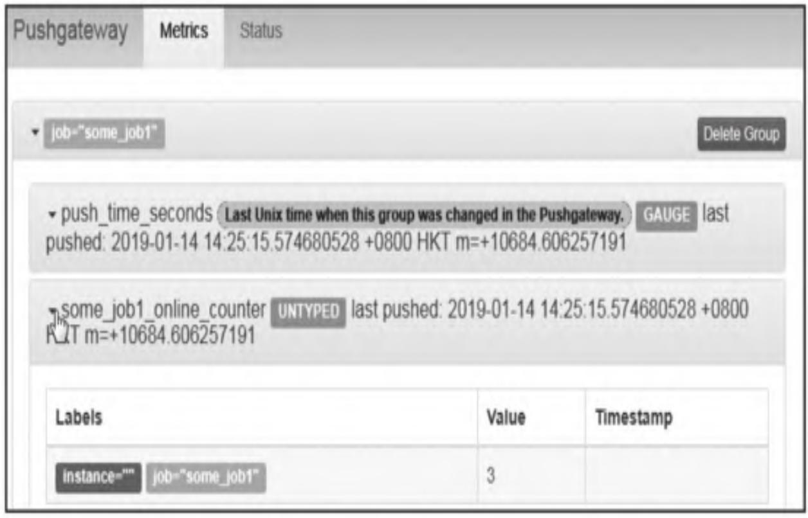
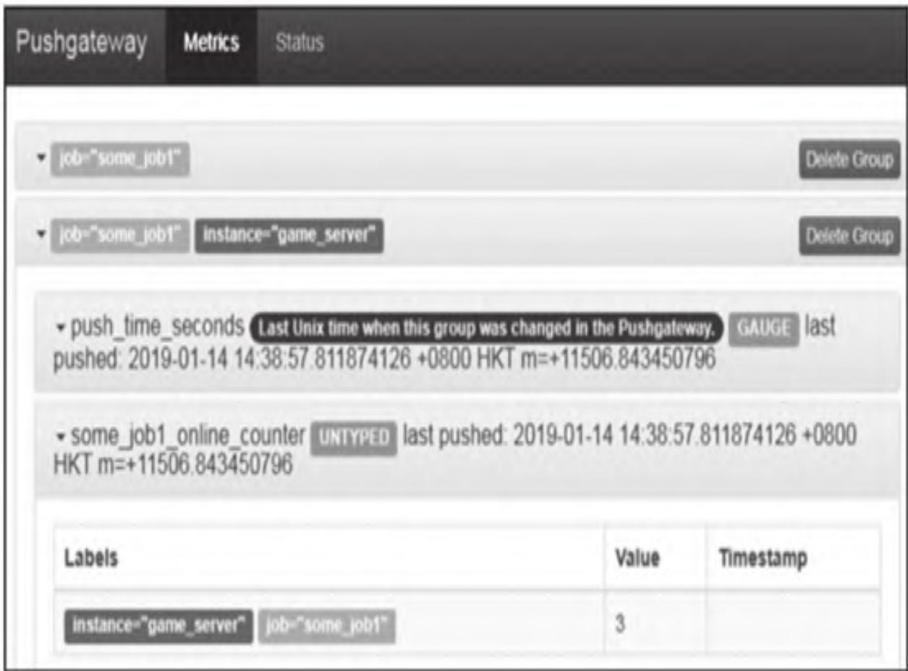
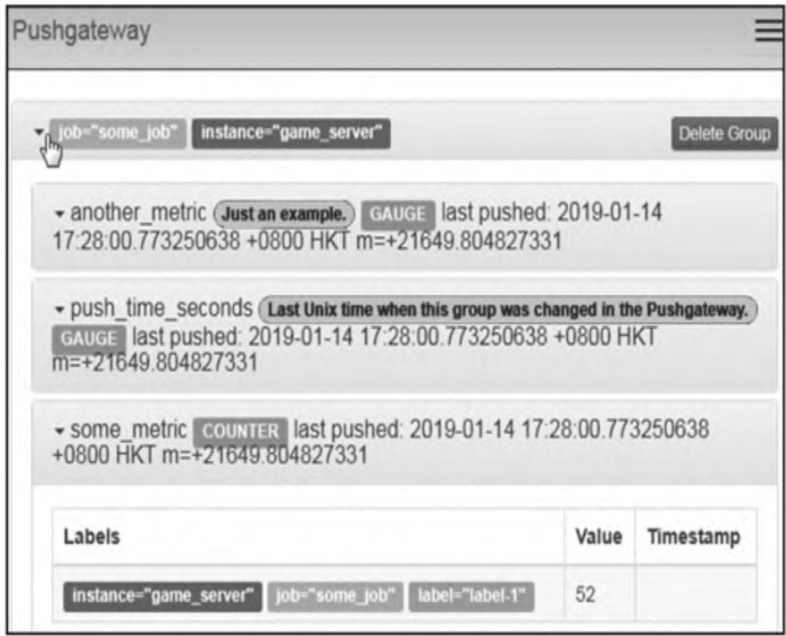
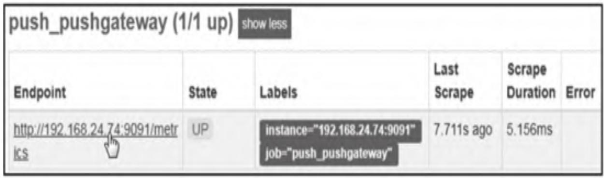
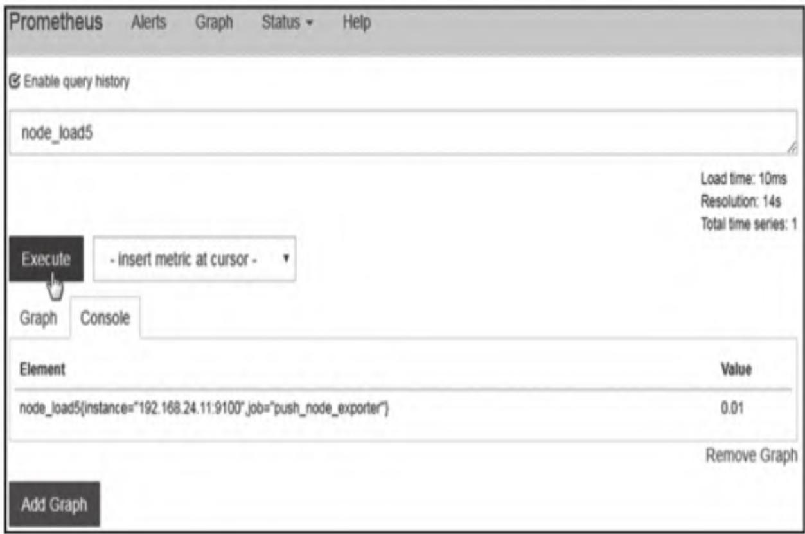

本文聚焦Prometheus生态中Pushgateway组件的核心原理与落地实操，针对短生命周期任务、网络隔离场景下的监控难题，从部署、集成、指标管理到完整推送监控架构落地，全方位拆解Pushgateway的使用方法，学完可独立完成Pushgateway的部署与全场景监控落地。

【本篇核心收获】

- 精准识别Pushgateway的适用场景，理解其设计初衷与官方使用建议
- 掌握Pushgateway二进制与Docker两种部署方式，熟悉核心启动参数配置
- 完成Pushgateway与Prometheus的集成配置，理解`honor_labels`参数的核心作用
- 熟练使用HTTP API向Pushgateway推送/删除监控指标，掌握完整的指标管理方法
- 落地基于Pushgateway的推送监控架构，解决内网节点、短生命周期任务的监控问题

## 1. 概述

Prometheus默认的pull模式能满足大多数常规监控场景，但面对网络隔离、短生命周期任务、无抓取端点的批处理作业等场景时，传统拉取方式无法有效采集指标。Pushgateway作为Prometheus生态的核心组件，专为解决这类推送式监控需求设计，是连接短生命周期/隔离服务与Prometheus的关键桥梁。

### 1.1 为什么需要Pushgateway

Prometheus默认采用**pull（拉取）** 模式采集指标，但以下场景中拉取模式无法生效：

- 网络限制：因安全策略或网络拓扑，Prometheus无法直接访问目标服务（如仅开放特定端口/路径）
- 生命周期过短：目标服务（如临时容器、批处理作业）运行时间极短，Prometheus还未完成拉取就已销毁
- 无抓取端点：批处理类作业无持续运行的HTTP服务，无法暴露可供抓取的指标端点

以上场景均需通过推送方式将指标传递给Prometheus，Pushgateway正是为此类场景设计的核心组件。

### 1.2 Pushgateway是什么

Pushgateway是独立的中间件服务，通过HTTP REST API接收监控指标，缓存后作为Prometheus的抓取目标，核心特性如下：

- 定位：指标缓存代理，非聚合器/分布式计数器，无statsd类语义
- 数据特性：推送的指标格式与pull模式抓取的指标完全一致
- 拓扑结构：位于指标发送端与Prometheus之间，接收推送后供Prometheus拉取



### 1.3 Pushgateway的使用限制与建议

官方仅建议在特定场景使用Pushgateway，严禁盲目替代pull模式，核心限制如下：

| 限制类型 | 具体问题 | 解决方案 |
|----------|----------|----------|
| 架构风险 | 单Pushgateway易出现单点故障、性能瓶颈 | 多实例部署（非核心场景不推荐） |
| 健康检查缺失 | Prometheus的UP指标仅检测Pushgateway状态，无法感知被监控实例健康 | 额外增加实例健康检测逻辑 |
| 过期数据残留 | Pushgateway持久化所有推送指标，服务下线后仍保留历史数据 | 定时清理过期指标 |

**官方建议**：

- 机器级指标优先使用Node Exporter的textfile收集器，而非Pushgateway
- Pushgateway仅用于监控短生命周期资源（如批处理作业）或网络隔离的资源
- 不适合作为事件存储，事件类监控需搭配专门的日志框架

**模块小结**：本模块明确了Pushgateway的定位、适用场景与核心限制，核心是仅在pull模式无法生效的场景下使用，避免架构风险与数据问题。

## 2. Pushgateway部署

Pushgateway基于Go语言开发，支持二进制与Docker两种部署方式，部署流程简单且无依赖。

### 2.1 二进制文件部署

#### 环境信息

- Linux操作系统：CentOS Linux release 7.5.1804 (Core) x86_64
- 主机IP：192.168.24.74
- Pushgateway版本：pushgateway-0.7.0.linux-amd64.tar.gz
- 下载地址：<https://prometheus.io/download/> 或 <https://github.com/prometheus/pushgateway/releases>

#### 安装步骤

1. 下载并校验软件包

```bash
sha256sum pushgateway-0.7.0-linux-amd64.tar.gz
# 核对结果与官网提供的SHA256 Checksum一致
```

2. 解压缩到指定目录

```bash
tar -zxf pushgateway-0.7.0-linux-amd64.tar.gz -C /data
cd /data
ln -sv pushgateway-0.7.0-linux-amd64 pushgateway
```

3. 启动Pushgateway

```bash
cd /data/pushgateway
./pushgateway
```

启动成功输出示例：

```txt
INFO[0000] starting pushgateway (version=0.7.0, branch=HEAD, revision=d5a56ba224c85c1cd27fb069a0f421ef150a9f00) source="main.go:68"
INFO[0000] Build context (go=gol.11.2, user=root@eb5396bf104d, date=20181208-00:11:15) source="main.go:69"
INFO[0000] Listening on :9091. source="main.go:108"
```

#### 核心启动参数

| 参数 | 作用 | 默认值 |
|------|------|--------|
| `--web.listen-address` | 修改监听端口 | :9091 |
| `--persistence.file` | 指定持久化文件路径（避免重启丢失数据） | 仅内存存储 |
| `--persistence.interval` | 设置持久化写入间隔 | 5分钟 |

启动后访问`http://192.168.24.74:9091`，可查看Pushgateway的Web界面：


### 2.2 Docker部署

使用官方镜像快速部署，无需手动配置环境：

```bash
docker pull prom/pushgateway
docker run -d -p 9091:9091 prom/pushgateway
```

**模块小结**：本模块完成了Pushgateway的两种部署方式，核心是二进制部署需注意校验与持久化配置，Docker部署更快捷，默认端口均为9091。

## 3. Pushgateway与Prometheus集成

要让Prometheus采集Pushgateway中的指标，需在Prometheus配置文件中添加对应的抓取任务，核心是配置`honor_labels`避免标签冲突。

### 3.1 配置Prometheus抓取任务

编辑Prometheus配置文件`prometheus.yml`，添加Pushgateway的抓取任务：

```yaml
scrape_configs:
- job_name: 'push_pushgateway'
  honor_labels: true          # 核心：避免覆盖原始job和instance标签
  static_configs:
  - targets: ['192.168.24.74:9091']
```

**关键参数说明**：

- `honor_labels: true`：默认情况下，Prometheus会为抓取目标附加`job`和`instance`标签，开启该参数后，会保留推送指标自带的`job/instance`标签，避免冲突覆盖。

### 3.2 生效配置

配置完成后，通过以下方式让配置生效：

1. 重启Prometheus服务（适用于无热加载的场景）
2. 热加载配置（推荐）：

```bash
curl -XPOST http://localhost:9090/-/reload
```

### 3.3 验证集成状态

访问Prometheus Web UI的Targets页面，可看到Pushgateway的状态为**UP**：



**模块小结**：本模块核心是完成Prometheus与Pushgateway的集成，关键配置为`honor_labels: true`，确保标签不冲突，配置生效后需验证Pushgateway的UP状态。

## 4. Pushgateway数据管理

Pushgateway的核心操作是指标的推送与删除，需掌握HTTP API的使用方式，确保指标准确推送且过期数据及时清理。

### 4.1 向Pushgateway发送监控指标

Pushgateway通过HTTP POST接口接收指标，支持单指标、带标签指标、带类型/帮助信息的完整指标推送，核心工具为`curl`。

#### 示例1：推送单个指标

```bash
echo "some_job1_online counter 3" | curl --data-binary @- http://localhost:9091/metrics/job/some_job1
```

- `--data-binary @-`：从标准输入读取数据作为POST请求体
- URL格式：`/metrics/job/<jobname>`，`some_job1`为`job`标签值
- 未指定指标类型时，Pushgateway会标记为`UNTYPED`（未指定类型）

推送成功后，在Pushgateway Web界面可看到`job="some_job1"`分组及对应指标：



#### 示例2：添加实例标签

通过URL路径追加`instance`标签，区分同一job下的不同实例：

```bash
echo "some_job1_online counter 3" | curl --data-binary @- http://localhost:9091/metrics/job/some_job1/instance/game_server
```

推送后Web界面会新增`instance="game_server"`的分组：



#### 示例3：推送带类型和帮助信息的指标

通过`# TYPE`指定指标类型，`# HELP`添加指标说明，确保指标元数据完整：

```bash
cat <<EOF | curl --data-binary @- http://localhost:9091/metrics/job/some_job/instance/game_server
# TYPE some_metric counter
some_metric{label="label-1"} 52
# TYPE another_metric gauge
# HELP another_metric Just an example.
another_metric 2019.113
EOF
```

推送后指标类型会正确显示为Counter/Gauge：



### 4.2 删除Pushgateway中的监控指标

Pushgateway不会自动清理过期指标，需手动通过API或Web界面删除，避免残留无效数据。

#### 方式1：API删除

- 删除整个job的所有指标：

```bash
curl -X DELETE localhost:9091/metrics/job/some_job1
```

- 删除特定job下某个实例的指标：

```bash
curl -X DELETE localhost:9091/metrics/job/some_job/instance/game_server
```

#### 方式2：Web界面删除

在Pushgateway Web界面中，点击对应Group右侧的「Delete Group」按钮，即可删除该分组的所有指标：


**注意事项**：

- 未指定`--persistence.file`时，指标仅存于内存，重启Pushgateway后数据丢失
- 指定持久化文件后，删除操作会同步清理持久化数据

**模块小结**：本模块掌握了Pushgateway指标的推送（单指标、带标签、带元数据）与删除（API/Web）方法，核心是确保指标格式正确且及时清理过期数据。

## 5. 基于推送的Prometheus监控实战

结合Node Exporter、Pushgateway与Prometheus，落地内网节点的推送式监控，解决节点端口保护、网络隔离的监控难题。

### 5.1 环境准备

| 角色 | 主机IP | 部署组件 | 核心作用 |
|------|--------|----------|----------|
| 被监控主机 | 192.168.24.11 | Node Exporter、转发器脚本 | 采集系统指标，推送至Pushgateway |
| Pushgateway服务 | 192.168.24.74 | Pushgateway | 缓存推送的指标，供Prometheus拉取 |
| Prometheus服务 | 192.168.24.17 | Prometheus | 从Pushgateway拉取指标，存储并展示 |

**前置要求**：

- 所有组件已部署并运行
- 被监控主机的Node Exporter端口（9100）仅对内开放，禁止外部直接访问

### 5.2 转发器脚本开发

核心功能：从Node Exporter拉取指标，推送到Pushgateway，脚本内容如下：

```bash
#!/bin/bash
# 转发器脚本：从node_exporter拉取指标并推送到Pushgateway

# 配置参数
EXPORTER_ADDR="192.168.24.11:9100"  # Node Exporter地址
PGW_ADDR="192.168.24.74:9091"       # Pushgateway地址
PGW_JOB="push_node_exporter"        # 推送的job名称
PGW_INSTANCE="192.168.24.11:9100"   # 推送的instance标签

# 检查Node Exporter是否存活
if curl -s -o /dev/null -w "%{http_code}" http://${EXPORTER_ADDR}/metrics | grep -q "200"; then
    # 拉取指标并推送至Pushgateway
    curl -s http://${EXPORTER_ADDR}/metrics | curl --data-binary @- http://${PGW_ADDR}/metrics/job/${PGW_JOB}/instance/${PGW_INSTANCE}
fi
```

### 5.3 计划任务配置

确保指标定时推送，保持Pushgateway中数据的时效性：

1. 保存脚本并添加执行权限：

```bash
mkdir -p /data/node_exporter
mv script.sh /data/node_exporter/cron.sh
chmod +x /data/node_exporter/cron.sh
```

2. 添加crontab定时任务：

```bash
echo "*/3 * * * * /data/node_exporter/cron.sh > /dev/null" >> /etc/crontab
```

- 执行频率：每3分钟一次，可根据监控精度调整
- 输出重定向：避免cron发送无用的邮件通知

### 5.4 效果验证

#### 步骤1：验证Prometheus与Pushgateway集成状态

访问Prometheus Targets页面，确认Pushgateway状态为UP：



#### 步骤2：手动执行转发器脚本

```bash
/data/node_exporter/cron.sh
```

#### 步骤3：验证Pushgateway指标推送结果

访问Pushgateway Web界面（`http://192.168.24.74:9091`），可看到新增`job="push_node_exporter"`分组：


#### 步骤4：验证Prometheus指标采集结果

在Prometheus Web UI中查询`node_load5`指标，可看到被监控主机的系统负载数据已成功采集：



**模块小结**：本模块落地了基于Pushgateway的推送监控架构，核心是通过转发器脚本+定时任务，将内网Node Exporter的指标推送至Pushgateway，解决了网络隔离场景下的监控难题。

## 【本篇核心知识点速记】

- **适用场景**：短生命周期任务（批处理）、无HTTP端点的服务、网络隔离无法直接拉取的场景
- **核心限制**：单点瓶颈、丢失UP健康检查、过期数据需手动清理，严禁替代pull模式
- **部署方式**：二进制（默认端口9091，支持`--persistence.file`持久化）、Docker（快速部署）
- **集成配置**：Prometheus需配置`honor_labels: true`避免标签冲突
- **指标管理**：推送（POST到`/metrics/job/<jobname>/instance/<instancename>`）、删除（DELETE API或Web界面）
- **实战架构**：Node Exporter + 转发器脚本 + Pushgateway + Prometheus，实现内网指标推送
- **官方建议**：仅用于特殊场景，优先使用pull模式；机器级指标优先用Node Exporter textfile收集器
