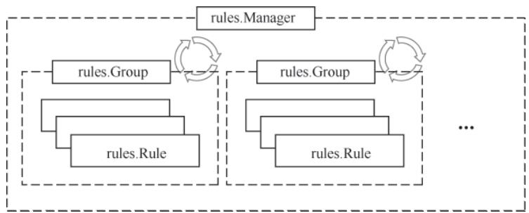
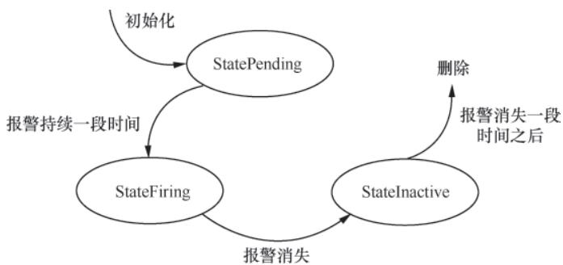
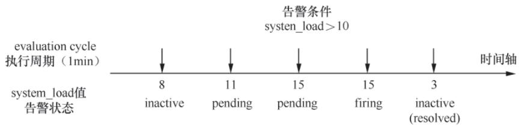

## 导语

Rule模块是Prometheus实现“自动化分析”的核心：Recording Rule（记录规则）预计算指标，Alerting Rule（告警规则）触发告警。在实际生产中，复杂的PromQL查询可能耗时过长，Recording Rule通过预计算将结果持久化为新时序，直接降低查询延迟；而Alerting Rule则替代人工巡检，基于PromQL阈值判断自动触发告警，是Prometheus“主动监控”的核心体现。

本文拆解Rule模块的加载、执行、告警发送全流程，从内存抽象到实际执行，理清每一步的技术逻辑。

## 一、核心组件

Rule模块的核心是对Recording Rule和Alerting Rule的内存抽象，以及规则管理器（Manager）—— 所有规则的加载、执行、生命周期管理均围绕这些核心结构体/接口展开。

### 1. 规则的基础抽象：rulefmt 结构体

Prometheus解析Rule配置文件时，首先将配置转换为`rulefmt.Rule`和`rulefmt.RuleGroup`实例（规则的“配置载体”）：

- `rulefmt.Rule`：对应单条规则，核心字段包括：
  - `Record`（记录规则名称）/`Alert`（告警规则名称，二选一）；
  - `Expr`（PromQL语句）；
  - `For`（告警持续时长，仅告警规则）；
  - `Labels`/`Annotations`（自定义标签/附加信息）。
- `rulefmt.RuleGroup`：对应规则组，核心字段包括：
  - `Name`（组名）；
  - `Interval`（执行周期，覆盖全局`evaluation_interval`）；
  - `Rules`（组内所有Rule实例）。

### 2. 运行时核心抽象：rules 包结构体/接口

配置文件解析完成后，Prometheus会将`rulefmt`实例转换为运行时的`rules.Group`和`rules.Rule`接口（包含`RecordingRule`和`AlertingRule`两个实现）：

- `rules.Group`：规则组的运行时实例，除包含名称、执行周期、规则列表外，还维护：
  - `evaluationDuration`（执行耗时）；
  - `seriesInPreviousEval`（上次执行的时序结果）；
  - `done/terminated`通道（用于优雅停止）等运行时状态。
- `rules.RecordingRule`：记录规则的运行时实例，核心字段包括：
  - `name`（新时序名称）；
  - `vector`（解析后的PromQL表达式）；
  - `labels`（要追加/覆盖的标签）；
  - `health`（执行健康状态）。
- `rules.AlertingRule`：告警规则的运行时实例，在记录规则基础上新增：
  - `holdDuration`（告警触发阈值时长）；
  - `active`（当前活跃告警集合）；
  - `annotations`（告警描述模板）。
  其中`active`集合的每个元素是`rules.Alert`实例，维护告警状态（`StatePending`/`StateFiring`/`StateInactive`）、触发时间、恢复时间等关键信息。

### 3. 规则管理器：rules.Manager

`rules.Manager`是Rule模块的“总控中心”，核心字段包括：

- `groups`（所有运行时规则组）；
- `mtx`（读写锁）；
- `block`（阻塞通道，等待Prometheus初始化完成）。
其核心职责是规则的加载、更新、启停管理。

## 二、Rule的加载与管理

Prometheus启动时会加载规则文件，将规则解析为内存对象，并监听规则文件变更以实现热重载，核心流程基于`Manager.Update()`方法展开。

### 1. 加载流程核心步骤

1. **解析配置文件**：调用`Manager.LoadGroups()`方法，遍历指定的Rule配置文件，先解析为`rulefmt.RuleGroup`/`rulefmt.Rule`，再转换为`rules.Group`/`rules.Rule`实例（记录规则创建`NewRecordingRule`，告警规则创建`NewAlertingRule`）。
2. **替换旧规则组**：遍历新解析的规则组，根据“组名+配置文件名”生成唯一Key，查找并停止旧的`rules.Group`实例（关闭`done`通道，等待`terminated`通道确认停止），同时复制旧实例的运行状态。
3. **启动新规则组**：为每个新规则组启动goroutine，监听`Manager.block`通道（Prometheus初始化完成后关闭）；通道关闭后调用`Group.run()`方法，开始周期性执行规则。
4. **清理无效规则组**：对未出现在新配置中的旧规则组执行停止操作，最终更新`Manager.groups`为新的规则组集合。

### 2. 关键代码逻辑

`Manager.Update()`方法通过goroutine和通道配合实现规则组的优雅启停与替换：

```go
func (m *Manager) Update(interval time.Duration, files []string) error {
    // 省略加锁/解锁逻辑
    groups, errs := m.LoadGroups(interval, files...) // 加载并解析Rule配置文件
    // 省略异常处理逻辑
    m.restored = true
    var wg sync.WaitGroup

    for _, newg := range groups {
        wg.Add(1)
        gn := groupKey(newg.name, newg.file)
        oldg, ok := m.groups[gn]
        delete(m.groups, gn)

        go func(newg *Group) {
            defer wg.Done() // 确保WaitGroup计数递减
            if ok {
                oldg.stop()        // 停止旧规则组
                newg.CopyState(oldg) // 复制旧实例运行状态
            }
            // 等待Prometheus初始化完成后启动规则组
            go func() {
                <-m.block
                newg.run(m.opts.Context) // 启动规则组周期执行
            }()
        }(newg)
    }

    // 清理未被新配置覆盖的旧规则组
    for _, oldg := range m.groups {
        oldg.stop()
    }

    wg.Wait()
    m.groups = groups
    return nil
}
```



**图8-1 Rule模块加载与管理结构**  

## 三、Recording Rule 执行流程

Recording Rule的核心目标是“预计算并持久化PromQL结果”：按配置间隔周期性执行PromQL计算，将结果写入TSDB，从而提升查询性能。核心执行逻辑分布在`Group.run()`和`RecordingRule.Eval()`方法中。

### 1. 规则组周期执行

`Group.run()`方法按`interval`指定的周期，循环调用`Group.Eval()`执行所有规则：

1. 计算首次执行时间，阻塞等待至执行时间点；
2. 调用`iter()`函数执行`Group.Eval()`，记录执行耗时、更新下次执行时间戳；
3. 通过`time.Ticker`实现周期触发，同时监控“慢规则”（若执行耗时超过周期，记录`iterationsMissed`指标）；
4. 若监听到`done`通道关闭（规则组停止），则退出循环并关闭`terminated`通道。

### 2. 单条记录规则执行

`Group.Eval()`遍历所有规则，调用`RecordingRule.Eval()`执行具体逻辑，步骤如下：

1. **执行PromQL**：通过`query`函数（基于PromQL引擎创建Instant Query）执行配置的PromQL语句，得到Instant vector结果；
2. **修改标签**：遍历查询结果中的每个时序，通过`labels.Builder`追加/覆盖配置的`labels`，并将新时序的名称设置为`RecordingRule.name`；
3. **写入TSDB**：获取TSDB的`Appender`，将修改后的时序数据写入存储；
4. **处理过期时序**：对比上次执行的时序结果（`seriesInPreviousEval`），若某条时序本次未出现，写入`StaleNaN`标识（标记为过期）；
5. **更新状态**：将规则健康状态设为`HealthGood`，记录执行耗时和下次执行时间。

### 3. 核心代码实现

```go
func (rule *RecordingRule) Eval(ctx context.Context, ts time.Time, query QueryFunc, _ *url.URL) (promql.Vector, error) {
    // 执行PromQL查询，获取Instant vector结果
    vector, err := query(ctx, rule.vector.String(), ts)
    if err != nil {
        rule.SetHealth(HealthBad)  // 标记规则执行异常
        rule.setLastError(err)
        return nil, err
    }

    // 遍历结果，为每个时序修改标签并设置新名称
    for i := range vector {
        sample := &vector[i]
        lb := labels.NewBuilder(sample.Metric)
        lb.Set(labels.MetricName, rule.name) // 设置新时序名称

        // 追加/覆盖配置的标签（空值标签直接删除）
        for _, l := range rule.labels {
            if l.Value == "" {
                lb.Del(l.Name)
            } else {
                lb.Set(l.Name, l.Value)
            }
        }
        sample.Metric = lb.Labels()
    }

    // 标记规则执行正常
    rule.SetHealth(HealthGood)
    rule.setLastError(nil)
    return vector, nil
}
```

## 四、Alerting Rule 执行流程

Alerting Rule的核心是“阈值判断+状态管理+告警发送”，流程比记录规则更复杂，核心分为“规则评估”和“告警发送”两部分。

### 1. 告警规则评估（AlertingRule.Eval()）

1. **执行PromQL**：同记录规则，执行配置的PromQL语句，得到符合告警条件的时序集合；
2. **模板渲染**：解析`Labels`和`Annotations`中的模板（基于时序标签和值），填充动态内容；
3. **告警状态管理**：
   - 新出现的时序：创建`rules.Alert`实例，初始状态为`StatePending`，记录`ActiveAt`（创建时间）；
   - 已存在的时序：更新`Value`和`Annotations`；若持续时长超过`holdDuration`，状态切换为`StateFiring`，记录`FiredAt`（触发时间）；
   - 消失的时序：状态切换为`StateInactive`，记录`ResolvedAt`（恢复时间）；若满足清理条件（未触发/恢复超过15分钟），从`active`集合中删除。
4. **生成监控时序**：将告警状态（`alertstate`标签）、告警名称（`alertname`标签）等信息生成为时序（`__name__`为`ALERTS`），写入TSDB供查询。



**图8-2 AlertState状态转换**  



**图8-3 2分钟holdDuration下的告警状态转换**  

### 2. 告警发送（AlertingRule.sendAlerts()）

规则评估完成后，调用`sendAlerts()`方法将告警发送到AlertManager，核心逻辑：

1. **筛选待发送告警**：仅发送`StateFiring`状态或“恢复后未发送”的告警，且需满足“最后发送时间+重发延迟（默认规则组周期）< 当前时间”；
2. **转换告警格式**：将`rules.Alert`转换为`notifier.Alert`，补充`StartsAt`（触发时间）、`EndsAt`（恢复时间/默认3个周期后）、`GeneratorURL`（跳转链接）等信息；
3. **批量发送**：通过`notifier.Manager`将告警写入队列，由`Manager.Run()`监听队列，批量序列化告警为JSON，通过HTTP POST请求发送到所有AlertManager实例。

### 3. Notifier模块发送逻辑

`notifier.Manager`采用“生产者-消费者”模式发送告警，保障高可用与容错：

- **生产者**：`Manager.Send()`将告警写入`queue`队列，通过`more`通道通知消费者；
- **消费者**：`Manager.Run()`监听`more`通道，批量取出队列中的告警；为每个AlertManager启动goroutine，调用`sendOne()`方法发送HTTP请求（Content-Type为JSON，检测响应码是否为2xx）；
- **容错处理**：若队列堆积超过阈值（默认10000），丢弃多余告警并记录`dropped`指标。

## 小结

Rule模块是Prometheus实现“主动监控”的关键：

- **Recording Rule**：通过预计算优化查询性能，尤其适合多维度聚合、复杂函数计算的PromQL；建议按“业务域+粒度”拆分规则组，避免单组规则过多导致执行延迟。
- **Alerting Rule**：通过状态管理和模板渲染实现精准告警；合理配置`For`时长可避免“抖动告警”，`Annotations`中补充清晰的告警描述和处理建议，能大幅提升故障排查效率。

Rule模块的热重载、优雅启停机制，保障了生产环境中规则变更的安全性。下一篇将介绍discovery模块，解析Prometheus动态发现采集目标的实现逻辑。
