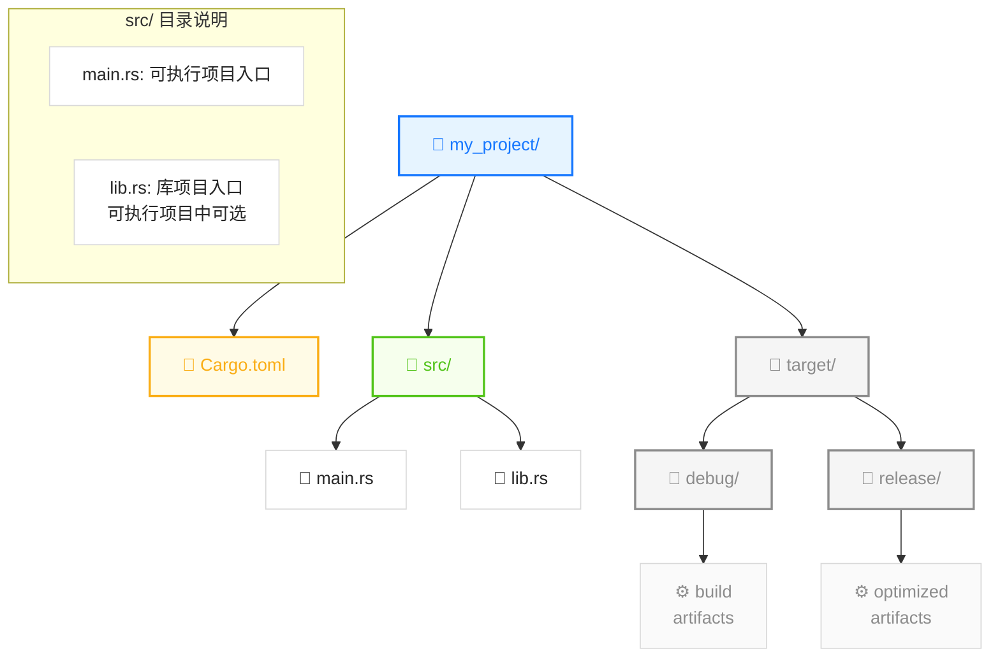
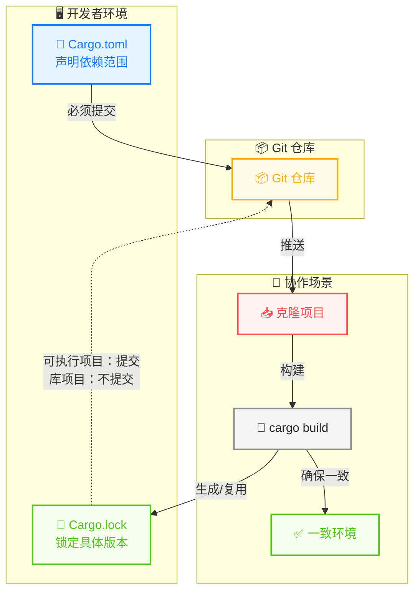
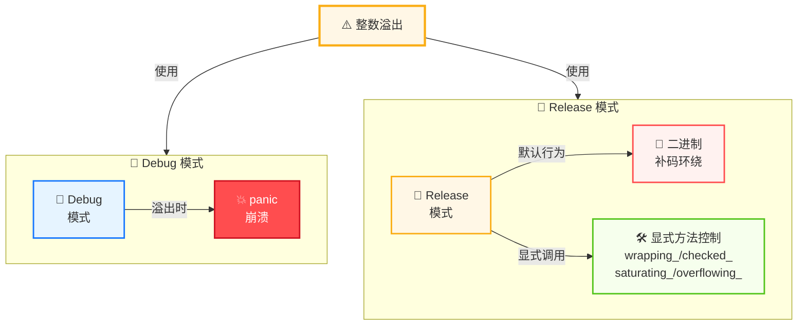

> **题记**：磨刀不误砍柴工。在写出第一行 Rust 代码之前，让我们先把这把"瑞士军刀"磨锋利。

## 写在开头

欢迎来到 Rust 世界。

如果你是从 C/C++ 转过来的老兵，你可能已经习惯了 Makefile 的依赖地狱；如果你是从 Java 过来的，XML 配置的 Maven 肯定让你头疼过；如果你是从 Node.js 过来的，那动辄几 GB 的 `node_modules` 肯定让你又爱又恨。

这些问题的根源在于：**没有统一的工具链**。每种语言都在重复发明轮子。

Rust 的答案是 **Cargo**——一个开箱即用的全家桶。构建、测试、文档、发布，全部在一个工具里搞定。而且它的设计哲学非常优雅：**约定优于配置**。你不需要写配置文件，只需要遵循它的目录结构，Cargo 就能猜到你想做什么。

这一天，我们分三步走：

1. 搭好 Rust 开发环境
2. 理解 Cargo 的设计哲学
3. 掌握基本数据类型

## 1. 环境搭建：你需要的一切

### 1.1 安装 Rust

Rust 的安装异常简单，一条命令走天下：

```bash
# Linux / macOS（macOS 也推荐用这个）
curl --proto '=https' --tlsv1.2 -sSf https://sh.rustup.rs | sh

# Windows 用户下载 rustup-init.exe 并运行
```

安装过程中会看到几个选项：

- **Default toolchain**: 选 `stable`（稳定版）
- **GitHub token**: 可以跳过
- **其他选项**: 保持默认即可

安装完成后，验证一下：

```bash
rustc --version    # 应该显示 rustc 1.75.0 或类似版本
cargo --version     # 应该显示 cargo 1.75.0 或类似版本
```

> **背后原理**：`rustup` 是 Rust 的版本管理工具。类比 Node.js 的 nvm 或 Python 的 pyenv。它可以让你同时安装多个 Rust 版本（stable/beta/nightly），并且随时切换。这对于测试新特性和兼容性非常有用。

**安装开发工具链组件**：

```bash
# 安装代码格式化工具
rustup component add rustfmt

# 安装代码检查工具
rustup component add clippy

# 安装语言服务器（IDE 支持）
rustup component add rust-analyzer
```

### 1.2 熟悉 Cargo

Cargo 是 Rust 的**构建工具和包管理器**二合一。让我通过类比来解释它的设计哲学：

| 功能 | Cargo | 类比 | 说明 |
|------|-------|------|------|
| 创建项目 | `cargo new` | `npm init` | 创建新项目 |
| 安装依赖 | `cargo add` | `npm install` | **需先安装 cargo-edit** |
| 构建项目 | `cargo build` | `make` / `npm build` | 编译项目 |
| 运行项目 | `cargo run` | `node index.js` | 构建并运行 |
| 运行测试 | `cargo test` | `npm test` | 运行测试用例 |
| 检查代码 | `cargo check` | - | 快速语法检查 |
| 代码格式化 | `cargo fmt` | `prettier` | 格式化代码 |
| 代码检查 | `cargo clippy` | `eslint` | 静态分析检查 |
| 生成文档 | `cargo doc` | `jsdoc` | 生成 API 文档 |
| 发布包 | `cargo publish` | `npm publish` | 发布到 crates.io |
| 安装二进制 | `cargo install` | `npm install -g` | 全局安装工具 |
| 搜索包 | `cargo search` | `npm search` | 搜索 crates.io |

**安装 cargo-edit 以使用 cargo add**：

```bash
cargo install cargo-edit
```

常用命令速查：

```bash
# 创建新项目（可执行文件）
cargo new my_project

# 创建库项目
cargo new --lib my_library

# 构建项目
cargo build

# 构建优化版本（Release 模式）
cargo build --release

# 构建并运行
cargo run

# 运行优化版本
cargo run --release

# 运行测试
cargo test

# 检查代码（比 build 快，适合 CI）
cargo check

# 格式化代码
cargo fmt

# 代码检查
cargo clippy

# 生成文档并在浏览器打开
cargo doc --open

# 发布到 crates.io
cargo publish
```

> **小技巧**：第一次 `cargo build` 会比较慢，因为需要编译所有依赖（Rust 标准库本身就需要编译）。之后的增量编译会快很多。如果你想生成优化过的二进制，用 `cargo build --release`（Release 模式）。

## 2. Cargo 项目结构：约定优于配置

### 2.1 标准结构

当你运行 `cargo new my_project` 后，会得到这样的目录结构：



**各部分说明**：

| 文件/目录 | 作用 |
|-----------|------|
| `Cargo.toml` | 项目清单，声明依赖和配置 |
| `Cargo.lock` | 锁定依赖版本（自动生成） |
| `src/main.rs` | 可执行文件的入口函数 |
| `src/lib.rs` | 库文件的入口函数（可执行项目可选，库项目必需） |
| `target/` | 编译产物目录（自动生成） |

### 2.2 Cargo.toml：你的项目配置

打开 `Cargo.toml`，你会看到这样的内容：

```toml
[package]
name = "my_project"           # 项目名（发布到 crates.io 时用）
version = "0.1.0"             # 语义化版本号
edition = "2021"              # Rust 版本（2021 是最新稳定版）
authors = ["Your Name <you@example.com>"]
description = "A brief description"
license = "MIT OR Apache-2.0"  # 开源许可证

[dependencies]                # 生产依赖（项目运行时需要）
serde = "1.0"                  # 序列化库（示例版本）
reqwest = { version = "0.12", features = ["json"] }  # HTTP 客户端（更新版本）

[dev-dependencies]            # 开发/测试依赖（仅测试时需要）
tempfile = "4.0"               # 临时文件库（更新版本）

[build-dependencies]          # 构建脚本依赖
quote = "1.0"                  # 宏生成库

[features]                    # 条件编译特性
default = ["feature1"]
feature1 = []
feature2 = []

[profile.release]              # Release 构建优化选项
lto = true                     # 链接时优化
codegen-units = 1              # 单 codegen 单元，利于优化
opt-level = 3                  # 优化级别
```

> **为什么要有 `[profile.release]`？** 因为 Debug 和 Release 模式适合不同的场景。Debug 模式编译快，适合开发；Release 模式编译慢，但运行快 2-10 倍，适合发布。

### 2.3 Cargo.lock vs Cargo.toml：版本锁定



- **Cargo.toml**：声明"我需要 serde 的 1.x 版本"，不限定具体版本
- **Cargo.lock**：记录"实际安装了 serde 1.0.152"，锁定每次构建一致

**提交策略**：

- **可执行项目（binary）**：提交 `Cargo.lock`，确保每次构建依赖版本一致
- **库项目（library）**：**不提交** `Cargo.lock`，让下游用户自由选择依赖版本

## 3. 基本类型：Rust 的数据类型

### 3.1 为什么 Rust 要有这么多类型？

在强类型语言中，类型的意义不仅是"存什么"，还有"占多少空间"和"怎么运算"。

考虑一个场景：你需要存储一个数字 42。

- 如果是游戏得分，42 永远不会是负数，用 `u32`（无符号32位）
- 如果是温度，可能是负数，用 `i32`（有符号32位）
- 如果是货币精确计算，用 `i128`（大整数避免精度丢失）
- 如果是科学计算，用 `f64`（双精度浮点）

**Rust 的类型命名规则非常直观**：

- `i` = 有符号（integer，可正可负）
- `u` = 无符号（unsigned，只能正）
- 数字 = 位数

### 3.2 整数类型一览

```rust
// 有符号整数（可正可负）
let a: i8 = -128;              // 8 位，范围 -128 ~ 127
let b: i16 = 32767;            // 16 位，范围 -32768 ~ 32767
let c: i32 = 2147483647;       // 32 位，范围 -2,147,483,648 ~ 2,147,483,647（最常用！）
let d: i64 = 9223372036854775807;  // 64 位
let e: isize = -1;             // 指针大小，取决于系统架构（32位系统=32位，64位系统=64位）

// 无符号整数（只能正）
let f: u8 = 255;               // 8 位，范围 0 ~ 255
let g: u16 = 65535;            // 16 位，范围 0 ~ 65535
let h: u32 = 4294967295;       // 32 位
let i: u64 = 18446744073709551615;  // 64 位
let j: usize = 1;              // 指针大小，用于数组索引和内存寻址
```

> **经验之谈**：大多数情况下用 `i32`（有符号32位）和 `u32`（无符号32位）就够了。`isize`/`usize` 主要用于数组索引和内存寻址（`vec.len()` 返回 `usize`）。在 64 位系统上 `isize`/`usize` 是 64 位，32 位系统上是 32 位。

### 3.3 浮点类型

浮点数是**近似值**，不是精确值。这点很容易被忽略，导致 bug。

```rust
let x: f32 = 3.14159;          // 32 位 IEEE 754 单精度（约 6-7 位十进制有效数字）
let y: f64 = 3.141592653589793;  // 64 位 IEEE 754 双精度（约 15-16 位十进制有效数字）

// 浮点运算的坑 - 注意字面量默认是 f64
let a: f64 = 0.1 + 0.2;
println!("{}", a);  // 输出 0.30000000000000004，不是 0.3！

// 明确指定 f32
let b: f32 = 0.1 + 0.2;
println!("{}", b);  // 输出 0.30000001
```

> **什么时候用 f32，什么时候用 f64？**
>
> - 图形/GPU 计算：用 `f32`（显卡对 f32 优化更好）
> - 科学计算、精密计算：用 `f64`
> - 默认情况：用 `f64`（Rust 浮点数字面量默认是 f64）

### 3.4 布尔和字符

```rust
let is_rust_awesome: bool = true;
let is_java_better: bool = false;

// char 是 4 字节 Unicode 标量值（UTF-32 编码）
let letter: char = 'A';        // ASCII 字母
let chinese: char = '中';      // 中文字符
let emoji: char = '💖';        // emoji 也是有效的 char

// 字符串字面量（字符串切片）
let greeting: &str = "Hello, Rust!";
```

> **重要区别**：Rust 的 `char` 是 4 字节（32位），可以表示任何 Unicode 标量值（U+0000 到 U+10FFFF，不包括代理对）。相比之下，C/C++ 的 `char` 只有 1 字节，只能表示 ASCII。这让 Rust 处理多语言文本更安全。

### 3.5 字符串类型：`String` 和 `&str`

Rust 有两种主要的字符串类型：

```rust
// &str：字符串切片，不可变引用，编译时常量或借用
let static_str: &str = "Hello";  // 编译时已知，存储在只读内存
let string_slice: &str = &my_string[0..5];  // 借用部分字符串

// String：堆分配的、可增长的字符串
let mut my_string = String::from("Hello");
my_string.push_str(", World!");
println!("{}", my_string);  // 输出 "Hello, World!"

// 转换
let s1: String = "hello".to_string();  // &str -> String
let s2: &str = &my_string;             // String -> &str（借用）
```

### 3.6 数组和元组

```rust
// 数组：固定大小，同类型元素
let numbers: [i32; 5] = [1, 2, 3, 4, 5];
let first = numbers[0];  // 访问元素
let len = numbers.len(); // 获取长度

// 元组：固定大小，可不同类型
let person: (&str, i32, bool) = ("Alice", 30, true);
let (name, age, is_student) = person;  // 解构
let name = person.0;  // 索引访问（从0开始）
```

### 3.7 单元类型 `()`

这是 Rust 特有的类型，它有两个含义：

- "无返回值的函数"的隐式返回类型（用于函数签名）
- 表示"空"或"无意义"的值（用于占位）

```rust
// 没有显式返回类型的函数，隐式返回 ()
fn greet(name: &str) {
    println!("Hello, {}!", name);
    // 隐式返回 ()
}

// main 函数默认返回 ()
fn main() {
    let result: () = greet("world");
    println!("Result: {:?}", result);  // 输出 "Result: ()"
}
```

### 3.8 类型转换：必须显式

Rust 追求**安全**，不允许隐式类型转换（除非是安全的情况下）。这和 C++ 的隐式转换不同，但能避免很多 bug。

```rust
let a: i32 = 42;
let b: f64 = a as f64;    // 必须用 `as` 显式转换
let c: u8 = b as u8;      // f64 -> u8 会截断小数（42.9 变成 42）

// 安全转换：TryFrom/TryInto（可能失败）
use std::convert::TryFrom;
let large: i32 = 1000;
let small: Result<u8, _> = u8::try_from(large);  // 返回 Result（可能失败）
```

> **为什么 Rust 要这样设计？** 因为隐式类型转换是 bug 的温床。比如 C++ 中 `int x = 1.5;` 会悄悄丢失精度，编译器只给警告。Rust 直接让这种代码无法编译，强迫你思考是否真的要截断。

### 3.9 调试输出

```rust
let x = 42;
let y = 3.14;
let name = "Alice";

// 基本打印
println!("x = {}, y = {}, name = {}", x, y, name);

// 调试打印（自动派生 Debug trait）
#[derive(Debug)]
struct Point {
    x: i32,
    y: i32,
}

let point = Point { x: 10, y: 20 };
println!("{:?}", point);  // 输出 "Point { x: 10, y: 20 }"
println!("{:#?}", point); // 美化输出

// dbg! 宏（输出表达式值和位置）
let result = dbg!(x * 2);  // 输出 "[src/main.rs:10] x * 2 = 84"
```

## 4. 整数溢出：一个重要的陷阱

> **重点**：Rust 对整数溢出的处理方式和你熟悉的语言不同！

### 4.1 Debug 和 Release 模式的不同行为



在 **Debug 模式**下，Rust 会检查整数溢出，发现时 `panic`（崩溃）。

在 **Release 模式**下，Rust 假设你知道自己在做什么，使用**二进制补码环绕**（`255 + 1 = 0`，`256u8 as i8 = 0`）。

### 4.2 为什么会这样设计？

这其实是 Rust 的实用主义：

- Debug 模式用于开发，发现 bug 就崩溃，让你尽早修复
- Release 模式用于发布，追求性能，不做额外检查

### 4.3 如果你确实需要特定行为

Rust 提供了四种处理方式：

```rust
let x: u8 = 255;

// wrapping_：环绕
assert_eq!(x.wrapping_add(1), 0);       // 255 + 1 = 0
assert_eq!(x.wrapping_sub(1), 254);    // 255 - 1 = 254

// checked_：溢出返回 None
assert_eq!(x.checked_add(1), None);     // 返回 None
assert_eq!(x.checked_sub(1), Some(254)); // 返回 Some(254)

// saturating_：饱和（最大/最小值）
assert_eq!(x.saturating_add(1), 255);  // 保持在最大值
assert_eq!(x.saturating_sub(1), 254);  // 正常减法

// overflowing_：返回结果和溢出标志
let (result, overflowed) = x.overflowing_add(1);
assert_eq!(result, 0);                 // 环绕结果
assert!(overflowed);                   // 溢出标志为 true
```

> **经验之谈**：大多数情况下，Debug 模式的检查已经够用。只有在明确知道会有溢出的场景（比如密码学算法、环形缓冲区索引），才需要用这些方法。

## 5. 变量与可变性：默认 immutable

### 5.1 为什么默认不可变？

这是 Rust 的设计选择：**不可变更安全，更容易推理**。

```rust
let x = 5;
x = 6;  // 编译错误！x 不可变

let mut y = 5;
y = 6;  // 正确，y 是可变的
```

> **类比**：想象你把一张便利贴贴在桌子上，上面写着"x = 5"。如果你不做特殊标记，别人不能随便改这张便利贴。但如果你说"这张便利贴可以改"，就可以擦掉重写。`mut` 就是那个"可以改"的标记。

### 5.2 为什么要这样设计？

考虑这段代码：

```rust
let data = vec![1, 2, 3];

// 某处调用
process(data);

// 你能确定 data 现在是什么吗？
```

如果是不可变的，你可以确定 `data` 在调用前后都是 `[1, 2, 3]`。如果是可变的，你必须去读 `process` 的实现才能确定。

**不可变性让代码更容易推理，减少 bug**。

## 6. 常量 vs 不可变变量

Rust 有两种"不变"：

| 特性 | `let`（不可变变量） | `const`（常量） |
|------|-------|---------|
| 求值时机 | 运行时 | 编译时 |
| 可用于常量表达式 | 否 | 是 |
| 可变性 | 需加 `mut` | 不可变（天生） |
| 作用域 | 块级 | 块级（通常放在模块顶部） |
| 性能 | 运行时访存 | 编译时内联 |
| 类型注解 | 可省略（类型推断） | 必须显式 |

```rust
let x = 5;              // 不可变变量（声明后不可修改）
const MAX_SIZE: u32 = 100;  // 编译时常量，编译时求值

// 常量表达式
const TWO: u32 = 1 + 1;           // 允许
const ARRAY_SIZE: usize = TWO as usize;  // 允许类型转换

// 错误示例
// let y = 5; const DOUBLE_Y: u32 = y * 2;  // 编译错误：y 不是常量
```

> **什么时候用 const？** 当你需要**在编译时就确定的值**时。比如数组大小、配置常量、数学常数等。const 值在编译时求值并内联到使用位置，没有运行时开销。

## 写在结尾

今天我们学习了：

1. **Rust 环境安装**：`rustup` 是版本管理工具，`rustup component add` 安装工具链组件
2. **Cargo 工具链**：构建、测试、发布一站式，包含 `cargo fmt`、`cargo clippy` 等代码质量工具
3. **基本类型**：整数、浮点、布尔、字符、字符串、数组、元组、单元类型
4. **类型转换**：显式 `as` 转换和安全 `TryFrom`/`TryInto`
5. **整数溢出**：Debug 和 Release 模式行为不同，提供 wrapping/checked/saturating/overflowing 方法
6. **变量默认不可变**：安全的设计选择，需 `mut` 关键字声明可变
7. **常量 vs 变量**：const 编译时常量，let 运行时变量

**明天预告**：函数、控制流、模式匹配、错误处理——你会发现 Rust 的错误处理和异常完全不同。

> **思考题**：Rust 选择默认不可变变量，和函数式编程语言（如 Haskell）的设计理念有相似之处。你认为这种设计对代码质量有什么影响？在什么场景下你会选择使用可变变量（`mut`）？
