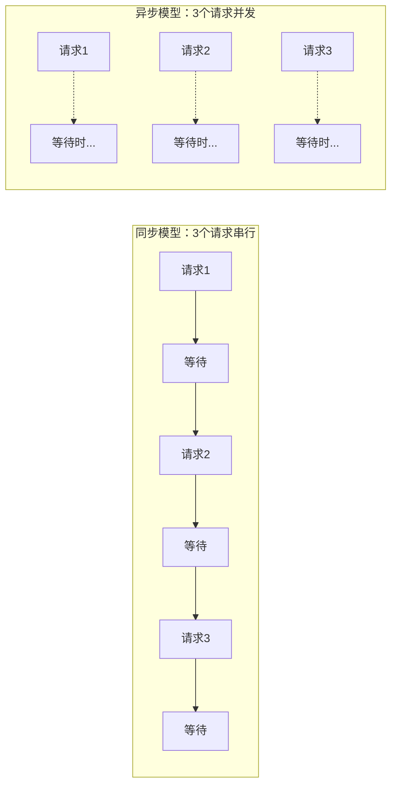
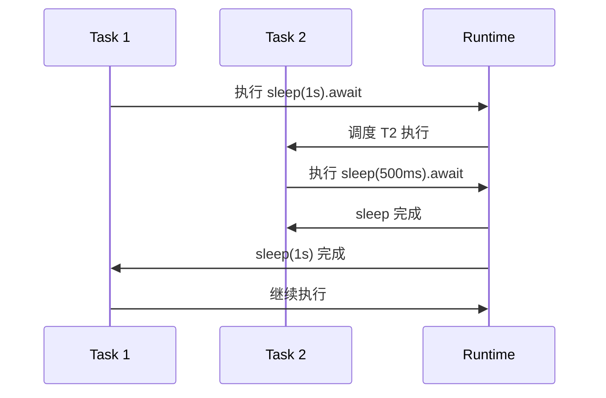
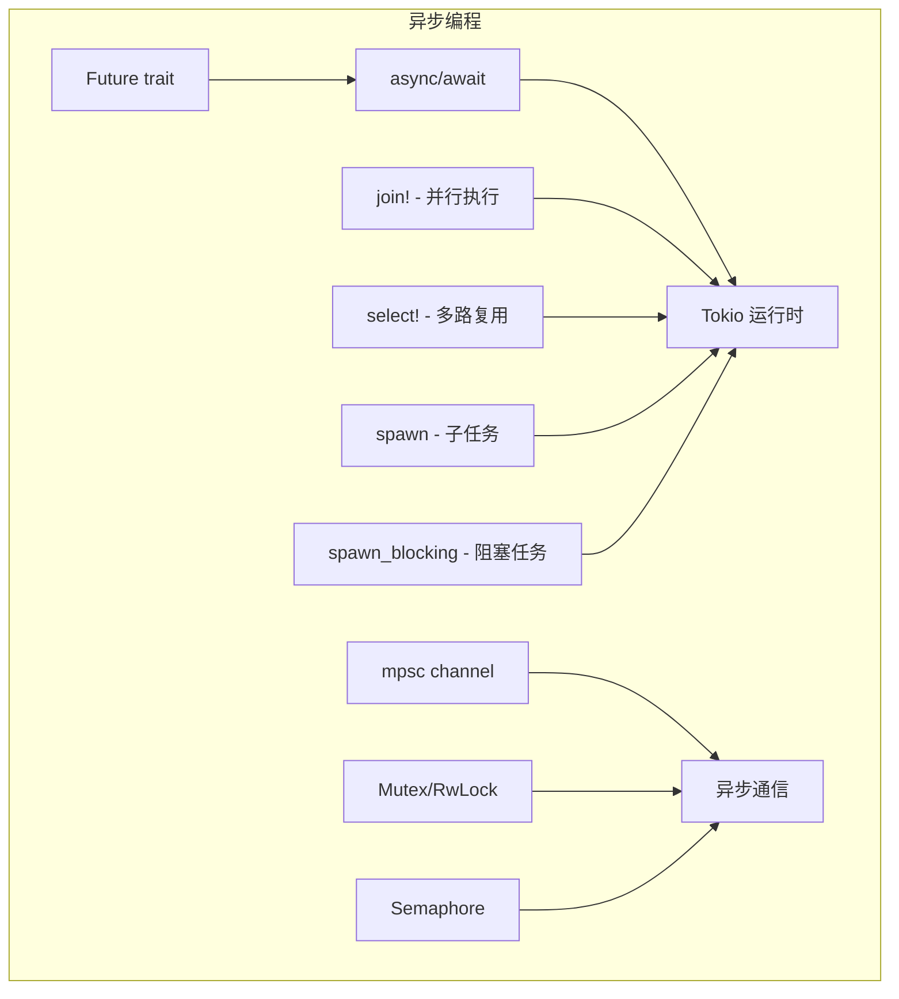

> **题记**：同步代码是排队等候，异步代码是领号后去喝咖啡。Rust 选择让异步代码看起来像同步代码。

## 写在开头

今天我们将进入 Rust 异步编程的世界。在 Day 9 中，我们学习了多线程并发——通过创建多个线程来并行执行任务。但线程有开销：每个线程占用约 1MB 栈空间（默认配置），创建和切换也有成本。

**异步编程**提供了另一种选择：使用更轻量的"任务"（Task）代替线程，同一个线程可以运行多个任务。任务在等待 I/O（如网络请求、文件读写）时会主动让出控制权，让其他任务继续执行。

Rust 的异步模型有如下特点：

- **语法**：`async`/`await` 关键字，让异步代码看起来像同步代码
- **运行时**：不在标准库中，通过外部 crate 提供（Tokio、async-std）
- **执行模型**：编译成状态机，不是系统线程
- **内存安全**：通过 `Pin` 机制保证 Future 不被非法移动

## 1. 异步编程基础

### 1.1 为什么需要异步？

想象你去咖啡店点单：

- **同步方式**：你站在柜台前等咖啡做好，期间什么事都做不了
- **异步方式**：你领了号，找个位置坐下看书，咖啡好了叫你

这就是异步的核心思想——**等待时不阻塞**，可以处理其他任务。

**实际场景对比**：



假设每个请求需要 100ms（大部分是网络等待）：

- 同步串行：300ms 总时间
- 异步并发：~100ms 总时间（理想情况）

### 1.2 Future：异步的核心

`Future`（未来值）是 Rust 异步的核心概念。它代表一个**可能还没完成的计算**。

```rust
// Future trait 的简化定义
trait Future {
    type Output;  // 最终产生的值
    
    // poll 方法询问 Future 是否完成
    // 注意：Context<'_> 包含唤醒器（Waker），用于通知运行时任务可继续
    fn poll(self: Pin<&mut Self>, cx: &mut Context<'_>) -> Poll<Self::Output>;
}

// Poll 是枚举，表示两种状态
enum Poll<T> {
    Ready(T),   // 已完成，产出值 T
    Pending,   // 还未完成，需要继续等待
}
```

**直观理解**：Future 就像一张欠条——承诺最终会给你一个值，但可能需要等待。Future 通过 `Pin` 保证内存位置固定，这是实现自引用结构体的关键。

### 1.3 async/await 语法

`async`/`await` 是 Future 的语法糖，让异步代码写起来像同步代码：

```rust
// async fn 创建的函数返回一个 impl Future
async fn fetch_data() -> String {
    String::from("data")
}

// async 块
async fn example() {
    // await 调用 Future，阻塞直到完成
    let result = fetch_data().await;
    println!("{}", result);
}
```

**编译原理**：`async fn` 会被编译成一个状态机，每个 `.await` 点是一个状态。编译器自动处理 `Pin` 和状态保存。

### 1.4 async vs 多线程：怎么选？

| 场景 | 推荐方案 | 原因 |
|------|----------|------|
| I/O 密集（网络请求、文件读写） | async | 等待时可以让出线程 |
| CPU 密集（计算密集） | 多线程 或 `spawn_blocking` | 需要真正并行计算 |
| 简单并发 | 多线程 | 编程模型更简单 |
| 高并发（数万连接） | async | 线程开销太大 |

## 2. Tokio 运行时

### 2.1 为什么需要运行时？

Rust 的 async/await 只是语法，**真正执行异步代码需要运行时**（Runtime）。标准库不包含运行时，需要通过外部 crate 提供。

最流行的运行时是 **Tokio**——一个高性能的异步运行时。

### 2.2 添加 Tokio 依赖

```toml
[dependencies]
tokio = { version = "1", features = ["full"] }
# features = ["full"] 包含所有常用功能
# 生产环境可用 ["rt-multi-thread", "macros", "net", "time", "fs"] 等按需选择以减少二进制大小
```

### 2.3 #[tokio::main]

`#[tokio::main]` 是便捷宏，将 async main 函数转换为阻塞的 main：

```rust
#[tokio::main]  // 相当于生成一个阻塞的 main，await 所有 async 代码
async fn main() {
    println!("Hello from async!");
}
```

**它展开后的本质**：

```rust
fn main() {
    let runtime = tokio::runtime::Runtime::new().unwrap();
    runtime.block_on(async {
        println!("Hello from async!");
    });
}
```

### 2.4 async 块

`async {}` 块创建一个临时的 Future：

```rust
#[tokio::main]
async fn main() {
    // async 块：创建一个 Future
    let future = async {
        println!("Inside async block");
        42
    };
    
    // await 执行 Future
    let result = future.await;
    println!("Result: {}", result);
}
```

## 3. await 的工作原理

### 3.1 await 暂停执行

当代码执行到 `.await` 时，如果 Future 还没完成，当前的任务会**暂停**，让出控制权给其他任务：

```rust
use tokio::time::{sleep, Duration};

#[tokio::main]
async fn main() {
    println!("Before await");
    
    // sleep 是一个 Future，await 会等待 1 秒
    // 这 1 秒期间，其他任务可以执行
    sleep(Duration::from_secs(1)).await;
    
    println!("After await (1 second later)");
}
```

**注意**：`tokio::time::sleep` 是异步睡眠，不会阻塞线程；而 `std::thread::sleep` 会阻塞整个线程，导致该线程上的所有任务都无法执行。

**时序图**：



### 3.2 并行执行（join!）

`tokio::join!` 宏让多个 Future 并行执行：

```rust
use tokio::time::{sleep, Duration};

#[tokio::main]
async fn main() {
    let start = std::time::Instant::now();
    
    // 两个任务真正并行执行
    // 如果串行，总时间是 1s + 2s = 3s
    // 并行只需要 max(1s, 2s) = 2s
    let (r1, r2) = tokio::join!(
        async {
            sleep(Duration::from_secs(1)).await;
            "one"
        },
        async {
            sleep(Duration::from_secs(2)).await;
            "two"
        }
    );
    
    println!("Both completed in {:?}", start.elapsed());  // ~2s
    println!("Results: {}, {}", r1, r2);
}
```

### 3.3 try_join! 处理错误

如果 Future 返回 `Result`，用 `try_join!` 可以同时处理多个错误：

```rust
async fn task1() -> Result<&'static str, &'static str> {
    Ok("task1 success")
}

async fn task2() -> Result<&'static str, &'static str> {
    Err("task2 failed")  // task2 失败
}

#[tokio::main]
async fn main() {
    let result = tokio::try_join!(task1(), task2());
    
    match result {
        Ok((r1, r2)) => println!("Both succeeded: {}, {}", r1, r2),
        Err(e) => println!("At least one failed: {}", e),
        // 输出: At least one failed: task2 failed
    }
}
```

**注意**：async 函数中可以使用 `?` 运算符传播错误：

```rust
async fn fetch_data() -> Result<String, reqwest::Error> {
    let resp = reqwest::get("https://example.com").await?;
    let text = resp.text().await?;
    Ok(text)
}
```

### 3.4 select! 多路复用

`tokio::select!` 宏可以同时等待多个 Future，**谁先完成就处理谁**：

```rust
use tokio::time::{sleep, Duration};

#[tokio::main]
async fn main() {
    tokio::select! {
        result = async {
            sleep(Duration::from_millis(100)).await;
            "fast"
        } => {
            println!("Completed: {}", result);
        }
        
        result = async {
            sleep(Duration::from_secs(1)).await;
            "slow"
        } => {
            println!("Completed: {}", result);
        }
    }
    // 输出: Completed: fast (100ms 后)
}
```

## 4. Spawn 子任务

### 4.1 tokio::spawn

`spawn` 创建新的异步任务（不是线程，开销小得多）：

```rust
#[tokio::main]
async fn main() {
    // spawn 返回 JoinHandle，可以等待任务完成
    let handle = tokio::spawn(async {
        42
    });
    
    let result = handle.await.unwrap();
    println!("Spawned result: {}", result);
}
```

### 4.2 在 spawn 中捕获变量

和线程一样，如果闭包需要捕获环境变量，需要 `move`：

```rust
#[tokio::main]
async fn main() {
    let data = vec![1, 2, 3];
    
    // 需要 move 关键字
    let handle = tokio::spawn(async move {
        println!("Data: {:?}", data);
        // data 移动进 async 块
    });
    
    handle.await.unwrap();
}
```

### 4.3 spawn_blocking 处理 CPU 密集型任务

对于可能阻塞线程的 CPU 密集型任务，使用 `tokio::task::spawn_blocking`：

```rust
#[tokio::main]
async fn main() {
    let result = tokio::task::spawn_blocking(|| {
        // 这里是 CPU 密集型计算
        let mut sum = 0;
        for i in 0..1000000 {
            sum += i;
        }
        sum
    }).await.unwrap();
    
    println!("Result: {}", result);
}
```

`spawn_blocking` 会将任务放到专门的阻塞线程池中执行，避免阻塞运行时的工作线程。

## 5. Channel 异步通信

### 5.1 tokio::sync::mpsc

Tokio 提供了异步版本的 channel：

```rust
use tokio::sync::mpsc;

#[tokio::main]
async fn main() {
    // 创建 channel，容量 32
    let (tx, mut rx) = mpsc::channel(32);
    
    // 生产者
    tokio::spawn(async move {
        tx.send("hello").await.unwrap();
    });
    
    // 消费者
    if let Some(msg) = rx.recv().await {
        println!("Received: {}", msg);
    }
}
```

### 5.2 broadcast 广播

`broadcast` channel 允许多个接收者收到同一消息：

```rust
use tokio::sync::broadcast;
use tokio::time::{sleep, Duration};

#[tokio::main]
async fn main() {
    let (tx, mut rx1) = broadcast::channel(16);
    let mut rx2 = tx.subscribe();  // 创建另一个订阅者
    
    // 发送者
    tokio::spawn(async move {
        tx.send("broadcast").unwrap();
    });
    
    // 两个 receiver 都能收到
    let handle1 = tokio::spawn(async move {
        println!("rx1: {:?}", rx1.recv().await);
    });
    
    let handle2 = tokio::spawn(async move {
        println!("rx2: {:?}", rx2.recv().await);
    });
    
    // 等待两个任务完成
    let _ = tokio::join!(handle1, handle2);
}
```

## 6. Mutex 异步锁

### 6.1 tokio::sync::Mutex

`tokio::sync::Mutex` 是异步版本的互斥锁：

```rust
use tokio::sync::Mutex;

#[tokio::main]
async fn main() {
    let data = Mutex::new(vec![1, 2, 3]);
    
    {
        // lock().await 获取锁（异步阻塞）
        let mut guard = data.lock().await;
        guard.push(4);
    }
    
    println!("{:?}", *data.lock().await);
}
```

### 6.2 tokio::sync::RwLock

读写锁在异步环境中同样适用：

```rust
use tokio::sync::RwLock;

#[tokio::main]
async fn main() {
    let data = RwLock::new(vec![1, 2, 3]);
    
    // 读（多个可以同时持有读锁）
    {
        let read = data.read().await;
        println!("Read: {:?}", *read);
    }
    
    // 写（独占）
    {
        let mut write = data.write().await;
        write.push(4);
    }
}
```

## 7. 常用异步工具

### 7.1 Semaphore 信号量

`tokio::sync::Semaphore` 用于限制并发数：

```rust
use tokio::sync::Semaphore;
use tokio::time::{sleep, Duration};

#[tokio::main]
async fn main() {
    let semaphore = Semaphore::new(3);  // 最多 3 个并发
    
    for i in 0..10 {
        let permit = semaphore.acquire().await.unwrap();
        
        tokio::spawn(async move {
            println!("Task {} started", i);
            sleep(Duration::from_millis(500)).await;
            println!("Task {} finished", i);
            drop(permit);  // 释放信号量许可
        });
    }
    
    sleep(Duration::from_secs(2)).await;  // 等待所有任务完成
}
```

### 7.2 异步 I/O

Tokio 提供了异步版本的 I/O 操作：

```rust
use tokio::fs;
use tokio::io::AsyncWriteExt;

#[tokio::main]
async fn main() -> Result<(), Box<dyn std::error::Error>> {
    // 异步读取文件
    let content = fs::read_to_string("Cargo.toml").await?;
    println!("File length: {}", content.len());
    
    // 异步写入文件
    let mut file = fs::File::create("test.txt").await?;
    file.write_all(b"Hello, async!").await?;
    
    Ok(())
}
```

## 8. 与其他语言的对比

### 8.1 Rust async vs JavaScript async/await

| 特性 | JavaScript | Rust |
|------|-------------|------|
| 语法 | async/await | async/await |
| 运行时 | 引擎内置 | 外部库（Tokio） |
| 并发模型 | 事件循环 | 多线程事件循环 |
| Promise | 等价于 Future | Future |
| 错误处理 | try/catch | Result |

### 8.2 Rust async vs Go goroutine

| 特性 | Go | Rust |
|------|-----|------|
| 语法 | goroutine + channel | async/await + mpsc |
| 调度 | 运行时调度 | 运行时调度 |
| 轻量级 | goroutine（KB 级栈） | Task（更轻量） |
| 性能 | 高 | 极高 |
| 内存安全 | 有 GC | 无 GC，所有权系统 |

## 9. 苏格拉底式自问自答

### 关于 Future

> **问**：Future 和线程有什么区别？

**答**：Future 是**协作式**的轻量级任务。当 Future 等待（如 I/O）时，它主动让出控制权，让其他 Future 运行。线程是**抢占式**的，由操作系统调度。创建 1000 个 Future 比创建 1000 个线程轻量得多。

> **问**：为什么 Rust 的 async 不在标准库？

**答**：不同的异步运行时有不同的特性和权衡。Tokio 最流行但较大，async-std 更轻量，smol 更小巧。Rust 把选择权交给用户。

### 关于 Tokio

> **问**：tokio::spawn 和 std::thread::spawn 区别？

**答**：`tokio::spawn` 创建的是**异步任务**，在 Tokio 运行时内调度，开销小；`std::thread::spawn` 创建的是**系统线程**，由 OS 调度，开销大。

> **问**：一个 tokio::spawn 的任务会阻塞其他任务吗？

**答**：如果是**异步阻塞**（如 `tokio::fs::File::read`），不会；但如果是**同步阻塞**（如 `std::thread::sleep`），会阻塞整个线程，导致该线程上的任务都无法执行。对于 CPU 密集任务，考虑用 `tokio::task::spawn_blocking`。

> **问**：如何限制异步任务的并发数？

**答**：使用 `tokio::sync::Semaphore` 信号量。创建指定许可数的信号量，每个任务在执行前需要获取许可，执行完成后释放许可。

## 10. 总结



**关键要点**：

1. **Future** 是异步核心，代表可能未完成的计算，通过 `Pin` 保证内存安全
2. **async/await** 是语法糖，让异步代码像同步一样易读
3. **Tokio** 是最流行的异步运行时，提供完整的异步生态
4. **await** 时任务让出控制权，实现高并发
5. **join!** 并行等待多个 Future，**select!** 谁先完成处理谁
6. **spawn** 创建轻量级异步任务，**spawn_blocking** 处理 CPU 密集型任务
7. **Semaphore** 用于限制并发数，解决思考题中的爬虫并发限制问题

> **思考题答案**：设计一个异步爬虫程序，使用 Tokio 并发抓取多个网页。为了避免对目标服务器造成过大压力，需要限制并发数为 10。可以使用 `tokio::sync::Semaphore` 信号量，创建 10 个许可，每个爬虫任务在执行前需要获取许可，执行完成后释放许可。

**扩展学习**：

- `Stream` trait：处理异步数据流（如 WebSocket、文件逐行读取）
- `async-trait` crate：在 trait 中定义异步方法
- `tokio::net`：异步网络编程（TCP/UDP）
- `tokio::signal`：处理系统信号
- `tower` 和 `hyper`：构建异步 HTTP 服务
