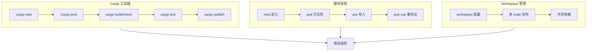

> **题记**：代码不是写出来的，是组织出来的。Cargo 是 Rust 的构建工具和包管理器，模块系统是代码的命名空间。

## 写在开头

今天是相对轻松的一天——我们将学习 Rust 的工程化管理工具 **Cargo** 和组织代码的 **模块系统**。这两个工具虽然不像所有权系统那样"硬核"，但对于编写大型项目和理解开源代码至关重要。

在前面的学习中，我们主要使用 `rustc` 直接编译单个文件。但真实项目有几十、几百个文件，需要工具来管理依赖、编译、测试和发布。Cargo 就是这个工具。

## 1. Cargo 基础

### 1.1 什么是 Cargo？

Cargo 是 Rust 的**包管理器**和**构建工具**：

- **包管理**：下载、编译、管理依赖
- **构建**：编译项目，运行测试
- **模板**：快速创建新项目

Cargo 随 Rust 1.0 于 2014 年正式发布，是 Rust 生态成功的关键之一。

### 1.2 创建新项目

```bash
cargo new my_project
```

这会创建一个标准结构的项目：

```
my_project/
├── Cargo.toml        # 项目配置文件
└── src/
    └── main.rs        # 入口文件
```

### 1.3 Cargo.toml：项目配置

`Cargo.toml` 是 Cargo 项目的核心配置文件：

```toml
[package]
name = "my_project"           # 项目名
version = "0.1.0"             # 版本号
edition = "2021"              # Rust 版本
# authors 字段已不再推荐使用，可使用 description 和 repository 等替代
description = "An example project"

[dependencies]
# 运行时依赖，版本号前的 ^ 表示兼容版本（默认）
serde = "1.0"                 # 等价于 ^1.0，自动下载最新兼容版本
tokio = { version = "1", features = ["full"] }

[dev-dependencies]
# 开发依赖（仅测试时使用）
mockall = "0.11"

[build-dependencies]
# 构建脚本依赖
```

### 1.4 常用命令

```bash
# 创建项目
cargo new my_project          # 创建可执行项目
cargo new --lib my_lib        # 创建库项目

# 构建和运行
cargo build                   # 编译 debug 版本
cargo build --release         # 编译 release 版本
cargo run                     # 构建并运行
cargo run --bin <name>        # 运行指定 binary

# 测试
cargo test                    # 运行所有测试
cargo test <name>             # 运行指定测试

# 检查（不生成二进制，比 build 快）
cargo check

# 添加依赖（Rust 1.62+ 稳定功能）
cargo add serde               # 添加最新版 serde
cargo add serde@1.0.0         # 添加指定版本

# 依赖管理
cargo tree                    # 查看依赖树
cargo update                  # 更新依赖
cargo outdated                # 查看过期依赖（需安装 cargo-outdated）

# 代码质量
cargo fmt                     # 格式化代码
cargo clippy                  # 代码检查（更严格）

# 发布
cargo publish                 # 发布到 crates.io
cargo login                   # 登录 crates.io
```

### 1.5 Cargo.lock

`Cargo.lock` 是**自动生成**的锁文件，记录了依赖的具体版本：

```toml
# Cargo.lock 示例
[[package]]
name = "serde"
version = "1.0.200"
source = "registry+..."
```

**要点**：

- `Cargo.lock` 应该提交到版本控制（Git），确保团队使用相同的依赖版本
- 对于二进制项目，建议提交 `Cargo.lock` 以保证可重现构建
- 对于库项目，`Cargo.lock` 可选提交，使用者会生成自己的锁文件
- `Cargo.toml` 中的版本约束（如 `^1.0`）是**灵活版本**，`Cargo.lock` 会锁定具体版本

## 2. 模块系统

### 2.1 什么是模块？

**模块**（Module）是组织代码的方式，解决了两个问题：

1. **命名空间**：避免命名冲突
2. **封装**：控制哪些内容对外可见

Rust 的模块系统和大多数语言类似，但更强大。

### 2.2 定义模块

模块用 `mod` 关键字定义，支持两种风格：

```rust
// 方式1：内联定义（适合小模块）
mod front_of_house {
    // 默认 private
    pub mod hosting {
        pub fn add_to_waitlist() {
            println!("Added to waitlist");
        }
        
        pub(super) fn internal_function() {
            // 只在父模块 front_of_house 中可见
        }
    }
    
    mod serving {
        fn take_order() {
            // private，只能在 front_of_house 内使用
        }
    }
}

// 方式2：外部文件定义（适合大模块）
// 在 front_of_house.rs 或 front_of_house/mod.rs 中定义内容
```

**注意**：Rust 2018 引入了新的模块系统，不再强制要求 `mod.rs` 文件，可以直接使用 `front_of_house.rs` 配合 `front_of_house/` 目录。

### 2.3 调用模块函数

使用 `::` 路径访问模块成员：

```rust
// 假设 front_of_house 模块已定义（内联或外部文件）
fn main() {
    // 使用完整路径
    front_of_house::hosting::add_to_waitlist();
}
```

### 2.4 pub 可见性

Rust 的可见性规则非常精细：

```rust
mod my_module {
    pub struct Config {
        pub width: u32,            // 公开字段
        pub(crate) height: u32,    // crate 内公开
        depth: u32,                // 模块内私有（默认）
        id: u32,                   // 私有字段，不加 pub 修饰
    }
    
    pub fn public_function() {
        println!("Public");
    }
    
    pub(super) fn super_only_function() {
        // 只在父模块中可见
    }
    
    pub(in crate::parent_module) fn ancestor_only_function() {
        // 在指定路径的模块中可见
        // 示例：假设 parent_module 是 my_module 的父模块
    }
    
    // 私有函数（默认）
    fn private_helper() {
        // 只在 my_module 内可见
    }
}
```

**可见性级别**：

| 修饰符 | 可见范围 |
|--------|----------|
| `pub` | 完全公开 |
| `pub(crate)` | 当前 crate 内公开 |
| `pub(super)` | 父模块中可见 |
| `pub(in path)` | 指定模块路径中可见 |
| （无修饰） | 模块内私有（默认） |

## 3. use 语句

### 3.1 基本用法

`use` 语句导入模块到当前作用域：

```rust
use std::collections::HashMap;
use std::io::{self, Write};  // 引入 io 模块和 Write trait
use std::fmt::Debug;         // 导入 Debug trait

fn main() {
    let mut map: HashMap<String, i32> = HashMap::new();
    let _ = map;
}
```

### 3.2 as 重命名

用 `as` 给导入项起别名，避免冲突：

```rust
use std::io::{Read, Write};
use std::io::Result as IoResult;  // 重命名避免冲突

fn read_file() -> IoResult<String> {
    let mut file = String::new();
    std::fs::File::open("test.txt")?.read_to_string(&mut file)?;
    Ok(file)
}
```

### 3.3 pub use 重导出

`pub use` 可以重新导出模块成员，简化外部接口：

```rust
// 内部实现
mod inner {
    pub mod maths {
        pub fn add(a: i32, b: i32) -> i32 { a + b }
        pub fn multiply(a: i32, b: i32) -> i32 { a * b }
    }
}

// 重导出到 crate 根
pub use inner::maths::{add, multiply};

// 或者重导出整个模块
pub use inner::maths;

fn main() {
    // 方式1：直接使用重导出的函数
    println!("1 + 2 = {}", add(1, 2));
    
    // 方式2：通过重导出的模块访问
    println!("3 * 4 = {}", inner::maths::multiply(3, 4));
}
```

## 4. 项目结构最佳实践

### 4.1 可执行项目 vs 库项目

```rust
// 可执行项目：src/main.rs
fn main() {
    println!("Hello!");
}

// 库项目：src/lib.rs
pub fn public_function() {
    // 公开API
}

fn private_function() {
    // 内部实现
}
```

一个 crate 可以同时有 `main.rs` 和 `lib.rs`，此时 `lib.rs` 定义库功能，`main.rs` 作为可执行入口。

### 4.2 模块文件结构

对于大型项目，推荐的文件结构：

```
my_project/
├── Cargo.toml
├── src/
│   ├── main.rs           # 可执行文件入口
│   ├── lib.rs            # 库入口（如果有）
│   ├── bin/              # 额外的二进制文件
│   │   ├── server.rs     # cargo run --bin server
│   │   └── client.rs     # cargo run --bin client
│   └── module/           # 子模块目录
│       ├── mod.rs        # 子模块声明（旧风格）
│       ├── another.rs    # 子模块文件
│       └── submodule/    # 嵌套模块
│           └── mod.rs
└── tests/
    └── integration_test.rs # 集成测试
```

**注意**：Rust 2018+ 支持直接在 `src/module.rs` 中定义模块，同时使用 `src/module/` 目录存放子模块。

### 4.3 二进制文件的模块组织

当项目有多个二进制文件时，在 `Cargo.toml` 中配置：

```toml
# Cargo.toml
[[bin]]
name = "server"
path = "src/bin/server.rs"

[[bin]]
name = "client"
path = "src/bin/client.rs"
```

对应的文件结构：

```
src/
├── lib.rs        # 核心逻辑（库）
├── main.rs       # 默认二进制入口（可选）
└── bin/
    ├── server.rs # 额外的二进制
    └── client.rs # 额外的二进制
```

## 5. Workspaces：多包管理

### 5.1 什么是 Workspace？

Workspace 让你管理**多个相关 crate**：

```toml
# Cargo.toml (workspace root)
[workspace]
members = [
    "crates/core",
    "crates/utils",
    "crates/cli",
]

# 可选：指定默认成员
default-members = ["crates/core", "crates/cli"]
```

### 5.2 workspace 结构

```
workspace/
├── Cargo.toml          # workspace 配置
├── Cargo.lock          # 共享的锁文件
├── crates/
│   ├── core/
│   │   ├── Cargo.toml
│   │   └── src/lib.rs
│   ├── utils/
│   │   ├── Cargo.toml
│   │   └── src/lib.rs
│   └── cli/
│       ├── Cargo.toml
│       └── src/main.rs
└── target/             # 共享的构建输出目录
```

### 5.3 共享依赖

Workspace 中的包可以共享依赖和内部依赖：

```toml
# crates/core/Cargo.toml
[dependencies]
# 内部依赖
utils = { path = "../utils" }

# 外部依赖（可在 workspace 根统一管理）
serde = "1.0"
```

## 6. Cargo 高级特性

### 6.1 Feature flags

用 feature 实现条件编译：

```toml
[features]
default = ["std"]      # 默认启用的 features
std = []               # 标准库支持
serialization = ["serde"]  # 序列化功能
advanced = ["std", "serialization"]  # 组合 features

[dependencies]
serde = { version = "1.0", optional = true }  # 可选依赖
```

```rust
// 代码中使用 feature gates
#[cfg(feature = "serialization")]
use serde::{Serialize, Deserialize};

#[cfg(feature = "serialization")]
impl Serialize for MyStruct {
    // 序列化实现
}

// 或者使用 cfg 属性
#[cfg_attr(feature = "serialization", derive(Serialize))]
struct MyData {
    value: i32,
}
```

### 6.2 Build scripts

构建脚本 `build.rs` 用于编译前自定义操作：

```rust
// build.rs
fn main() {
    // 告诉 Cargo 当指定文件变化时重新运行构建脚本
    println!("cargo:rerun-if-changed=src/schema.proto");
    
    // 运行 protoc 编译 protobuf
    prost_build::compile_protos(&["src/schema.proto"], &["src/"])
        .expect("Failed to compile protobuf");
}
```

### 6.3 Conditional compilation

条件编译选择性地包含代码：

```rust
// 根据目标操作系统编译不同代码
#[cfg(target_os = "linux")]
fn platform_specific() {
    println!("Running on Linux!");
}

#[cfg(target_os = "windows")]
fn platform_specific() {
    println!("Running on Windows!");
}

#[cfg(target_os = "macos")]
fn platform_specific() {
    println!("Running on macOS!");
}

// 测试专用代码
#[cfg(test)]
mod tests {
    use super::*;
    
    #[test]
    fn test_platform() {
        // 只有测试时编译
    }
}

// 组合条件
#[cfg(all(unix, not(target_os = "macos")))]
fn unix_not_macos() {
    println!("Unix but not macOS!");
}
```

## 7. 与其他语言的对比

### 7.1 Cargo vs npm/Maven/Go

| 特性 | npm | Maven | Go | Cargo |
|------|-----|-------|-----|-------|
| 包注册 | npmjs | Maven Central | pkg.go.dev | crates.io |
| 锁文件 | package-lock.json | pom.xml + 本地仓库 | go.sum | Cargo.lock |
| workspaces | 支持 | 支持（多模块） | 第三方工具 | 原生支持 |
| 命名空间 | npm org 作用域 | groupId 层级 | 仓库路径 | 包名全局唯一 |

### 7.2 Rust 模块 vs 其他语言

| 特性 | Java | Python | Rust |
|------|------|-------|------|
| 模块定义 | 文件 = 类，包 = 目录 | 文件 = 模块，目录 = 包 | `mod` 关键字定义，文件系统映射 |
| 导入语法 | `import com.example.Class` | `import module` / `from module import func` | `use path::to::item` |
| 可见性控制 | `public`/`private`/`protected` | `_` 前缀约定 | `pub` 修饰符，支持精细作用域 |
| 命名空间 | 包层级 + 类 | 文件/模块层级 | 模块树形结构，crate 根开始 |

## 8. 苏格拉底式自问自答

### 关于 Cargo

> **问**：`cargo build` 和 `cargo check` 有什么区别？

**答**：`cargo check` 只检查代码能否编译，不生成二进制文件，速度快得多（尤其是大型项目）。日常开发推荐用 `check` 快速验证语法，CI/CD 或发布时用 `build` 生成最终产物。

> **问**：为什么有 `Cargo.lock` 还要 `Cargo.toml`？

**答**：`Cargo.toml` 描述**意图**（我想要 serde 的 1.x 兼容版本），`Cargo.lock` 记录**事实**（实际用了 serde 1.0.200）。`Cargo.toml` 提交给 Git 追踪需求变更，`Cargo.lock` 锁定版本保证可复现构建。对于二进制项目，两者都应提交；对于库项目，`Cargo.lock` 可选。

> **问**：依赖的版本 `serde = "1.0"` 中的 `^` 是什么意思？

**答**：`serde = "1.0"` 等价于 `serde = "^1.0"`，`^` 表示"兼容版本"。`^1.0` 等价于 `>=1.0.0, <2.0.0`。其他版本操作符：`~1.0`（`>=1.0.0, <1.1.0`，补丁兼容），`=1.0.0`（精确版本），`*`（任意版本，不推荐）。

### 关于模块系统

> **问**：为什么 Rust 的默认可见性是私有？

**答**：这是"**最小暴露原则**"（Principle of Least Privilege）。默认私有意味着你必须显式决定什么该公开，减少意外暴露，也减少了 API 维护负担。这有助于创建更稳定、更易维护的库接口。

> **问**：`pub(crate)` 和 `pub(in path)` 有什么区别？

**答**：`pub(crate)` 是"crate 内任何地方都可见"的简写；`pub(in path)` 更精确，只在指定模块路径内可见。比如 `pub(in crate::util::math)` 只在 `util::math` 模块及其子模块中可见，而 `pub(crate)` 在整个 crate 中可见。

## 9. 实战练习

### 练习：构建一个 CLI 工具

目标：创建一个带多个子命令的 CLI 工具。

首先，添加依赖到 `Cargo.toml`：

```toml
[dependencies]
clap = { version = "4.0", features = ["derive"] }
```

然后实现 CLI：

```rust
// src/main.rs
use clap::Parser;

#[derive(Parser, Debug)]
#[command(name = "myapp")]
#[command(about = "An awesome CLI tool", version = "1.0")]
struct Args {
    #[arg(short, long)]
    verbose: bool,
    
    #[command(subcommand)]
    command: Option<Commands>,
}

#[derive(Parser, Debug)]
enum Commands {
    /// 计算平方根
    Sqrt {
        /// 要计算平方根的数字
        number: f64,
    },
    /// 打印问候语
    Hello {
        /// 问候的对象名称
        name: String,
    },
}

fn main() {
    let args = Args::parse();
    
    if args.verbose {
        println!("Verbose mode enabled");
    }
    
    match args.command {
        Some(Commands::Sqrt { number }) => {
            if number >= 0.0 {
                println!("sqrt({}) = {}", number, number.sqrt());
            } else {
                println!("Error: Cannot calculate square root of negative number");
            }
        }
        Some(Commands::Hello { name }) => {
            println!("Hello, {}!", name);
        }
        None => {
            println!("No command provided. Use --help for usage information.");
        }
    }
}
```

运行示例：

```bash
cargo run -- --help
cargo run -- sqrt 4.0
cargo run -- hello World
```

## 10. 总结



**关键要点**：

1. **Cargo** 是 Rust 的包管理器和构建工具，核心文件是 `Cargo.toml`，`Cargo.lock` 保证可重现构建
2. **模块系统** 用 `mod` 定义，`pub` 控制可见性，支持精细的作用域控制
3. **use 语句** 导入模块成员，`pub use` 重导出简化外部接口
4. **项目结构** 支持可执行项目和库项目，可通过 `src/bin/` 存放多个二进制
5. **Workspace** 管理多 crate 项目，共享依赖和构建输出
6. **最小暴露原则**：默认私有，显式公开，创建更安全的 API

> **思考题**：假设你要开发一个 HTTP 服务器项目，包含核心库 `http-server` 和 CLI 包装 `http-server-cli`。请设计合适的 workspace 结构，并说明各 crate 的职责划分。

**参考答案**：

```
http-project/
├── Cargo.toml                    # workspace 配置
├── crates/
│   ├── http-core/                # 核心库
│   │   ├── Cargo.toml
│   │   └── src/lib.rs           # HTTP 协议实现、服务器逻辑
│   ├── http-middleware/          # 中间件库（可选）
│   │   ├── Cargo.toml
│   │   └── src/lib.rs
│   └── http-cli/                 # CLI 包装
│       ├── Cargo.toml
│       └── src/main.rs          # 命令行解析、服务器启动
└── examples/                     # 使用示例
    └── basic_server.rs
```

职责划分：

- `http-core`：纯库，实现 HTTP 协议解析、路由、请求处理等核心功能
- `http-middleware`：可选库，提供日志、认证、压缩等中间件
- `http-cli`：二进制，依赖 `http-core`，提供命令行接口和服务器启动逻辑
