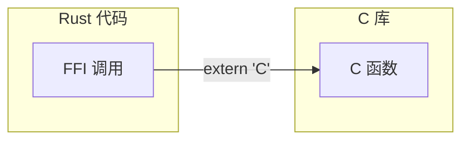
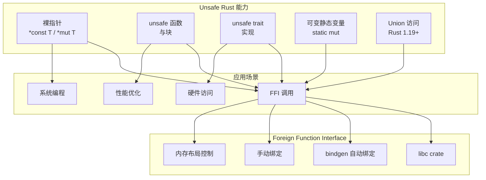

> **题记**：Unsafe 不是"不安全"，而是"我已经检查过了"。FFI 是 Rust 与 C 世界的桥梁。

## 写在开头

今天是 Rust 学习中特殊的一天——我们将学习 **Unsafe Rust**。

在前面的学习中，Rust 通过所有权、借用检查、生命周期等机制保证了内存安全。但 Rust 承认，有些操作本质上需要"绕过"这些安全检查：

- 与操作系统交互
- 调用 C 函数库
- 实现高性能底层代码
- 直接访问硬件

**Unsafe Rust** 并非"不安全"，而是 Rust 给你的一把"钥匙"，允许你做一些安全 Rust 不允许的事。关键是你必须自己保证这些操作是安全的。

## 1. Unsafe 的能力

### 1.1 五个 Unsafe 超能力

在 `unsafe` 块内，你可以做五件普通 Rust 不能做的事：

```rust
unsafe {
    // 1. 解引用裸指针
    let num = 42;
    let raw = &num as *const i32;
    let _val = *raw;  // 安全：raw 指向有效的 i32
    
    // 2. 调用 unsafe 函数
    dangerous_function();
    
    // 3. 实现 unsafe trait
    unsafe trait Dangerous {}
    struct MyType;
    unsafe impl Dangerous for MyType {}
    
    // 4. 访问可变静态变量
    static mut COUNTER: i32 = 0;
    COUNTER += 1;
    
    // 5. 访问 union 字段（Rust 1.19+ 支持）
}
```

### 1.2 unsafe 函数

标记为 `unsafe` 的函数调用时必须处在 `unsafe` 块中：

```rust
unsafe fn dangerous() -> i32 {
    42
}

fn main() {
    // ❌ 编译错误！必须用 unsafe 调用
    // let _ = dangerous();
    
    // ✅ 正确的调用方式
    unsafe {
        let _ = dangerous();
    }
}
```

### 1.3 safe 包装 unsafe 实现

好的设计是用 safe 函数包装 unsafe 操作，封装复杂性：

```rust
// 好的设计：对外是安全的，内部使用 unsafe 优化
fn safe_function(data: &[i32]) -> i32 {
    // 这里用 unsafe 但对外透明
    data.iter().map(|x| unsafe { 
        // 假设 compute_unchecked 有前置条件：x 不能为负数
        compute_unchecked(x) 
    }).sum()
}

// unsafe 函数：调用者保证 x >= 0
unsafe fn compute_unchecked(x: &i32) -> i32 {
    // 使用 unsafe 操作，如解引用裸指针
    let ptr = x as *const i32;
    *ptr * 2
}
```

## 2. 裸指针

### 2.1 *const T 和*mut T

裸指针（Raw Pointer）和引用 `&T` / `&mut T` 类似，但不遵守借用规则：

```rust
fn main() {
    let mut num = 42;
    
    // 从引用创建裸指针
    let raw_const = &num as *const i32;
    let raw_mut = &mut num as *mut i32;
    
    // 解引用需要 unsafe
    unsafe {
        println!("const: {}, mut: {}", *raw_const, *raw_mut);
        
        // 通过可变指针修改
        *raw_mut = 100;
        println!("num = {}", num);  // 100
    }
}
```

**裸指针 vs 引用**：

| 特性 | `&T` / `&mut T` | `*const T` / `*mut T` |
|------|-----------------|----------------------|
| 借用规则 | 遵守 | 不遵守 |
| 所有权 | 不拥有 | 不拥有 |
| 可否为 null | 否 | 是 |
| 解引用 | 安全 | 需要 unsafe |
| 自动实现 Send/Sync | 是（当 T 满足条件时） | 是（当 T 满足条件时），但实现是 unsafe 的 |

### 2.2 从引用创建裸指针

安全 Rust 中可以从引用创建裸指针（安全操作）：

```rust
fn main() {
    let data = vec![1, 2, 3];
    
    // 安全：从引用创建只读指针
    let ptr = data.as_ptr();
    
    unsafe {
        println!("First element: {}", *ptr);
    }
}
```

### 2.3 空指针检查

裸指针可以是 null，需要手动检查：

```rust
fn main() {
    let ptr: *const i32 = std::ptr::null();
    
    if ptr.is_null() {
        println!("Pointer is null");
    }
    
    // 解引用空指针是未定义行为！
    // unsafe { println!("{}", *ptr); }  // 危险！
}
```

### 2.4 裸指针的 Send/Sync

`*const T` 和 `*mut T` 自动实现 `Send` 和 `Sync` trait（当 `T: Send` 时实现 `Send`，当 `T: Sync` 时实现 `Sync`），但这些实现是 `unsafe` 的，因为指针指向的数据可能不满足线程安全要求。

```rust
// 标准库中的实现（示意）
unsafe impl<T: Send + ?Sized> Send for *const T {}
unsafe impl<T: Send + ?Sized> Send for *mut T {}
unsafe impl<T: Sync + ?Sized> Sync for *const T {}
unsafe impl<T: Sync + ?Sized> Sync for *mut T {}
```

### 2.5 std::ptr 常用操作

```rust
use std::ptr;

unsafe {
    let mut x = 42;
    let ptr = &mut x as *mut i32;
    
    // 读写操作
    ptr::write(ptr, 100);           // 写入值（不读取旧值）
    let val = ptr::read(ptr);       // 读取值（不 drop）
    
    // 内存拷贝
    let mut dst = [0u8; 10];
    let src = [1u8; 10];
    ptr::copy(src.as_ptr(), dst.as_mut_ptr(), 10);
    
    // 指针偏移
    let base_ptr = src.as_ptr();
    let offset_ptr = base_ptr.add(5);  // 向后偏移 5 个元素
}
```

## 3. 访问可变静态变量

### 3.1 static vs const

`static` 变量是运行时值，`const` 是编译时值：

```rust
static mut COUNTER: i32 = 0;  // 可变静态变量（需要 unsafe）
const PI: f64 = 3.14159;       // 常量（编译时计算）

fn main() {
    unsafe {
        COUNTER += 1;
        println!("Counter: {}", COUNTER);
    }
}
```

### 3.2 线程安全的静态变量

`static mut` 访问需要 `unsafe`，但可以用 `Mutex` 或 `Atomic` 包装实现线程安全：

```rust
use std::sync::Mutex;

static COUNTER: Mutex<i32> = Mutex::new(0);

fn main() {
    *COUNTER.lock().unwrap() += 1;
    println!("Counter: {}", *COUNTER.lock().unwrap());
}

// 使用原子类型（无锁）
use std::sync::atomic::{AtomicI32, Ordering};
static ATOMIC_COUNTER: AtomicI32 = AtomicI32::new(0);

fn atomic_example() {
    ATOMIC_COUNTER.fetch_add(1, Ordering::SeqCst);
    println!("Atomic counter: {}", ATOMIC_COUNTER.load(Ordering::SeqCst));
}
```

## 4. unsafe trait

### 4.1 什么是 unsafe trait？

当 trait 的实现需要使用者保证某些不变量时，trait 可以标记为 `unsafe`：

```rust
// 标记为 unsafe：实现者必须保证安全性
unsafe trait DangerousOperation {
    fn perform(&self);
}

// 实现 unsafe trait 也需要 unsafe
struct MyType(i32);

unsafe impl DangerousOperation for MyType {
    fn perform(&self) {
        println!("Performing dangerous operation with {}", self.0);
    }
}

fn main() {
    let obj = MyType(42);
    // 调用 unsafe trait 方法也需要 unsafe
    unsafe {
        obj.perform();
    }
}
```

### 4.2 Send 和 Sync

`Send` 和 `Sync` 是 Rust 安全保证的核心，它们本身就是 `unsafe trait`：

```rust
// Send: 类型可以在线程间安全传递
unsafe impl Send for MyStruct {}

// Sync: 类型的引用可以在线程间安全共享
unsafe impl Sync for MyStruct {}
```

大多数类型自动实现这两个 trait，只有以下情况需要手动实现：

- 自定义线程同步原语
- 包含裸指针或 FFI 类型的结构
- 需要特殊线程安全保证的类型

## 5. FFI 基础

### 5.1 什么是 FFI？

**FFI**（Foreign Function Interface，外来函数接口）是 Rust 调用**其他语言**（尤其是 C）函数的能力。



### 5.2 声明外部 C 函数

用 `extern "C"` 块声明 C 函数：

```rust
use std::ffi::CStr;
use std::os::raw::c_char;

// 声明外部 C 函数
extern "C" {
    fn abs(x: i32) -> i32;
    fn strlen(s: *const c_char) -> usize;
}

fn main() {
    unsafe {
        println!("abs(-42) = {}", abs(-42));
        
        let c_str = CStr::from_bytes_with_nul(b"hello\0").unwrap();
        println!("strlen(\"hello\") = {}", strlen(c_str.as_ptr()));
    }
}
```

### 5.3 完整的 C 库绑定

使用 `libc` crate 调用标准库：

```rust
use std::ffi::CString;
use std::os::raw::c_char;

extern "C" {
    fn puts(s: *const c_char) -> i32;
}

fn main() {
    let s = CString::new("Hello from Rust!").unwrap();
    unsafe {
        puts(s.as_ptr());
    }
}
```

### 5.4 使用 libc crate

`libc` crate 提供了 C 标准库的 Rust 绑定：

```toml
[dependencies]
libc = "0.2.155"  # 使用最新稳定版本
```

```rust
use libc::{c_char, c_int};

extern "C" {
    fn strlen(s: *const c_char) -> usize;
}

fn main() {
    let s = CString::new("hello").unwrap();
    let len = unsafe { strlen(s.as_ptr()) };
    println!("strlen(\"hello\") = {}", len);  // 5
}
```

## 6. 绑定 C 库

### 6.1 bindgen 自动绑定生成

`bindgen` 可以从 C 头文件自动生成 Rust FFI 绑定：

```bash
cargo install bindgen
bindgen input.h -o bindings.rs
```

### 6.2 使用生成的绑定

```rust
// 正确写法：使用 include! 宏
include!(concat!(env!("OUT_DIR"), "/bindings.rs"));

fn main() {
    unsafe {
        some_c_function();
    }
}
```

### 6.3 手动创建 FFI 绑定

对于简单的 C 结构：

```rust
use std::os::raw::{c_int, c_char};
use std::ffi::CStr;

// C 端
// struct Point { int x; int y; };

#[repr(C)]
pub struct Point {
    pub x: c_int,
    pub y: c_int,
}

extern "C" {
    fn create_point(x: c_int, y: c_int) -> *mut Point;
    fn free_point(ptr: *mut Point);  // 使用更标准的命名
    fn get_point_x(p: *const Point) -> c_int;
}

fn main() {
    unsafe {
        let pt = create_point(10, 20);
        println!("Point: ({}, {})", get_point_x(pt), (*pt).y);
        free_point(pt);
    }
}
```

### 6.4 导出 Rust 函数供 C 调用

```rust
use std::ffi::CStr;
use std::os::raw::c_char;

// 导出函数供 C 调用
#[no_mangle]  // 防止名称修饰
pub extern "C" fn rust_function(input: *const c_char) -> i32 {
    unsafe {
        let c_str = CStr::from_ptr(input);
        let rust_str = c_str.to_str().unwrap_or("");
        println!("C called Rust with: {}", rust_str);
        42
    }
}

// 导出全局变量
#[no_mangle]
pub static RUST_GLOBAL: i32 = 100;
```

## 7. 内存布局

### 7.1 repr(C)

`#[repr(C)]` 保证结构体内存布局与 C 一致：

```rust
#[repr(C)]
struct Point {
    x: f64,   // 8 bytes
    y: f64,   // 8 bytes
}

#[repr(C)]
struct Rect {
    top_left: Point,      // 16 bytes
    bottom_right: Point,  // 16 bytes
}
```

### 7.2 repr(transparent)

`#[repr(transparent)]` 让类型与另一个类型使用相同的内存表示：

```rust
#[repr(transparent)]
struct MyWrapper(i32);

fn main() {
    let w = MyWrapper(42);
    let p = &w as *const i32 as *const MyWrapper;
    unsafe {
        assert_eq!((*p).0, 42);
    }
}
```

### 7.3 repr(packed)

`#[repr(packed)]` 去除对齐，可能节省空间但降低访问效率：

```rust
#[repr(packed)]
struct Packed {
    a: u8,   // 1 byte
    b: u32,  // 4 bytes（不对齐，可能跨边界）
}

// 或者指定对齐方式
#[repr(C, align(1))]
struct ExplicitPacked {
    a: u8,
    b: u32,
}
```

### 7.4 MaybeUninit 处理未初始化内存

```rust
use std::mem::MaybeUninit;

fn maybe_uninit_example() {
    // 创建未初始化的内存
    let mut uninit = MaybeUninit::<[u8; 1024]>::uninit();
    
    unsafe {
        // 初始化部分内存
        let ptr = uninit.as_mut_ptr() as *mut u8;
        for i in 0..10 {
            ptr.add(i).write(i as u8);
        }
        
        // 假设剩余部分由 C 函数填充
        // some_c_function(ptr);
        
        // 获取初始化的值
        let initialized = uninit.assume_init();
        println!("First byte: {}", initialized[0]);
    }
}
```

## 8. 回调函数

### 8.1 传递 Rust 函数给 C

C 代码经常需要回调函数指针：

```rust
extern "C" fn rust_callback(x: i32) -> i32 {
    x * 2
}

extern "C" {
    fn register_callback(cb: extern "C" fn(i32) -> i32);
}

fn main() {
    unsafe {
        register_callback(rust_callback);
    }
}
```

### 8.2 闭包不能直接传给 C

C 函数指针不包含环境，闭包需要转换为静态函数或使用上下文指针：

```rust
use std::sync::atomic::{AtomicI32, Ordering};

static CALLBACK_STATE: AtomicI32 = AtomicI32::new(0);

extern "C" fn static_callback(x: i32) -> i32 {
    CALLBACK_STATE.store(x, Ordering::SeqCst);
    x * 2
}

extern "C" {
    fn register_callback(cb: extern "C" fn(i32) -> i32);
}

fn main() {
    unsafe {
        register_callback(static_callback);
    }
}
```

### 8.3 使用上下文指针传递闭包

```rust
use std::os::raw::c_void;

// C 端期望的回调签名：void (*callback)(void* context, int value)
type Callback = extern "C" fn(*mut c_void, i32);

struct Context {
    multiplier: i32,
}

extern "C" fn callback_with_context(context: *mut c_void, value: i32) {
    unsafe {
        let ctx = &mut *(context as *mut Context);
        println!("Result: {}", value * ctx.multiplier);
    }
}

extern "C" {
    fn register_callback_with_context(cb: Callback, context: *mut c_void);
}

fn main() {
    let mut context = Context { multiplier: 3 };
    
    unsafe {
        register_callback_with_context(
            callback_with_context,
            &mut context as *mut Context as *mut c_void
        );
    }
}
```

## 9. 内存管理与类型转换

### 9.1 Box 与裸指针转换

```rust
fn box_to_raw() {
    let boxed = Box::new(42);
    let raw_ptr = Box::into_raw(boxed);  // 转移所有权给裸指针
    
    unsafe {
        println!("Value: {}", *raw_ptr);
        // 必须手动释放
        let _ = Box::from_raw(raw_ptr);  // 重新获取所有权，自动 drop
    }
}
```

### 9.2 Vec 与 C 数组转换

```rust
fn vec_to_c_array() {
    let vec = vec![1, 2, 3, 4, 5];
    
    // 获取指针和长度
    let ptr = vec.as_ptr();
    let len = vec.len();
    let capacity = vec.capacity();
    
    // 防止 Rust 释放内存
    std::mem::forget(vec);
    
    unsafe {
        // 传递给 C 函数
        // some_c_function(ptr, len);
        
        // 重新获取所有权（必须长度、容量匹配）
        let _vec = Vec::from_raw_parts(ptr as *mut i32, len, capacity);
    }
}
```

### 9.3 String 与 C 字符串转换

```rust
use std::ffi::{CString, CStr};
use std::os::raw::c_char;

fn string_conversions() {
    // Rust String -> C 字符串
    let rust_str = String::from("hello");
    let c_string = CString::new(rust_str).unwrap();
    let c_ptr = c_string.as_ptr();
    
    // C 字符串 -> Rust String
    unsafe {
        let c_str = CStr::from_ptr(c_ptr);
        let rust_str_back = c_str.to_string_lossy().into_owned();
        println!("Converted back: {}", rust_str_back);
    }
    
    // 注意：CString 分配的内存会在离开作用域时自动释放
}
```

### 9.4 防止 panic 跨越 FFI 边界

```rust
use std::panic::catch_unwind;

extern "C" fn safe_rust_function() -> i32 {
    let result = catch_unwind(|| {
        // 可能 panic 的代码
        42
    });
    
    match result {
        Ok(value) => value,
        Err(_) => {
            // 处理 panic，返回错误码
            -1
        }
    }
}
```

## 10. 与其他语言的对比

### 10.1 Rust vs C 互操作

| 特性 | C | Rust |
|------|---|------|
| FFI 原生支持 | 是 | 需要 unsafe |
| 内存安全 | 手动 | unsafe 绕过安全规则 |
| 裸指针 | 原生语法 | 需要 unsafe 解引用 |
| 绑定生成 | 手动编写 | bindgen 自动生成 |
| 错误处理 | 返回错误码 | Result 类型，需要转换 |

### 10.2 Rust vs C++ 互操作

| 特性 | C++ | Rust |
|------|-----|------|
| 外部函数接口 | extern "C" | extern "C" 或其他 ABI |
| 成员函数 | T.method() | 需包装为普通函数 |
| 引用 | T& / T* | &T / *mut T |
| 内存管理 | RAII / 手动 | Ownership / unsafe 手动管理 |
| 模板/泛型 | 模板实例化 | 泛型单态化，需要手动绑定 |

## 11. 苏格拉底式自问自答

### 关于 Unsafe

> **问**：Unsafe Rust 是不是违反了 Rust 的安全承诺？

**答**：恰恰相反。Unsafe Rust **尊重** Rust 的承诺——它明确标记了"这里需要你自己保证安全"的部分。安全 Rust 和 Unsafe Rust 就像安全驾驶和特技表演——特技驾驶不是"不遵守物理定律"，而是"在明确知道自己在做什么的前提下"。

> **问**：什么时候应该用 Unsafe？

**答**：只有在必要时：

1. 调用 C API 或其他语言接口
2. 性能关键的底层代码（如 SIMD、内存布局优化）
3. 实现其他语言无法实现的系统特性
4. 编写操作系统内核、嵌入式固件等
5. 实现自定义的并发原语

> **问**：如何最小化 Unsafe 代码？

**答**：

1. 把 unsafe 代码封装在小型、可测试的函数中
2. 用 safe 函数包装 unsafe 操作，提供安全接口
3. 为每个 unsafe 块写清楚安全假设和不变量
4. 使用 `cargo miri` 检查未定义行为
5. 使用 `#![forbid(unsafe_code)]` 禁止非必要的 unsafe

### 关于 FFI

> **问**：为什么 FFI 需要 unsafe？

**答**：因为 Rust 无法验证外部代码的正确性。C 函数可能返回空指针、修改预期外的内存、或做任何奇怪的事。Rust 的编译器不能保证这些调用是"安全的"，所以要求 `unsafe`。

> **问**：bindgen 生成的代码需要审核吗？

**答**：是的。bindgen 只能机械转换，不能理解语义。你需要：

1. 检查结构体大小和对齐是否符合预期
2. 确认内存布局与 C 端一致
3. 验证回调函数签名匹配
4. 检查是否有平台特定的差异
5. 确保类型转换正确（如 `size_t` → `usize`）

> **问**：如何处理 FFI 中的内存管理？

**答**：

1. **所有权明确**：文档说明谁分配、谁释放
2. **使用 RAII**：用 Rust 类型包装 C 资源，在 drop 时自动释放
3. **避免双重释放**：使用 `Option<*mut T>` 或 `NonNull<T>` 跟踪空指针
4. **注意线程安全**：确保跨线程传递的资源是 `Send`/`Sync` 的

## 12. 总结



**关键要点**：

1. **Unsafe** 不是"不安全"，而是"我已经检查过了"——要求开发者明确安全责任
2. **裸指针** `*const T` / `*mut T` 不遵守借用规则，但自动实现 Send/Sync（条件满足时）
3. **FFI** 通过 `extern "C"` 块声明外部函数，需要 `unsafe` 调用
4. **bindgen** 自动从 C 头文件生成 Rust 绑定，但需人工审核
5. **repr** 属性控制内存布局：`C`（C 兼容）、`transparent`（透明包装）、`packed`（无对齐）
6. **最小化原则**：unsafe 代码越少越好，封装在安全接口内
7. **内存管理**：明确所有权，使用 `Box::into_raw`/`from_raw`、`Vec::from_raw_parts`
8. **错误处理**：转换 C 错误码为 `Result`，使用 `catch_unwind` 防止 panic 传播

**进阶主题**：

- `Pin` 类型：处理自引用结构，实现异步运行时
- `std::arch`：平台特定 intrinsics，SIMD 优化
- `link` 属性：静态链接外部库
- `cfg` 属性：条件编译不同平台的 FFI 代码

> **思考题**：假设你要为 Rust 绑定一个 C 语言实现的压缩库 `libz`。请列出你需要考虑的关键问题：
>
> 1. **错误处理**：如何将 C 错误码转换为 Rust 的 `Result` 类型？
> 2. **内存管理**：压缩/解压缩缓冲区由谁分配？如何避免内存泄漏？
> 3. **安全 API**：如何设计安全的 Rust 接口，隐藏 unsafe 细节？
> 4. **线程安全**：libz 函数是否线程安全？是否需要加锁？
> 5. **资源清理**：如何确保压缩流对象正确关闭？
> 6. **版本兼容**：如何处理不同版本的 libz ABI 变化？
