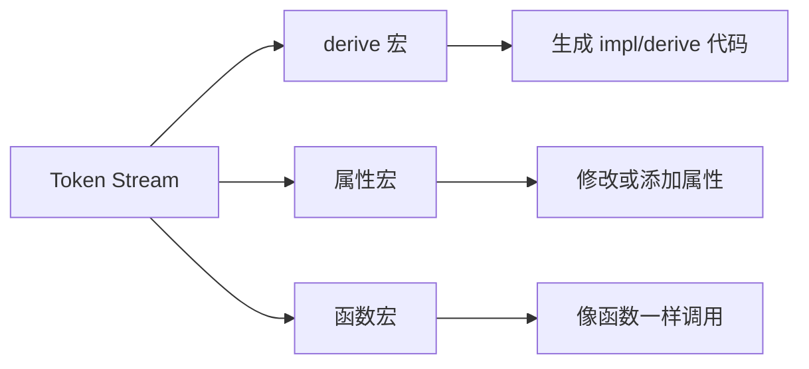
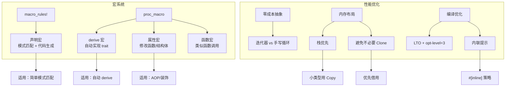

> **题记**：宏是代码生成器，编译器是优化器。理解它们，才能写出真正高效的 Rust 代码。

## 写在开头

今天是 Rust 学习的高级主题日——我们将探索两个强大的工具：**宏**和**性能优化**。

**宏**（Macro）是 Rust 中容易被忽视但极其强大的特性。它允许你在编译时生成代码，实现 DRY（Don't Repeat Yourself）原则的极致应用。

**性能优化**则是让 Rust 程序跑得更快的艺术。Rust 标榜"零成本抽象"，但这不意味着所有抽象都没有开销——理解编译器优化和改进代码是关键。

## 1. 宏基础

### 1.1 什么是宏？

让我们从一个问题开始：**什么是宏？为什么要用宏？**

假设你需要写一个打印日志的函数，日志需要包含文件名和行号：

```rust
// 普通函数方式
fn log(msg: &str) {
    println!("[INFO] {} at {}:{}", msg, file!(), line!());
}
```

但如果想同时返回某个值并打印日志呢？

```rust
// 需要写很多重复代码！
let x = 10;
println!("Processing x at {}:{}", file!(), line!());
// ... 更多代码 ...
```

这就是宏的用武之地——**编写能生成代码的代码**。

### 1.2 宏 vs 函数

| 特性 | 函数 | 宏 |
|------|------|-----|
| 执行时机 | 运行时 | 编译时 |
| 参数类型 | 编译时检查 | 语法树级别 |
| 代码生成 | 不能 | 能 |
| 复杂性 | 简单 | 较高 |
| 可见性规则 | 标准模块可见性 | 需显式导出 |

### 1.3 声明宏初体验

```rust
// macro_rules! 定义声明宏
macro_rules! say_hello {
    () => {
        println!("Hello!");
    };
}

fn main() {
    say_hello!();  // 编译时展开
}

// 导出宏：需要在模块中使用 #[macro_export]
#[macro_export]
macro_rules! public_macro {
    () => {
        println!("Public macro!");
    };
}
```

## 2. 声明宏

### 2.1 基本语法

声明宏使用 `macro_rules!` 定义，语法类似 match：

```rust
macro_rules! my_macro {
    // 模式 => 展开
    ($arg:expr) => {
        // 生成的代码
        println!("Got: {}", $arg);
    };
}
```

### 2.2 片段类型

宏可以通过不同的**片段类型**匹配不同语法元素：

| 标识符 | 含义 | 示例 |
|--------|------|------|
| `expr` | 表达式 | `1 + 2`, `if x {}` |
| `stmt` | 语句 | `let x = 1;` |
| `type` | 类型 | `i32`, `Vec<String>` |
| `pat` | 模式 | `Some(x)`, `_` |
| `ident` | 标识符 | `my_var`, `foo` |
| `path` | 路径 | `std::vec::Vec` |
| `meta` | 元数据 | `feature = "abc"` |
| `item` | 项 | `fn foo() {}` |
| `block` | 块 | `{ ... }` |
| `literal` | 字面量 | `42`, `"hello"` |
| `tt` | 令牌树 | 任意token序列，最通用 |

### 2.3 带条件的宏

```rust
macro_rules! maybe {
    ($condition:expr, $then:expr) => {
        if $condition {
            $then
        } else {
            ()  // 返回单元类型，确保展开总是完整表达式
        }
    };
}

fn main() {
    maybe!(true, println!("Yes"));    // 输出: Yes
    maybe!(false, println!("No"));    // 无输出，但不破坏语法
}
```

### 2.4 重复模式：$()* 和 $+

这是宏最强大的特性——处理重复的模式：

```rust
macro_rules! vec_of {
    // $( $elem:expr ),* 处理多个表达式
    ($($elem:expr),*) => {
        {
            let mut v = Vec::new();
            $(
                v.push($elem);
            )*
            v
        }
    };
}

fn main() {
    let v = vec_of![1, 2, 3, 4, 5];
    println!("{:?}", v);  // [1, 2, 3, 4, 5]
}
```

**语法解释**：

- `$(...)*` 匹配零个或多个
- `$(...)+` 匹配一个或多个
- `$()` 内部是每次迭代的内容
- `*` 或 `+` 后面的`,` 或其他分隔符是分隔符

### 2.5 更复杂的重复

```rust
macro_rules! hash_map_of {
    ($($key:expr => $value:expr),*) => {
        {
            let mut map = std::collections::HashMap::new();
            $(
                map.insert($key.to_string(), $value.to_string());
            )*
            map
        }
    };
}

fn main() {
    let map = hash_map_of! {
        "name" => "Alice",
        "age" => "30",
        "city" => "Beijing"
    };
    println!("{:?}", map);
}
```

## 3. 过程宏

### 3.1 三种过程宏

过程宏比声明宏更强大，它允许你**处理 Token 流**并生成新的代码。有三种类型：



**注意**：过程宏需要单独的 crate 并配置 `proc-macro = true`

### 3.2 derive 宏示例

**Cargo.toml 配置**：

```toml
[lib]
proc-macro = true

[dependencies]
syn = { version = "2.0", features = ["full", "extra-traits"] }
quote = "1.0"
```

```rust
// 在过程宏crate中
use proc_macro::TokenStream;
use syn::{self, parse_macro_input, DeriveInput};
use quote::quote;

#[proc_macro_derive(Hello)]
pub fn hello_derive(input: TokenStream) -> TokenStream {
    // syn 解析 TokenStream 为 AST
    let ast = parse_macro_input!(input as DeriveInput);
    
    // 获取结构体名
    let name = &ast.ident;
    
    // quote 生成新的 TokenStream
    quote! {
        impl #name {
            fn hello() {
                println!("Hello, {}!", stringify!(#name));
            }
        }
    }.into()
}

// 在使用crate中
// Cargo.toml: [dependencies] hello_macro = { path = "../hello_macro" }
use hello_macro::Hello;

#[derive(Hello)]
struct MyStruct;

fn main() {
    MyStruct::hello();  // 输出: Hello, MyStruct!
}
```

### 3.3 属性宏示例

```rust
// 在过程宏crate中
use proc_macro::TokenStream;
use syn::{parse_macro_input, ItemFn};
use quote::quote;

#[proc_macro_attribute]
pub fn trace(_attr: TokenStream, item: TokenStream) -> TokenStream {
    let input_fn = parse_macro_input!(item as ItemFn);
    let fn_name = &input_fn.sig.ident;
    let fn_block = &input_fn.block;
    
    quote! {
        fn #fn_name() {
            println!("[TRACE] Calling {}", stringify!(#fn_name));
            #fn_block
        }
    }.into()
}

// 在使用crate中
#[trace]
fn my_function() {
    println!("Inside my_function");
}

fn main() {
    my_function();  // 输出: [TRACE] Calling my_function \n Inside my_function
}
```

## 4. 宏的卫生性

### 4.1 什么是卫生宏？

Rust 的宏是**卫生的**（Hygienic）——宏内定义的变量不会意外污染外部作用域：

```rust
macro_rules! hygienic {
    () => {
        let _x = 42;  // 这个 _x 不会影响外部
    };
}

fn main() {
    hygienic!();
    let _x = 100;  // 这里可以安全定义 _x，不会冲突
    println!("{}", _x);  // 输出: 100
}
```

### 4.2 打破卫生性

有时需要打破卫生性，比如定义静态变量，但需要注意避免重复定义：

```rust
macro_rules! define_counter {
    ($name:ident) => {
        static $name: std::sync::atomic::AtomicI32 = std::sync::atomic::AtomicI32::new(0);
    };
}

fn main() {
    define_counter!(MY_COUNTER);  // 定义名为 MY_COUNTER 的静态变量
    // 后续可以使用 MY_COUNTER
}
```

## 5. 宏的常见用途

### 5.1 简化错误处理

这可能是宏最重要的用途之一：

```rust
// 自定义错误处理宏（Rust 2018 后用 ? 操作符，但宏在某些场景仍有用）
macro_rules! try_opt {
    ($expr:expr) => {
        match $expr {
            Some(v) => v,
            None => return None,
        }
    };
}

// 使用
fn find_in_map<'a>(map: &'a std::collections::HashMap<&str, i32>, key: &str) -> Option<&'a i32> {
    let value = try_opt!(map.get(key));
    Some(value)
}
```

### 5.2 Builder 模式

宏可以让 Builder 模式更简洁：

```rust
macro_rules! builder {
    ($name:ident, {$($field:ident: $type:ty),*}) => {
        #[derive(Default)]
        struct #name {
            $($field: $type),*
        }
        
        impl #name {
            fn new() -> Self {
                Self::default()
            }
            
            $(
                fn $field(mut self, val: $type) -> Self {
                    self.$field = val;
                    self
                }
            )*
            
            fn build(self) -> #name {
                self
            }
        }
    };
}

// 使用
builder!(Config, {
    host: String,
    port: u16,
    timeout: Option<u64>,
});

fn main() {
    let config = Config::new()
        .host("localhost".to_string())
        .port(8080)
        .timeout(None)
        .build();
}
```

### 5.3 测试代码生成

```rust
// 假设有要测试的函数
fn add_one(x: i32) -> i32 {
    x + 1
}

macro_rules! test_cases {
    ($name:ident, $($input:expr => $expected:expr),*) => {
        #[test]
        fn $name() {
            $(
                assert_eq!(add_one($input), $expected, "Failed for input: {}", $input);
            )*
        }
    };
}

// 生成测试
test_cases!(test_add_one,
    0 => 1,
    1 => 2,
    5 => 6,
    -1 => 0
);
```

## 6. 性能优化原则

### 6.1 零成本抽象

Rust 的设计哲学之一是**零成本抽象**（Zero-Cost Abstraction）。这意味着：

- 高级抽象应该没有运行时开销（设计目标）
- 如果你不用某个特性，你不需要为它付出代价
- 底层代码和手写的应该一样快（在优化后）

```rust
// 迭代器版本——编译器会优化成手写循环
fn sum_squares_iter(data: &[i32]) -> i32 {
    data.iter().map(|x| x * x).sum()
}

// 手写循环版本
fn sum_squares_loop(data: &[i32]) -> i32 {
    let mut sum = 0;
    for x in data {
        sum += x * x;
    }
    sum
}
// 两种写法在 release 模式下性能基本相同！
```

### 6.2 性能分析工具

```bash
# 安装分析工具
cargo install cargo-flamegraph
cargo install cargo-binutils  # 包含 cargo asm

# 生成性能分析数据
cargo bench                  # 运行基准测试
cargo flamegraph            # 生成火焰图

# 查看生成的汇编代码
cargo asm --lib --release your_crate::your_function
```

## 7. 内存优化

### 7.1 Stack vs Heap

栈分配快但空间有限；堆分配灵活但有开销。选择的原则：**能用栈就用栈**。

```rust
// 栈上分配——极快（编译器在编译时确定大小）
fn on_stack() -> [i32; 1000] {
    [0; 1000]  // 1000个i32在栈上，约4KB
}

// 堆上分配——有分配开销
fn on_heap() -> Vec<i32> {
    vec![0; 1000]  // 在堆上分配
}

// 但要注意栈溢出风险
fn dangerous() {
    let _huge = [0u8; 10_000_000];  // 10MB在栈上，可能栈溢出！
}
```

### 7.2 小型数据结构用 Copy

如果类型小且简单，实现 `Copy` 可以避免移动开销：

```rust
// f32 实现了 Copy，所以 Point3D 自动获得 Copy
#[derive(Clone, Copy, Debug)]
struct Point3D {
    x: f32,
    y: f32,
    z: f32,
}

// 调用时直接复制，不需要所有权转移
fn process(point: Point3D) -> Point3D {
    Point3D {
        x: point.x * 2.0,
        y: point.y * 2.0,
        z: point.z * 2.0,
    }
}

fn main() {
    let p1 = Point3D { x: 1.0, y: 2.0, z: 3.0 };
    let p2 = process(p1);  // p1 被复制，仍然可用
    println!("p1: {:?}, p2: {:?}", p1, p2);
}
```

**何时实现 Copy**：类型大小适中（通常小于等于指针大小），且所有字段都实现了 Copy。

### 7.3 避免不必要的 Clone

Clone 是深拷贝，有性能开销。优先使用借用：

```rust
// 借用——只传引用（零拷贝）
fn sum(data: &[i32]) -> i32 {
    data.iter().sum()
}

// 克隆——复制整个数据（有开销）
fn sum_clone(data: &[i32]) -> i32 {
    let cloned = data.to_vec();  // 不必要的克隆！
    cloned.iter().sum()
}

// 正确的做法：需要所有权时才克隆
fn process_owned(data: Vec<i32>) -> i32 {
    // 这里需要所有权，所以克隆是合理的
    data.iter().sum()
}

fn main() {
    let v = vec![1, 2, 3];
    let sum1 = sum(&v);           // ✅ 推荐：借用
    let sum2 = sum_clone(&v);     // ❌ 不推荐：不必要克隆
    let sum3 = process_owned(v);  // ✅ 需要所有权时克隆
}
```

## 8. 编译优化

### 8.1 profile 配置

在 `Cargo.toml` 中可以配置 release 优化级别：

```toml
[profile.dev]
opt-level = 0       # 开发模式：不优化，编译快，调试方便

[profile.release]
opt-level = 3        # 最高优化级别（0-3，3最高）
lto = "thin"         # 链接时优化
codegen-units = 1    # 单 codegen 单元（更好的优化机会）
panic = "abort"      # panic时直接终止程序（更小更快的二进制）
strip = "debuginfo"  # 移除调试信息（减小二进制大小）

[profile.release-with-debug]
inherits = "release"  # 继承release配置
debug = 1             # 保留调试信息（用于性能分析）
```

### 8.2 LTO 优化

LTO（Link-Time Optimization）让链接器在链接阶段进行全局优化：

```toml
[profile.release]
# lto = "fat"         # 完整 LTO，最高质量但编译慢
lto = "thin"          # 精简 LTO，质量好，编译较快（推荐）
# lto = false         # 禁用 LTO，编译最快但优化较少
```

**何时使用 LTO**：

- 发布生产版本时使用 `lto = "thin"`
- 需要极致性能时使用 `lto = "fat"`
- 快速迭代开发时禁用 LTO

### 8.3 内联优化

`#[inline]` 提示编译器可以内联函数：

```rust
// 强烈建议内联（非常小的、频繁调用的函数）
#[inline(always)]
pub fn get<T>(value: &T) -> &T {
    value
}

// 允许但不强制（让编译器决定）
#[inline]
pub fn calculate_length(slice: &[i32]) -> usize {
    slice.len()
}

// 建议不内联（大函数或不常调用的函数）
#[inline(never)]
pub fn expensive_computation(data: &[f64]) -> f64 {
    // 复杂的计算...
    data.iter().fold(0.0, |acc, &x| acc + x)
}

// 冷路径提示（编译器可能将这部分代码放到不常执行的位置）
#[cold]
fn handle_error(err: &str) {
    eprintln!("Error: {}", err);
}
```

**内联指南**：

- `#[inline(always)]`: 函数体极小（1-3行），频繁调用
- `#[inline]`: 中等大小函数，让编译器决定
- `#[inline(never)]`: 大函数或递归函数
- `#[cold]`: 错误处理等不常执行的代码路径

## 9. 与其他语言的对比

### 9.1 Rust 宏 vs C 宏

| 特性 | C 宏 | Rust 宏 |
|------|------|---------|
| 类型安全 | 无（纯文本替换） | 有（语法树操作） |
| 卫生性 | 无（容易出 bug） | 有（保护作用域） |
| 调试 | 困难（展开前调试） | 正常（展开后调试） |
| 复杂度 | 文本替换，简单但危险 | 语法树操作，安全但复杂 |
| 错误信息 | 难以理解 | 相对清晰 |

### 9.2 Rust 宏 vs Python 装饰器

| 特性 | Python 装饰器 | Rust 属性宏 |
|------|---------------|-------------|
| 执行时机 | 运行时（函数定义时） | 编译时 |
| 复杂度 | 简单（动态语言特性） | 较复杂（静态类型系统） |
| 灵活性 | 高（动态类型） | 高（但受类型系统限制） |
| 性能影响 | 有（运行时装饰） | 无（编译时展开） |
| 错误检测 | 运行时错误 | 编译时错误 |

## 10. 苏格拉底式自问自答

### 关于宏

> **问**：什么时候应该用宏而不是函数？

**答**：当需要**编译时代码生成**时。具体场景：

1. 消除重复的样板代码（如Builder模式、测试用例）
2. 处理不同类型或数量的参数（泛型做不到的变长参数）
3. 实现 DSL（领域特定语言）
4. 编译时计算和检查

> **问**：为什么 Rust 的宏比 C 的宏更安全？

**答**：C 宏是纯文本替换，没有作用域和类型概念，容易导致：

- 运算符优先级问题：`MAX(a,b) a>b?a:b` 在 `MAX(x&y, z)` 中出错
- 多次求值问题：`SQUARE(x) x*x` 在 `SQUARE(i++)` 中多次递增
- 作用域污染：宏内变量可能覆盖外部变量

Rust 宏操作的是语法树，有卫生性保护，不会意外捕获或污染外部变量。

> **问**：过程宏和声明宏怎么选？

**答**：

- **声明宏** (`macro_rules!`): 适合简单模式匹配和代码生成，语法相对简单
- **过程宏**: 适合需要精细控制 Token 流的情况，如：
  - `#[derive(...)]` 自动实现trait
  - 复杂的代码转换和生成
  - 需要完整AST分析的情况

### 关于性能

> **问**：迭代器真的和手写循环一样快吗？

**答**：是的（在大多数情况下）。Rust 的迭代器是零成本抽象——编译器会内联并优化成等价的机器码。可以用 `cargo asm` 查看生成的汇编验证。但要注意：

- 某些复杂链式操作可能阻止优化
- 迭代器适配器（如 `.filter().map()`）可能创建临时对象
- 对于性能关键代码，仍应进行基准测试

> **问**：什么时候应该用 `#[inline]`？

**答**：

- **`#[inline(always)]`**: 函数体极小（1-3行）且频繁调用时
- **`#[inline]`**: 让编译器决定，通常用于中等大小、可能频繁调用的函数
- **不要滥用**: 过度内联会增加代码体积，可能降低缓存效率
- **经验法则**: 只在性能分析显示有好处时才添加 `#[inline]`

> **问**：`Box` 和智能指针的性能影响？

**答**：

- `Box<T>`: 一次堆分配开销，访问需要解引用
- `Rc<T>`/`Arc<T>`: 引用计数开销（原子操作对于 `Arc`）
- 尽量在栈上分配，需要多态或大对象时才用 `Box`
- 考虑使用 `Cow<T>`（Copy-on-Write）避免不必要的克隆

## 11. 总结



**关键要点**：

1. **声明宏** `macro_rules!` 适合模式匹配和简单代码生成
2. **过程宏** 提供强大的 Token 流操作能力，但需要单独crate
3. **卫生性** 保护宏不污染外部作用域，提高安全性
4. **零成本抽象** 是设计目标，高级抽象应无运行时开销
5. **迭代器和手写循环** 在优化后性能基本相同
6. **内存布局** 优先栈分配，小类型实现 `Copy`
7. **编译优化** LTO 和适当的 `opt-level` 能显著提升性能
8. **性能分析** 优化前先测量，使用 `cargo bench` 和火焰图

**进阶思考**：

- 宏可以访问编译时的信息（如 `file!()`, `line!()`, `stringify!()`）
- 过程宏可以实现复杂的编译时计算和检查
- 性能优化是权衡：速度 vs 内存 vs 代码大小 vs 编译时间
- Rust 的强类型系统本身是一种"零成本"的运行时安全检查

> **思考题**：设计一个 `#[timed]` 属性宏，在 debug 模式下为函数添加执行时间记录功能，而在 release 模式下不产生任何代码开销。请思考如何利用 `cfg` 属性和过程宏实现这一点。

**提示**：可以使用 `#[cfg(debug_assertions)]` 检测是否为 debug 模式，在过程宏中根据条件生成不同的代码。
