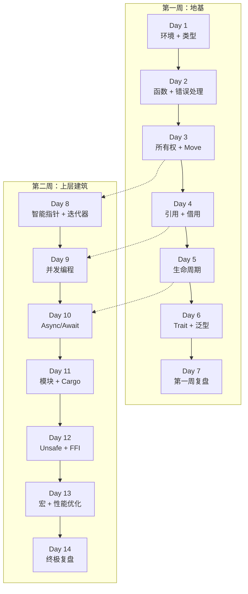
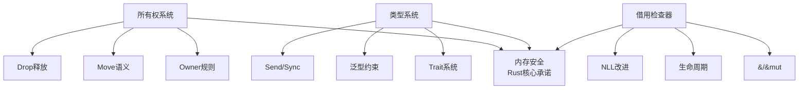
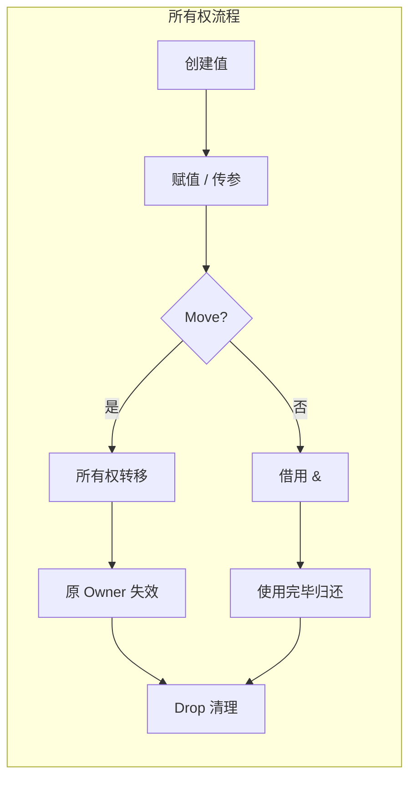
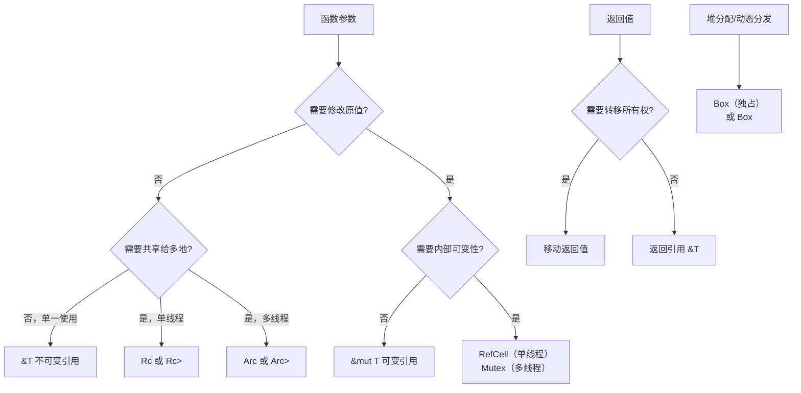
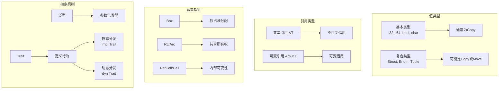
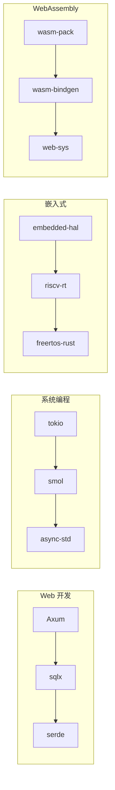

> **题记**：学习不是积累，是连接。14 天后，让我们用全局视角审视 Rust。
>
## 写在开头

经过 14 天的学习，你已经掌握了 Rust 的核心理论和高级特性。这一天，我们不做新知识的学习，而是：

1. 建立全局知识地图
2. 理解概念间的联系
3. 规划未来学习路径
4. 展望 Rust 生态

让我们用费曼学习法，做一次全面的知识梳理。

## 1. Rust 知识全景图

### 1.1 14 天知识脉络

学习 Rust 如同建造一座房子——我们需要先打地基（环境与类型），再砌墙（函数与控制流），安装核心管道系统（所有权），最后装修（高级特性）。下面这张图展示了 14 天的知识脉络：



### 1.2 核心概念关系图

Rust 的所有概念都围绕一个核心：**内存安全**。这个核心通过三条路径实现：



## 2. 各语言对比总结

### 2.1 Rust vs C/C++

理解 Rust 与 C/C++ 的区别，是理解 Rust 设计哲学的关键。C/C++ 给了程序员最大的自由，也把安全的责任完全交给了程序员。Rust 则通过编译时检查消除了大量 bug。

| 维度 | C/C++ | Rust |
|------|-------|------|
| **内存管理** | 手动 `malloc`/`free` 或 RAII | Ownership + Drop trait |
| **线程安全** | Pthread / 手动同步 | 类型系统静态保证 |
| **空指针** | 可能（use-after-free） | Option\<T>强制编译期处理（安全抽象） |
| **数据竞争** | 可能 | 借用规则阻止 |
| **泛型** | 模板（文本展开） | Trait + 泛型（编译时检查） |
| **宏** | 文本替换（危险） | 声明宏卫生安全，过程宏灵活但需谨慎 |
| **编译时间** | 快 | 较慢（单态化开销） |
| **运行时性能** | 极快 | 与C++相当（有时更优） |

### 2.2 Rust vs Go

Go 和 Rust 都专注于现代服务器开发，但走了不同的路。Go 追求**简单性**，Rust 追求**控制与安全**。

| 维度 | Go | Rust |
|------|-----|------|
| **并发模型** | goroutine + channel | 线程 + async/await + 通道/锁 |
| **内存安全** | GC（运行时） | 编译期保证 |
| **空值** | nil（运行时 panic） | Option\<T>（编译期强制处理） |
| **错误处理** | 多返回值 | Result<T, E> |
| **泛型** | Go 1.18+ | 原生支持 |
| **性能** | 中等 | 高（与C++相当） |
| **学习曲线** | 平缓 | 陡峭 |
| **编译时间** | 快 | 较慢 |

### 2.3 Rust vs Java/Python

Java 和 Python 是虚拟机/解释器语言，牺牲性能换取开发效率和跨平台。Rust 则在保留系统级控制的同时，提供了高级抽象。

| 维度 | Java / Python | Rust |
|------|---------------|------|
| **内存管理** | GC（运行时） | Ownership（编译时） |
| **空值安全** | NullPointerException | Option\<T> |
| **执行速度** | 解释/JIT | AOT编译（无运行时开销） |
| **类型系统** | 泛型 | 泛型 + Trait |
| **内存布局** | 不透明 | 可控内存布局（可优化） |
| **并发安全** | GC + synchronized | 类型系统 + borrowing |
| **二进制大小** | JVM/Python 运行时 | 静态链接，小 |

## 3. 深入 Ownership 体系

### 3.1 为什么 Rust 要这样设计？

Rust 的所有权系统是解决**系统级编程最大难题**的方案：如何在没有 GC 的情况下安全地管理内存？

**目标**：编译期内存安全，无 GC 开销

**方法论**：

1. **单一所有权**：每个值有且只有一个 Owner（基本规则，Rc/Arc提供共享所有权）
2. **明确清理**：Owner 离开作用域时值被 Drop
3. **借用共享**：通过引用共享访问权
4. **生命周期**：确保引用不会比它引用的值活得更久



### 3.2 所有权决策树

在实际编程中，如何选择所有权的使用方式？



### 3.3 借用规则的直觉理解

> **类比**：把值想象成一本珍贵的书
>
> - **不可变借用**（`&T`）：你可以找多人同时借阅这本书，大家只能看，不能涂改
> - **可变借用**（`&mut T`）：你可以借给一个人，他可以在书上做标记——但此时不能有人正在看

这条规则在编译时就消除了数据竞争的可能性。

## 4. 类型系统全貌

### 4.1 类型分类总览

Rust 的类型系统可以分为四大类，各有其用途：



### 4.2 Trait 系统深度理解

Trait 是 Rust 最重要的抽象工具，它定义了：

- **行为**：类型能做什么
- **约束**：泛型的限制条件
- **多态**：通过 trait 对象实现运行时多态

```rust
// 1. 定义 trait
trait Drawable {
    fn draw(&self);
    fn area(&self) -> f64;
}

// 2. 实现 trait
struct Circle { radius: f64 }
struct Rectangle { width: f64, height: f64 }

impl Drawable for Circle {
    fn draw(&self) { /* 画圆 */ }
    fn area(&self) -> f64 { std::f64::consts::PI * self.radius * self.radius }
}

impl Drawable for Rectangle {
    fn draw(&self) { /* 画矩形 */ }
    fn area(&self) -> f64 { self.width * self.height }
}

// 3. 使用 trait bound
fn total_area(shapes: &[&dyn Drawable]) -> f64 {
    shapes.iter().map(|s| s.area()).sum()
}
```

### 4.3 泛型 vs Trait 对象

什么时候用泛型，什么时候用 trait 对象？

| 维度 | 泛型 `<T>` | Trait 对象 `dyn Trait` |
|------|-------------|----------------------|
| **分发方式** | 编译时（静态） | 运行时（动态） |
| **性能** | 更快（内联） | 稍慢（虚表） |
| **类型信息** | 具体类型 | 模糊（只知道 trait） |
| **适用场景** | 编译时确定类型 | 异构集合、插件 |
| **二进制大小** | 可能膨胀（单态化） | 较小 |

## 5. 设计模式总结

### 5.1 Rust 惯用模式

Rust 的类型系统鼓励一些特定的设计模式：

**Builder 模式**：

```rust
struct Config {
    host: String,
    port: u16,
    timeout: Option<u64>,
}

impl Config {
    fn new() -> Self { /* 默认值 */ }
    fn host(mut self, host: String) -> Self { self.host = host; self }
    fn port(mut self, port: u16) -> Self { self.port = port; self }
    fn timeout(mut self, timeout: u64) -> Self { self.timeout = Some(timeout); self }
}

let config = Config::new()
    .host("localhost".to_string())
    .port(8080);
```

**Option/Result 链式调用**：

```rust
fn get_config_value(config: &Config) -> Result<String, Error> {
    let value = config.get("key")?;      // ? 传播错误
    let parsed = parse(value)?;          // 继续传播
    Ok(parsed.to_uppercase())           // 最终成功
}
```

### 5.2 状态模式

```rust
enum State {
    Idle,
    Loading,
    Loaded(String),
    Error(String),
}

struct Resource {
    state: State,
}

impl Resource {
    fn load(&mut self) {
        self.state = State::Loading;
        // 模拟加载...
        self.state = State::Loaded("data".to_string());
    }
}
```

## 6. 常见错误与解决方案

### 6.1 所有权相关错误

| 错误 | 原因 | 解决方案 |
|------|------|----------|
| `value used after move` | 使用了已移动的值 | 克隆 `.clone()` 或借用 `&` |
| `cannot borrow as mutable` | 不可变借用中存在可变借用 | 确保可变借用唯一 |
| `closure may outlive borrowed` | 闭包捕获的引用可能失效 | 使用 `move` 关键字捕获所有权或克隆数据 |

### 6.2 生命周期相关错误

| 错误 | 原因 | 解决方案 |
|------|------|----------|
| `missing lifetime specifier` | 返回引用但生命周期不明确 | 添加生命周期参数 `'a` |
| `lifetime mismatch` | 输入输出生命周期不一致 | 显式标注相同生命周期 |

## 7. 费曼学习法终极测试

### 7.1 用一句话解释 Rust 的内存安全

> **挑战**：向一个非程序员解释为什么 Rust 程序不会出现"悬挂指针"错误。

**参考答案**：Rust 要求每个数据都有一个"负责人"。当负责人离开时，它必须清理数据。任何想"看一眼"数据的人必须得到负责人的许可，而且必须遵守规矩——如果是多人可以同时看，但只能有一个人可以涂改。这些规则在程序运行前（编译时）就检查完毕，所以不可能出现访问已删除数据的错误。

### 7.2 向 C++ 开发者解释 Rust

> **挑战**：假设你要向一个资深 C++ 开发者介绍 Rust，你会强调哪三个核心差异？

**参考答案**：

1. **借用检查器 vs RAII**：C++ 的 RAII 在析构函数中释放资源，但依赖程序员遵守规则；Rust 的借用检查器在编译时就强制执行这些规则
2. **Option\<T> vs nullptr**：C++ 用指针表示"可能没有值"，Rust 用类型系统明确表达这个可能性
3. **无 GC 的安全**：C++ 没有 GC 但需要手动管理或依赖 smart pointer；Rust 在没有 GC 的情况下通过所有权系统保证了内存安全

### 7.3 设计一个安全的 API

> **挑战**：设计一个接受用户输入的回调函数的安全 API，需要处理回调中的 panic。

```rust
use std::panic::{catch_unwind, AssertUnwindSafe};

enum ApiResult<T> {
    Success(T),
    Panicked,
}

fn safe_invoke<T, F>(f: F) -> ApiResult<T>
where
    F: FnOnce() -> T,
    F: std::panic::UnwindSafe,
{
    match catch_unwind(AssertUnwindSafe(f)) {
        Ok(value) => ApiResult::Success(value),
        Err(_) => ApiResult::Panicked,
    }
}
```

## 8. 未来学习路径

### 8.1 深入方向推荐

根据不同的职业方向，Rust 有不同的深入路径：



### 8.2 推荐工具链

| 工具 | 用途 |
|------|------|
| `clippy` | 高级代码检查 |
| `rustfmt` | 代码格式化 |
| `cargo-audit` | 依赖安全漏洞扫描 |
| `cargo-expand` | 宏展开查看 |
| `miri` | 检测 unsafe 中的未定义行为 |
| `cargo-geiger` | 统计 unsafe 代码占比 |

### 8.3 推荐阅读

| 级别 | 书籍 |
|------|------|
| 入门 | 《The Rust Programming Language》 |
| 进阶 | 《Programming Rust》 |
| 高级 | 《Rust for Rustaceans》 |
| 深度 | 《The Rustonomicon》（unsafe 深度） |
| 工程 | 《Zero To Production In Rust》 |

**版本说明**：本文档内容适用于 Rust 1.75+ 稳定版。部分高级特性可能需更新版本，请参考官方文档。

## 9. 14 天学习总结检查表

### 9.1 第一周核心技能

| 技能 | 掌握程度 | 自我评估 |
|------|----------|----------|
| 环境搭建 + Cargo 基本操作 | ☐ | /5 |
| 基本类型 + 变量绑定 | ☐ | /5 |
| 函数 + 模式匹配 + 错误处理 | ☐ | /5 |
| 所有权规则 + Move 语义 | ☐ | /5 |
| 借用规则 + & / &mut | ☐ | /5 |
| 生命周期注解 | ☐ | /5 |
| Struct + Enum + Trait + 泛型 | ☐ | /5 |

### 9.2 第二周核心技能

| 技能 | 掌握程度 | 自我评估 |
|------|----------|----------|
| Box + Rc + RefCell | ☐ | /5 |
| 迭代器 + 适配器链式调用 | ☐ | /5 |
| 线程创建 + channel | ☐ | /5 |
| Mutex + Arc 线程安全 | ☐ | /5 |
| async/await + Tokio | ☐ | /5 |
| 模块系统 + pub 可见性 | ☐ | /5 |
| Unsafe Rust + FFI | ☐ | /5 |
| 宏基础 + 性能优化 | ☐ | /5 |

## 10. 实战项目建议

### 10.1 入门级项目

1. **命令行 Todo 应用**：文件持久化 + 命令行解析
2. **HTTP 状态码查询工具**：使用 `reqwest` 发起请求
3. **Markdown 到 HTML 转换器**：文件 I/O + 字符串处理

### 10.2 进阶级项目

1. **异步 HTTP 服务器**：使用 Axum/Tokio
2. **并发文件下载器**：多线程 + 断点续传
3. **Redis 客户端**：async/await + 网络编程

### 10.3 高阶级项目

1. **嵌入式 BLE 设备驱动**：embedded-hal
2. **WebAssembly 图片处理**：wasm-bindgen
3. **操作系统内核探索**：Rust OS

## 写在结尾

### 恭喜你完成了 14 天 Rust 学习

这 14 天里，你学到的不仅是语法，更是**思维方式**的转变：

- **系统思考**：理解底层机制（内存、并发、编译）
- **安全意识**：让编译器成为你的安全助手
- **抽象能力**：用泛型和 trait 构建可扩展系统
- **工程实践**：Cargo + 测试 + 文档 = 专业开发

**记住**：学习 Rust 不是目的，用 Rust 解决实际问题才是。

> "The best way to learn a language is to write programs in it."
> —— Dennis Ritchie

**下一步**：选择一个项目，开始用 Rust 写代码吧！

## 附录：速查表

### A.1 所有权规则

```
1. 每个值有一个 Owner（基本规则）
2. 同一时间只有一个 Owner  
3. Owner 离开作用域时，值被 Drop
```

### A.2 借用规则

```
1. 可以有任意数量的不可变引用 &
2. 或者一个可变引用 &mut
3. 不可变引用和可变引用不能共存
```

### A.3 常用宏

```rust
// 创建 Vec
let v = vec![1, 2, 3];

// 格式化输出
println!("{} + {} = {}", a, b, c);

// 格式化字符串
let s = format!("{:.2}", 3.14159);

// panic with message
panic!("Something went wrong: {}", error);
```

### A.4 常用 Trait

```rust
// Debug - 调试输出
#[derive(Debug)]

// Clone - 深拷贝
#[derive(Clone)]

// Copy - 按位复制
#[derive(Copy, Clone)]

// PartialEq - 相等比较
#[derive(PartialEq)]
```

### A.5 内部可变性模式

```rust
// 单线程内部可变性
use std::cell::{RefCell, Cell};

// 多线程内部可变性  
use std::sync::{Mutex, RwLock};
```

### A.6 写时复制 (Copy-on-Write)

```rust
use std::borrow::Cow;

// Cow 可以在需要时克隆数据
fn process_data(data: Cow<str>) -> String {
    data.into_owned()
}
```

> **最终思考题**：14 天后，如果你要向一个新学者介绍 Rust 最吸引你的三个特性，你会说什么？
