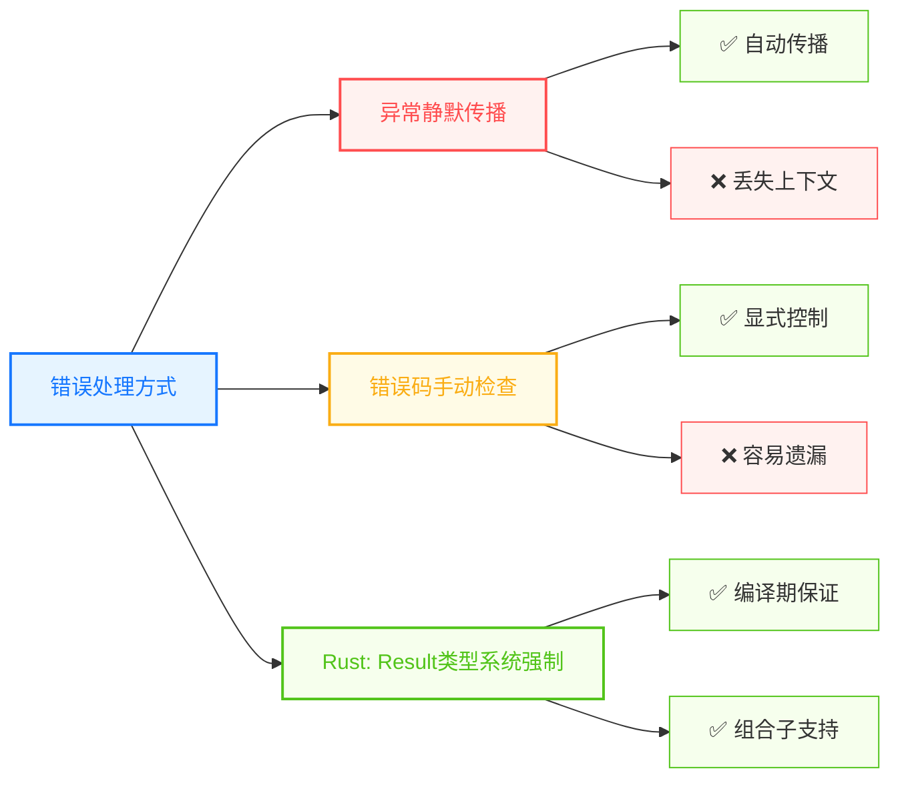

> **题记**：Rust 没有异常，只有错误。Result 和 Option 是 Rust 处理"可能失败"的标准方式——这不是缺陷，而是设计哲学。

## 写在开头

在大多数语言中，错误处理是个难题：

- **C 语言**：用错误码，需要手动检查，容易忽略
- **Java**：用异常，异常可以抛出任何地方，调用者容易忘记处理
- **Python**：混合使用异常和返回码，但异常会吞掉错误

Rust 选择了**显式错误处理**：



今天我们会学到：

1. **函数**：Rust 函数的独特之处
2. **模式匹配**：处理不同情况的优雅方式
3. **错误处理**：Result 和 Option 的正确用法

## 1. 函数基础：Rust 函数的独特之处

### 1.1 函数的定义

Rust 的函数定义和大多数语言类似，但有几个特点：

```rust
// Rust 函数定义
fn greet(name: &str) -> String {
    // 函数体最后一行是返回值（不需要 return）
    format!("Hello, {}!", name)
}

// 如果函数没有返回值，默认返回 ()
fn print_greeting(name: &str) {
    println!("Hello, {}!", name);
}
```

> **和 C/Java 的区别**：Rust 不需要 `void` 表示无返回值——函数没有 `->` 返回类型时默认返回 `()`。

### 1.2 函数返回值：最后一行是 return

Rust 的函数有**隐式返回**机制：

```rust
fn add(a: i32, b: i32) -> i32 {
    a + b  // 最后一行没有分号，就是返回值
}

fn add_with_return(a: i32, b: i32) -> i32 {
    return a + b;  // 也可以用 return，但 idiomatic Rust 用前者
}
```

> **经验之谈**：Rust 程序员习惯省略 `return`，因为 Rust 是表达式导向的语言。大多数函数用最后一行作为返回值。

### 1.3 早期返回

可以用 `return` 提前退出：

```rust
fn find_element(arr: &[i32], target: i32) -> Option<usize> {
    for (i, &elem) in arr.iter().enumerate() {
        if elem == target {
            return Some(i);  // 找到就返回
        }
    }
    None  // 没找到返回 None
}
```

### 1.4 函数签名中的类型推断

```rust
// Rust 必须在函数签名中显式声明返回类型
fn add(a: i32, b: i32) -> i32 {
    a + b
}

// 但闭包和块表达式可以省略返回类型，由编译器推断
fn process(data: &str) -> String {
    data.to_uppercase()
}
```

> **建议**：函数签名中显式写返回类型是好的实践（文档作用）。Rust 要求函数必须声明返回类型，不能省略。

## 2. 方法语法：impl

### 2.1 在 impl 块中定义方法

Rust 的"方法"（类似面向对象的成员函数）需要在 `impl` 块中定义：

```rust
struct Rectangle {
    width: u32,
    height: u32,
}

impl Rectangle {
    // self 是方法的第一个参数
    fn area(&self) -> u32 {
        self.width * self.height
    }
    
    // 可以有多个参数
    fn can_hold(&self, other: &Rectangle) -> bool {
        self.width > other.width && self.height > other.height
    }
    
    // 关联函数（类似静态方法）
    fn new(width: u32, height: u32) -> Self {
        Rectangle { width, height }
    }
}

fn main() {
    let rect = Rectangle::new(30, 50);
    println!("Area: {}", rect.area());
}
```

### 2.2 self 的三种形式

| 形式 | 含义 | 调用后所有权 |
|------|------|-------------|
| `self` | 获取所有权 | 原实例失效（被移动） |
| `&self` | 不可变借用 | 原实例保留 |
| `&mut self` | 可变借用 | 原实例保留，但可变借用期间不能使用 |

```rust
impl Rectangle {
    fn take_ownership(self) -> String {
        format!("Taking: {}x{}", self.width, self.height)
    }
    
    fn borrow(&self) -> u32 {
        self.width  // 只读访问
    }
    
    fn mut_borrow(&mut self) {
        self.width *= 2;  // 可变访问
    }
}
```

> **注意**：`self` 表示方法获取实例的所有权，调用后原变量失效（move）。`&self` 和 `&mut self` 是借用，原实例仍可用。

## 3. 模式匹配：match 和 if let

### 3.1 match：强大的 switch

```rust
fn main() {
    let x = 3;
    
    match x {
        1 => println!("one"),
        2 => println!("two"),
        3 => println!("three"),
        _ => println!("something else"),  // _ 是通配符，类似 default
    }
}
```

> **Rust 的 match 分支使用 `=>` 分隔模式与执行代码**。

### 3.2 match 绑定值

```rust
fn main() {
    let x = 5;
    
    match x {
        n if n < 0 => println!("negative"),
        n if n == 0 => println!("zero"),
        n => println!("positive: {}", n),  // 绑定到 n
    }
}
```

### 3.3 match 用于 Option

```rust
fn main() {
    let some_value: Option<i32> = Some(42);
    
    match some_value {
        None => println!("No value"),
        Some(v) => println!("Got value: {}", v),  // 绑定到 v
    }
}
```

### 3.4 if let：简化单模式匹配

```rust
// match 版本
match some_value {
    Some(v) => println!("Got: {}", v),
    None => {},
}

// if let 版本（更简洁）
if let Some(v) = some_value {
    println!("Got: {}", v);
}
```

### 3.5 if let-else

```rust
if let Some(v) = some_value {
    println!("Got: {}", v);
} else {
    println!("It was None");
}
```

### 3.6 while let：循环匹配

```rust
let mut stack = vec![1, 2, 3];

while let Some(top) = stack.pop() {
    println!("Popped: {}", top);
}
// 输出: 3, 2, 1
```

## 4. 错误处理：Result 与 Option

### 4.1 为什么 Rust 没有异常？

异常的问题在于**隐式传播**——函数可能抛出异常，但类型签名不告诉你。

```rust
# Java 示例
String readFile(String path) throws IOException {
    // 可能抛出异常，但调用者容易忘记处理
}
```

Rust 选择**显式错误处理**：使用 `Result<T, E>` 和 `Option<T>` 将错误信息编码在类型系统中，强制调用者处理可能失败的情况，避免异常静默传播导致的运行时崩溃。

### 4.2 Option\<T\>：可能无值

```rust
// 模拟一个查找函数
fn find_user(id: u32) -> Option<&'static str> {
    if id == 1 {
        Some("Alice")
    } else {
        None
    }
}

fn main() {
    let user = find_user(1);
    
    match user {
        Some(name) => println!("Found: {}", name),
        None => println!("User not found"),
    }
}
```

**Option 的两个成员**：

| 成员 | 含义 |
|------|------|
| `Some(T)` | 有值，包装在 Some 里 |
| `None` | 没有值 |

### 4.3 Result<T, E>：可能失败

```rust
// 模拟一个解析函数
fn parse_number(s: &str) -> Result<i32, std::num::ParseIntError> {
    s.parse::<i32>()
}

fn main() {
    match parse_number("42") {
        Ok(n) => println!("Parsed: {}", n),
        Err(e) => println!("Error: {}", e),
    }
}
```

**Result 的两个成员**：

| 成员 | 含义 |
|------|------|
| `Ok(T)` | 成功，值包装在 Ok 里 |
| `Err(E)` | 失败，错误信息包装在 Err 里 |

### 4.4 为什么要区分 Option 和 Result？

**选择原则**：

- 用 `Option`：只关心"有没有"，不关心"为什么没有"
- 用 `Result`：需要知道失败的原因

### 4.5 ? 操作符：错误的传播

`?` 是 Rust 的错误传播语法糖，只能用于返回 `Result`、`Option` 或实现了 `std::ops::Try` 类型的函数中：

```rust
use std::io::Read;

// 使用 ? 简化错误处理
fn read_file() -> Result<String, std::io::Error> {
    let mut file = std::fs::File::open("test.txt")?;
    // 上面 ? 的作用：
    // 如果是 Err，自动 return Err
    // 如果是 Ok，继续执行
    
    let mut contents = String::new();
    file.read_to_string(&mut contents)?;  // 同样传播错误
    
    Ok(contents)
}
```

等价于：

```rust
fn read_file() -> Result<String, std::io::Error> {
    let mut file = match std::fs::File::open("test.txt") {
        Ok(f) => f,
        Err(e) => return Err(e),
    };
    
    let mut contents = String::new();
    match file.read_to_string(&mut contents) {
        Ok(_) => {},
        Err(e) => return Err(e),
    }
    
    Ok(contents)
}
```

> **经验之谈**：`?` 操作符让错误处理代码从 5-6 行变成 1 行，极大减少了视觉噪音。善用 `?`，包括在返回 `Result` 的 `main` 函数中。

### 4.6 unwrap 和 expect：快速提取值

有时候你确定值存在，可以用 `unwrap()` 或 `expect()`：

```rust
let s = "42";
let n = s.parse::<i32>().unwrap();  // 如果是 Err 会 panic
let m = s.parse::<i32>().expect("Should be valid number");  // 自定义错误信息
```

> **警告**：不要在生产代码中用 `unwrap()`，除非你 100% 确信值一定存在。它是"我确定这里不会错，但如果错了就崩溃"的意思。

### 4.7 or_else 和 unwrap_or：提供默认值

```rust
let x: Option<i32> = None;

// None 时使用默认值
let y = x.unwrap_or(42);  // y = 42

// None 时计算默认值
let z = x.unwrap_or_else(|| {
    println!("Computing default...");
    100
});  // z = 100

// 对于实现了 Default trait 的类型
let w: Option<String> = None;
let default_string = w.unwrap_or_default();  // 返回 String::default()（空字符串）
```

## 5. 其他控制流

### 5.1 if 是表达式

Rust 的 `if` 是**表达式**，可以返回值：

```rust
let x = 5;
let sign = if x > 0 { "positive" } else if x < 0 { "negative" } else { "zero" };
```

> **和 C 的区别**：C 的 `if` 是语句（不返回值），Rust 的 `if` 是表达式（返回值）。Rust 的 `if` 表达式每个分支必须返回相同类型，否则编译错误。

### 5.2 loop：无限循环

```rust
let mut counter = 0;

let result = loop {
    counter += 1;
    if counter == 10 {
        break counter * 2;  // break 可以返回值
    }
};

println!("Result: {}", result);  // 20
```

### 5.3 while 循环

```rust
let mut n = 0;

while n < 5 {
    println!("n = {}", n);
    n += 1;
}
```

### 5.4 for 循环

```rust
// 遍历范围
for i in 0..5 {
    println!("i = {}", i);  // 0, 1, 2, 3, 4
}

// 遍历数组
let arr = [10, 20, 30];
for elem in arr {
    println!("elem = {}", elem);
}

// 遍历 vector（使用引用避免所有权转移）
let v = vec![1, 2, 3];
for i in &v {
    println!("i = {}", i);
}
// 或者使用迭代器
for i in v.iter() {
    println!("i = {}", i);
}
```

## 6. 常见模式与最佳实践

### 6.1 链式错误处理

```rust
use std::num::ParseIntError;

fn parse_and_add(a: &str, b: &str) -> Result<i32, ParseIntError> {
    let a: i32 = a.parse()?;
    let b: i32 = b.parse()?;
    Ok(a + b)
}

fn main() {
    match parse_and_add("10", "20") {
        Ok(sum) => println!("Sum: {}", sum),
        Err(e) => println!("Error: {}", e),
    }
}
```

### 6.2 用 map 和 and_then 转换 Option 和 Result

```rust
// Option 的转换
let x: Option<i32> = Some(5);

// map: 转换内部的值
let y = x.map(|v| v * 2);  // Some(10)

// and_then: 链式处理
let z = x.and_then(|v| if v > 0 { Some(v) } else { None });  // Some(5)

// Result 也有类似的方法
let r: Result<i32, &str> = Ok(5);
let r2 = r.map(|v| v * 2);  // Ok(10)
let r3 = r.and_then(|v| if v > 0 { Ok(v) } else { Err("negative") });  // Ok(5)
```

### 6.3 用 unwrap_or_else 延迟计算默认值

```rust
fn get_config(key: &str) -> Option<String> {
    None
}

fn main() {
    let value = get_config("timeout")
        .unwrap_or_else(|| {
            println!("Using default timeout");
            "30".to_string()
        });
}
```

## 7. 与其他语言的错误处理对比

| 特性 | Java 异常 | Go error | Rust Result |
|------|-----------|----------|-------------|
| 传播方式 | 隐式 | 显式返回 | 显式返回 + `?` |
| 编译器检查 | 强制声明 | 不强制 | 强制处理（`#[must_use]`） |
| 组合性 | 一般 | 一般 | 强大（map, and_then） |
| 性能 | 有开销 | 有开销 | 零开销 |

## 写在结尾

今天我们学习了：

1. **函数**：最后一行作为返回值，impl 定义方法
2. **模式匹配**：match 和 if let 处理不同情况
3. **Option\<T>**：可能无值的类型
4. **Result<T, E>**：可能失败的类型
5. **? 操作符**：错误传播的语法糖

**明天预告**：所有权与 Move 语义——Rust 最核心的概念。

> **思考题**：Rust 的 `Result` 类型和 Go 的多返回值错误处理看起来相似，但本质不同。Rust 的 `?` 操作符可以看作 Go 的 `if err != nil { return err }` 的语法糖，但 Rust 的类型系统让错误处理更加组合化。你认为这种设计对代码质量有什么影响？
