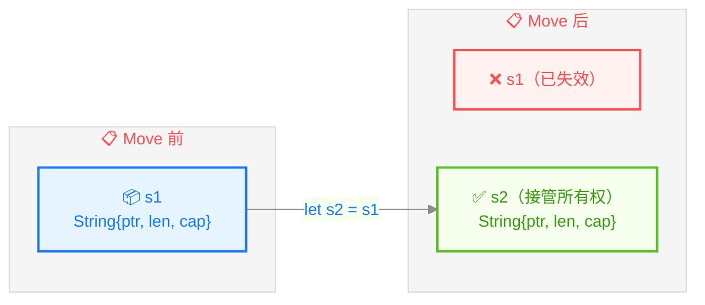
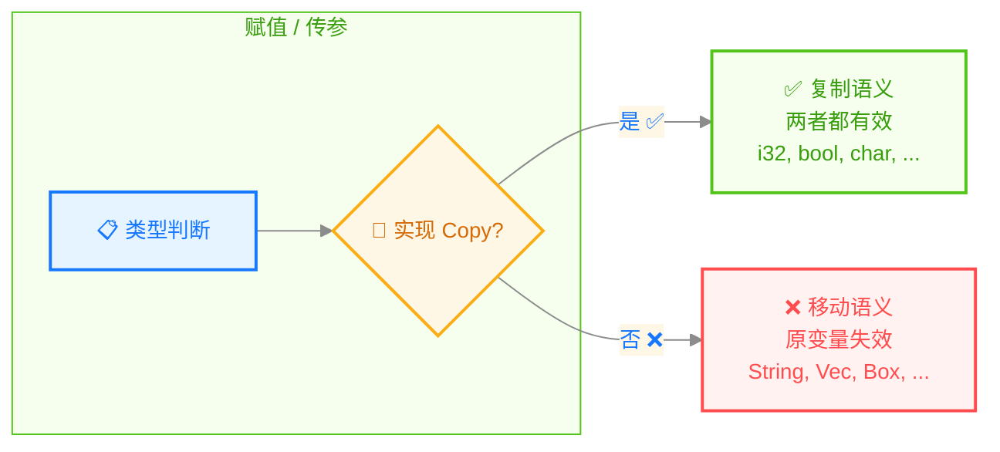
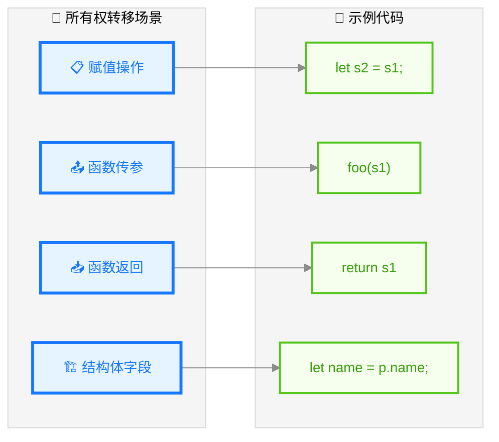
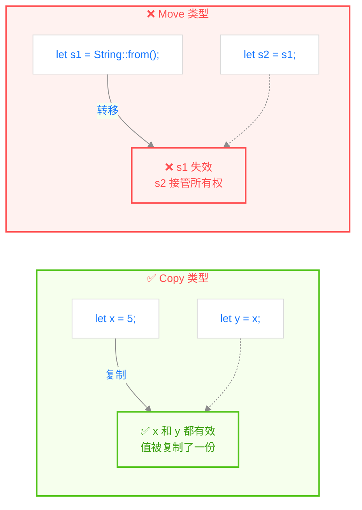

> **题记**：C++ 的内存泄漏和 Go 的 STW GC 暂停是业界两大痛点。Rust 的解法是在编译期就解决内存问题。代价是你必须接受所有权的概念——一旦理解，你会觉得这个代价值得。

## 写在开头

这是 Rust 最重要的概念，没有之一。

在你熟悉的语言中，内存管理有两种主要方式：

| 方式 | 代表语言 | 优点 | 缺点 |
|------|----------|------|------|
| 手动管理 | C/C++ | 性能极致，完全控制 | 内存泄漏、悬挂指针 |
| 垃圾回收 | Java/Go/Python | 省心，自动回收 | GC 暂停、性能不稳定 |

Rust 选择了**第三条路**：**编译期静态分析**。

> **核心思想**：在编译时就确定每个值由谁"负责"（owner），在值不再被需要时自动释放。没有运行时开销，没有 GC 暂停。

这一天可能会让你感到"违反直觉"，因为所有权规则和你用过的语言都不一样。但请相信我，这套系统是经过 15 年设计和改进的。一旦理解它，你会发现自己能够写出更安全、更高效的代码。

## 1. 什么是所有权

### 1.1 三条简单规则

Rust 的所有权系统遵循三条简单规则：

1. **每个值都有一个所有者**：Rust 中的每个值都有且只有一个所有者（变量）。
2. **同一时间只能有一个所有者**：不能有两个变量同时拥有同一个值。
3. **当所有者离开作用域时，值将被丢弃**：变量离开作用域时，Rust 会自动调用 `drop` 函数释放内存。

就这么简单。记住这三条规则，它们是理解 Rust 的基础。

### 1.2 所有者是谁？

看一个具体例子：

```rust
fn main() {
    // s 是字符串的所有者
    let s = String::from("hello");
    
    // x 是数字 5 的所有者
    let x = 5;
    
    // main 结束时，s 和 x 都会被自动清理
}
```

在上面的例子中：

- `s` 是 `String` 的**唯一所有者**
- `x` 是 `i32` 的**唯一所有者**

### 1.3 作用域与 Drop

当变量离开作用域时，Rust 会自动调用 `drop` 函数来释放内存：

```rust
fn main() {
    {                      // ── s 在这里还没有声明，不存在
        let s = String::from("hello");  // ── s 在这里诞生
        // s 在这里有效          // ── s 在这里使用
    }                      // ── s 在这里被 drop，内存释放
    // s 已经不存在了
}
```

> **这和 C++ 的 RAII 模式很相似**，但 Rust 在编译时就验证了这个行为，不需要运行时支持。
>
> **`Drop` trait**：Rust 通过 `Drop` trait 实现自动清理。当值离开作用域时，Rust 会自动调用 `drop` 方法。你可以为自定义类型实现 `Drop` trait 来定义清理逻辑。

## 2. Move 语义：所有权的转移

### 2.1 什么是 Move？

在大多数语言中，赋值操作是"复制"：

```python
# Python 示例
a = [1, 2, 3]  # 创建列表
b = a           # 复制引用（或者深复制，取决于实现）
a.append(4)     # 修改 a
print(b)        # 可能是 [1, 2, 3]，也可能是 [1, 2, 3, 4]
```

在 Rust 中，**赋值默认是 Move**（转移所有权），不是复制：

```rust
fn main() {
    let s1 = String::from("hello");  // s1 是所有者
    let s2 = s1;                      // 所有权从 s1 转移到 s2
    
    // println!("{}", s1);  // 编译错误！s1 已经无效
    println!("{}", s2);  // 正确！s2 是新的所有者
}
```

为什么 `s1` 会无效？



> **底层发生了什么？** `String` 在堆上分配了一块内存。Move 之后，`s2` 接管了指向那块内存的指针，而 `s1` 不再指向任何有效内存。这不是复制，而是"所有权的交接"。

### 2.2 为什么这样设计？

想象如果 Rust 进行浅复制（共享指针）会发生什么：

```rust
// 如果 Rust 像某些语言一样进行浅复制
let s1 = String::from("hello");
let s2 = s1;  // 如果这是浅复制（共享指针）
// 现在 s1 和 s2 指向同一块内存

// s1 和 s2 离开作用域时...
// ...都会尝试释放同一块内存！
// 这就是经典的 double free 问题
```

Rust 的 Move 语义**从根源上避免了这个问题**：



### 2.3 所有权的转移发生在什么时候？

以下四种情况会发生所有权转移：



**1. 赋值操作**

```rust
let s1 = String::from("hello");
let s2 = s1;  // Move!
```

**2. 函数参数传递**

```rust
let s = String::from("hello");
takes_ownership(s);  // s 的所有权转移到函数

// println!("{}", s);  // 编译错误！s 已经失效
```

**3. 函数返回值**

```rust
let s1 = String::from("hello");
let s2 = takes_and_returns(s1);  // s1 转移，s2 获得返回值所有权
```

**4. 结构体字段赋值**

```rust
struct Person {
    name: String,
}

let p = Person { name: String::from("Alice") };
let name = p.name;  // Move！p.name 不能再使用
```

### 2.4 函数参数和返回值的所有权

```rust
fn takes_ownership(s: String) {
    // s 在这里有效
    println!("{}", s);
}  // s 在这里被 drop，内存释放

fn makes_copy(x: i32) {
    // x 在这里有效
    println!("{}", x);
}  // x 在这里被 drop（但 i32 是 Copy 类型，原变量继续有效）

fn main() {
    let s = String::from("hello");
    takes_ownership(s);  // s 的所有权转移到函数，s 不再有效
    
    let x = 5;
    makes_copy(x);       // x 被复制（i32 是 Copy），原变量 x 继续有效
    
    println!("x is still: {}", x);  // 正常！x 仍然有效
}
```

> **关键点**：当 `String` 作为参数时，它的所有权会转移给函数，调用者不能再使用它。当 `i32` 作为参数时，因为它是 `Copy` 类型，所以是复制，原变量继续有效。
>
## 3. Copy 类型：不需要移动的类型

### 3.1 什么是 Copy？

有些类型在赋值时是**复制**的，不是移动的。这些类型实现了 `Copy` trait（可以理解为"标记"）：

```rust
fn main() {
    // i32 是 Copy 类型
    let x = 5;
    let y = x;  // 复制，不是移动
    
    // 两者都有效！
    println!("x = {}, y = {}", x, y);
    
    // 所有基本整数类型都是 Copy
    let a: i8 = -128;
    let b: u8 = 255;
    let c: f64 = 3.14;
    let d: bool = true;
    let e: char = 'A';
}
```

### 3.2 Copy vs Move：对比图



| 特性 | Copy 类型 | Move 类型 |
|------|----------|-----------|
| 赋值时 | 复制值 | 转移所有权 |
| 原变量 | 继续有效 | 失效 |
| 代表 | i32, u64, f64, bool, char | String, Vec, Box, File |
| 实现 | `Copy` trait | 没有 Copy |

### 3.3 为什么有些类型是 Copy，有些不是？

**能 Copy 的条件**：类型在内存中的表示是"简单位复制"。

- `i32`：就是 4 个字节，直接复制 bits 就行
- `bool`：就是 1 个字节
- `char`：4 个字节的 Unicode 码点

**不能 Copy 的条件**：类型包含**指向堆内存的指针**。

- `String`：包含 `{ptr: *, len: usize, cap: usize}`，如果复制 ptr，两个 String 会指向同一块堆内存，导致 double free
- `Vec`：同样包含指针，不能简单复制

### 3.4 如何实现 Copy？

你可以手动实现 `Copy` trait，但通常使用 `#[derive(Copy, Clone)]` 来自动派生。需要注意的是，如果一个类型包含 `Drop` trait 的实现（自定义析构逻辑），它就不能是 `Copy`：

```rust
// 这个类型可以是 Copy
#[derive(Debug, Clone, Copy)]
struct Point {
    x: f64,
    y: f64,
}

// 这个类型不能是 Copy
struct NoCopy {
    data: String,  // String 不是 Copy
}
```

## 4. Clone：显式深复制

### 4.1 什么时候需要 Clone？

当你确实需要复制一个值（而不是转移所有权），可以用 `clone()`：

```rust
let s1 = String::from("hello");
let s2 = s1.clone();  // 深复制，s1 仍然有效

println!("s1 = {}, s2 = {}", s1, s2);  // 两者都有效
```

> **Clone vs Copy**：
>
> - **Copy**：隐式、无成本（位复制）、编译器自动处理
> - **Clone**：显式、有成本（可能涉及堆分配）、需要手动调用
>
> Copy 是 Clone 的特例：所有 Copy 类型也必须是 Clone 的，但反过来不一定成立。

### 4.2 使用场景

```rust
// 场景1：需要保留原变量
let s1 = String::from("hello");
let s2 = s1.clone();  // s1 保留

// 场景2：函数参数需要复制
let data = String::from("important data");
process_data(data.clone());  // 传入克隆，原变量保留

fn process_data(data: String) {
    // 使用 data
}
```

> **经验之谈**：过度使用 `clone()` 会影响性能。如果发现代码里到处都是 `clone()`，可能是设计有问题，需要考虑是否应该用引用（`&`）而不是所有权转移。
>
## 5. 常见错误与解决

### 5.1 错误1：使用已移动的值

```rust
fn main() {
    let s1 = String::from("hello");
    let s2 = s1;  // s1 移动到 s2
    
    println!("{}", s1);  // ❌ 编译错误！s1 已失效
}
```

**解决方案**：使用引用（`&`）借用，或者 `clone()`：

```rust
// 方案1：使用引用
let s1 = String::from("hello");
let s2 = &s1;  // s1 借用给 s2，所有权不转移
println!("{}", s1);  // ✅ 正常

// 方案2：clone
let s1 = String::from("hello");
let s2 = s1.clone();  // 深复制
println!("{}", s1);  // ✅ 正常
```

### 5.2 错误2：忘记返回值的所有权

```rust
fn takes_and_returns(s: String) -> String {
    s  // 返回并转移所有权
}

fn main() {
    let s1 = String::from("hello");
    let s2 = takes_and_returns(s1);  // s1 转移，s2 获得所有权
    // println!("{}", s1);  // ❌ s1 已失效
    println!("{}", s2);  // ✅ s2 有效
}
```

### 5.3 错误3：返回局部变量的引用

```rust
fn invalid_ref() -> &String {
    let s = String::from("hello");
    &s  // ❌ 编译错误！返回局部变量 s 的引用
}

fn main() {
    // let r = invalid_ref();  // 编译失败
}
```

这个错误涉及**生命周期**，明天会详细讲解。暂时记住：**不要返回局部变量的引用**。

## 6. 所有权 vs 其他语言

### 6.1 vs C/C++

| 特性 | C/C++ | Rust |
|------|-------|------|
| 内存分配 | `malloc`/`new` | 栈上分配或通过智能指针/集合类型在堆上分配 |
| 释放时机 | 手动 `free`/`delete` | 离开作用域自动 `drop` |
| 悬挂指针 | 可能（use-after-free） | 编译期阻止 |
| 双重释放 | 可能 | 编译期阻止 |
| 所有权概念 | 无 | 编译期强制 |

### 6.2 vs Java/Go/Python

| 特性 | Java/Go/Python | Rust |
|------|-------------|------|
| 内存管理 | GC | Ownership |
| 空指针 | NullPointerException | Option\<T> 强制处理 |
| 确定性析构 | 一般没有 | 有 (Drop) |
| GC 暂停 | 有 | 无 |

## 7. 思维转变：如何像 Rust 一样思考

### 7.1 从"赋值是复制"到"赋值可能是转移"

### 7.2 从"函数参数是复制"到"函数参数可能是转移"

```rust
// C 风格：参数总是复制
void process(String s) {  // Java：s 是副本
    // 修改 s 不影响调用者
}

// Rust 风格：参数可能是 Move 或 Borrow
fn process(s: String) {  // s 获得所有权，调用者失去所有权
    // ...
}
```

### 7.3 实践建议

**当你遇到编译错误"value used after move"时**：

1. 这个值需要保留吗？→ 用 `&` 引用
2. 需要保留一个副本吗？→ 用 `.clone()`
3. 这个值应该转移给函数吗？→ 接受所有权转移

## 写在结尾

今天我们深入学习了 Rust 最核心的概念：**所有权系统**。

**核心要点**：

1. 每个值有唯一所有者
2. 赋值/传参时，非 Copy 类型会 Move
3. Move 后原变量失效
4. Copy 类型（基本类型）始终是复制
5. 用 `clone()` 可以显式深复制
6. 用 `&` 可以借用而不转移所有权

**明天预告**：引用与借用——理解 Rust 的借用检查器，这是写出安全代码的关键。
> **思考题**：想象你是一个房产中介，Rust 的所有权系统就像房产证。一个人可以拥有一套房子（owner），但可以有任意多把钥匙给不同的人参观（不可变引用），或者只有一个人有钥匙可以进去装修（可变引用）。这个比喻和 Rust 的所有权/借用系统有什么对应关系？
