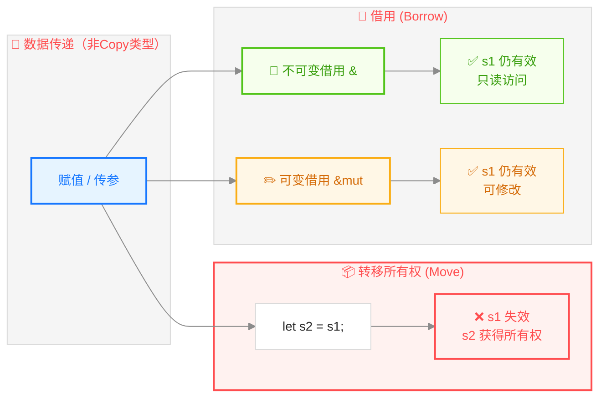
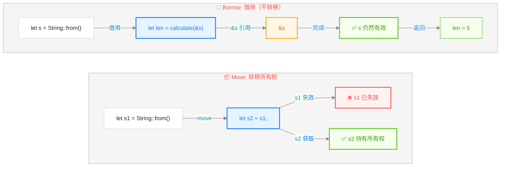
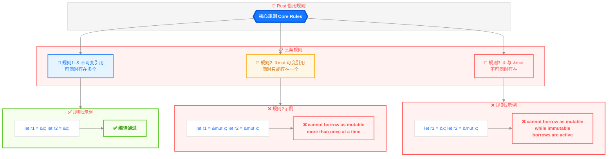
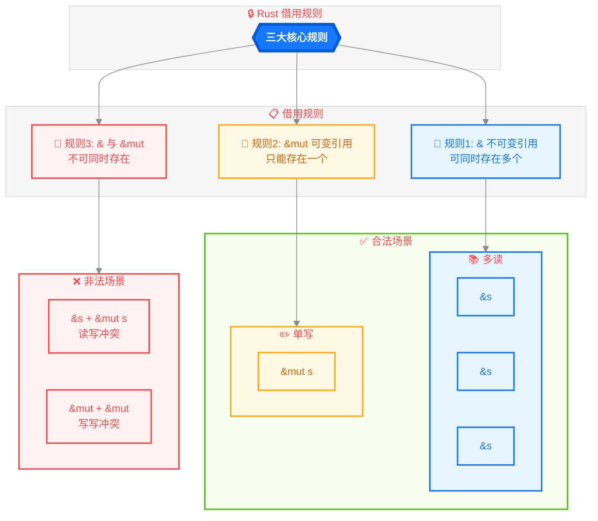
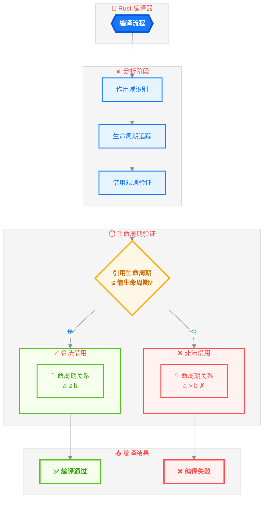
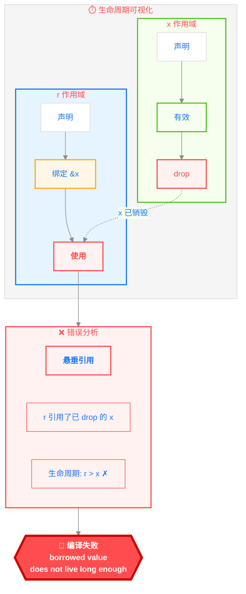
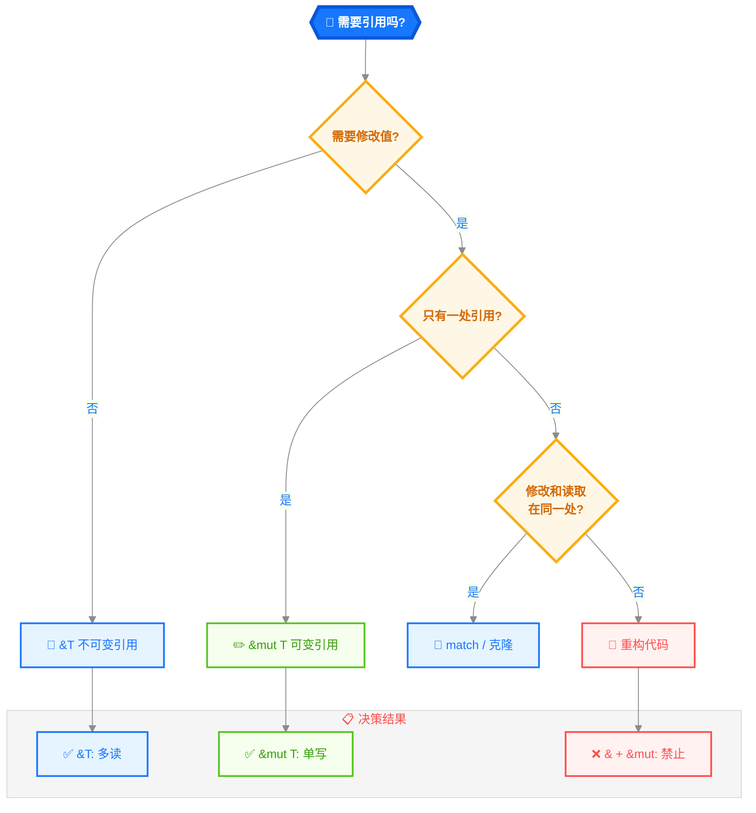

> **题记**：借用就像图书借阅——你可以有多个人同时持有只读副本（不可变引用），但如果你要涂改书页（可变引用），就不能有人同时在看。这一规则由编译器保证，永久有效。

## 写在开头

上一章我们学到：赋值是转移所有权，函数参数也会转移所有权。但有时候我们只是想"用一下"数据，不需要获得所有权。

这就引出了 Rust 的**引用（Reference）**机制——借用数据而不获取所有权。



> **注意**：上图描述的是 `String` 等非 `Copy` 类型的行为。对于 `i32` 等 `Copy` 类型，赋值是复制而不是转移所有权。

这一章会解释：

- 引用是什么
- 借用规则是什么
- 为什么这些规则能保证内存安全

## 1. 引用：借用数据

### 1.1 什么是引用？

**引用**是"指向数据的指针"，但不拥有数据。

```rust
fn main() {
    let s = String::from("hello");
    
    // &s 是对 s 的引用，不获取所有权
    let len = calculate_length(&s);
    
    println!("Length of '{}' is {}", s, len);  // s 仍然有效！
}

// 使用 &str 而不是 &String，这样函数更通用
// &str 可以接受 &String（通过 deref coercion）
fn calculate_length(s: &str) -> usize {
    s.len()  // s 是一个引用，我们用它但不拥有它
}  // s 离开作用域，但不 drop 任何东西，因为它不拥有数据
```

> **类比**：引用就像**借书**。你从图书馆借了一本书，书还是图书馆的（owner），你只是临时拥有使用权。

### 1.2 引用 vs 所有权转移



```rust
// 所有权转移版本
let s1 = String::from("hello");
let s2 = s1;  // s1 失效，s2 获得所有权
// println!("{}", s1);  // ❌ 错误

// 引用借用版本
let s1 = String::from("hello");
let s2 = &s1;  // s2 是 s1 的引用
println!("{}", s1);  // ✅ 正常，s1 仍然有效
```

### 1.3 可变引用

如果需要修改数据，用**可变引用** `&mut`：

```rust
fn main() {
    let mut s = String::from("hello");
    
    change(&mut s);  // 传入可变引用
    
    println!("{}", s);  // 输出 "hello, world"
}

fn change(s: &mut String) {
    s.push_str(", world");
}
```

> **注意 `mut` 的位置**：
>
> - `let r = &mut x;` - `r` 是**可变引用**，可以修改 `x` 的值
> - `let mut r = &x;` - `r` 是**可变绑定**，可以重新绑定到其他引用，但不能修改 `x` 的值
>
> 关键区别：`mut` 在 `&` 前面修饰的是引用变量本身（可重新绑定），在 `&` 后面修饰的是引用指向的数据（可修改）。

## 2. 借用规则：Rust 的核心规则

### 2.1 借用规则三条



### 2.2 规则1：多个不可变引用

```rust
fn main() {
    let s = String::from("hello");
    
    let r1 = &s;  // OK
    let r2 = &s;  // OK，可以有任意多个
    let r3 = &s;  // OK
    
    println!("{} {} {}", r1, r2, r3);  // 三个引用都有效
}
```

**为什么可以多个不可变引用？** 因为没人修改数据，所以不会有冲突。

### 2.3 规则2：一个可变引用

```rust
fn main() {
    let mut s = String::from("hello");
    
    let r1 = &mut s;  // OK
    // let r2 = &mut s;  // ❌ 错误！不能同时有两个可变引用
    println!("{}", r1);
}
```

**为什么只能有一个可变引用？** 因为同时修改同一份数据会产生数据竞争。

### 2.4 规则3：不可变和可变不能共存

```rust
fn main() {
    let mut s = String::from("hello");
    
    let r1 = &s;       // OK
    let r2 = &s;       // OK
    // let r3 = &mut s;  // ❌ 错误！有不可变引用时不能有可变引用
    
    println!("{} {}", r1, r2);
}
```

**为什么？** 因为不可变引用的使用者期望数据不变，如果同时有可变引用在修改，数据就可能变化。

### 2.5 借用规则的应用场景



**常见场景分析**：

| 场景 | 合法？ | 原因 |
|------|--------|------|
| 多个 `&T` | ✅ | 没人修改 |
| 一个 `&mut T` | ✅ | 没人读取 |
| 一个 `&T` + 一个 `&mut T` | ❌ | 有人在读时不能写 |
| 多个 `&T` + 一个 `&mut T` | ❌ | 同上 |

## 3. 悬空引用：Rust 防止的经典错误

### 3.1 什么是悬空引用？

**悬空引用**（Dangling Reference）是引用了已释放内存的指针。这是 C/C++ 的经典 bug：

```c
// C 语言：悬空引用
char* get_greeting() {
    char s[] = "hello";  // 栈上数组
    return s;  // ❌ 返回后 s 被释放，返回的指针无效
}
```

### 3.2 Rust 防止悬空引用

```rust
fn main() {
    // 下面这行代码会编译错误
    // let reference = dangle();
}

// 这个函数定义本身就会编译错误
fn dangle() -> &String {  // ❌ 编译错误：missing lifetime specifier
    let s = String::from("hello");
    &s  // 返回 s 的引用，但 s 会在这里被 drop
}

// 即使加上生命周期参数，仍然错误：
// fn dangle<'a>() -> &'a String {  // ❌ 编译错误：returns a reference to data owned by the current function
//     let s = String::from("hello");
//     &s
// }
```

> **Rust 编译器直接拒绝编译这段代码**：首先是"missing lifetime specifier"（缺少生命周期参数），如果加上生命周期参数，错误是"returns a reference to data owned by the current function"（返回了当前函数拥有的数据的引用）。

### 3.3 为什么 Rust 能防止悬空引用？

因为 Rust 有**借用检查器**和**生命周期系统**。编译器会确保：

- 引用存在的范围（生命周期）不能超过它引用的值存在的范围
- 如果这个规则被违反，编译失败

## 4. 借用检查器：编译器如何工作

### 4.1 借用检查器原理

借用检查器（Borrow Checker）是 Rust 编译器的组成部分，负责检查引用是否有效。



### 4.2 生命周期示例

```rust
fn main() {
    let r;                      // ─── r 声明
    {                           //
        let x = 5;              // ── x 声明
        r = &x;                 // ── r = &x（x 的引用赋给 r）
    }                           // ── x 在这里 drop
    println!("r: {}", r);       // ❌ r 引用了已 drop 的 x
}
```



### 4.3 正确示例

```rust
fn main() {
    let r;
    let x = 5;       // x 在这里声明
    r = &x;          // r = &x
    println!("r: {}", r);  // ✅ x 仍然有效
}  // x 在这里 drop，r 不再使用
```

```
时间线：
x:     |----声明----|----有效----|----drop----|
r:          |----未初始化----|----有效----|
                                    ↑
                                    两个都在这个区间有效
```

### 4.4 非词法生命周期（NLL）

Rust 2018 引入了**非词法生命周期**（Non-Lexical Lifetimes，NLL），它允许借用检查器更精确地判断引用的实际使用范围，而不是简单地依赖词法作用域。

```rust
fn main() {
    let mut v = vec![1, 2, 3];
    let first = &v[0];  // 不可变借用开始
    
    println!("{}", first);  // 使用不可变借用
    // 在这里，first 不再被使用，所以不可变借用结束
    
    v.push(4);  // ✅ 在 NLL 下，这是允许的！
    // 因为 first 已经不再使用，可变借用不会冲突
}
```

> 在引入 NLL 之前，上面的代码会编译错误，因为 `first` 的作用域持续到其声明的块结束。NLL 使 Rust 的借用检查更加灵活和符合直觉。

## 5. 实际使用中的借用规则

### 5.1 函数参数是引用时

```rust
fn first_word(s: &str) -> &str {
    // 函数参数是 &str（字符串切片引用）
    // 返回值是 &str（同一个切片的引用）
    // 借用检查器确保返回值生命周期 ≤ 参数生命周期
}

fn main() {
    let text = String::from("hello world");
    let word = first_word(&text);
    println!("First word: {}", word);
}
```

### 5.2 结构体中的引用

```rust
// 结构体中的引用需要生命周期标注
struct ImportantExcerpt<'a> {
    part: &'a str,  // 这个引用必须比结构体活得更久
}

fn main() {
    let novel = String::from("Call me Ishmael...");
    let first = ImportantExcerpt {
        part: &novel[..4],  // "Call"
    };
    println!("{}", first.part);
}  // novel 和 first 都在这里 drop，但 novel 的生命周期 ≥ first 的生命周期
```

> **生命周期 `'a`**：表示"这个引用必须至少活这么久"。结构体实例的生命周期必须**小于或等于** `'a`，也就是说，结构体不能比它包含的引用活得长。

### 5.3 可变引用的限制

```rust
fn main() {
    let mut v = vec![1, 2, 3];
    
    let first = &v[0];  // 获取第一个元素的引用
    
    v.push(4);  // ❌ 编译错误！可能重新分配内存
    
    println!("{}", first);  // 如果 push 成功，first 可能无效
}
```

**为什么 push 会出问题？** 因为 `push` 可能导致 Vec 重新分配内存，原来的 `first` 引用就会悬空。

```rust
// 正确做法：先 print，再 push
let mut v = vec![1, 2, 3];
let first = &v[0];
println!("{}", first);  // ✅ 使用完 first
v.push(4);              // ✅ 现在可以修改了
```

### 5.4 重新借用（Reborrowing）

重新借用允许从现有的可变引用创建新的可变引用，这在某些情况下很有用：

```rust
fn main() {
    let mut x = 5;
    let r1 = &mut x;
    
    // 重新借用：从 r1 创建新的可变引用
    let r2 = &mut *r1;
    
    *r2 += 1;
    
    // r1 在这里不能再使用，因为它的借用已经被"重新借用"出去了
    // println!("{}", r1);  // ❌ 错误
    println!("{}", r2);  // ✅ 输出 6
}
```

重新借用的规则与普通借用相同：不能同时有多个可变引用。

## 6. 借用规则的实际应用

### 6.1 多个不可变引用的场景

```rust
fn main() {
    let s = String::from("hello");
    
    print_length(&s);
    print_uppercase(&s);
    print_reversed(&s);
    
    // 三个函数可以同时借用 s
}

fn print_length(s: &String) { println!("{}", s.len()); }
fn print_uppercase(s: &String) { println!("{}", s.to_uppercase()); }
fn print_reversed(s: &String) { println!("{}", s.chars().rev().collect::<String>()); }
```

### 6.2 可变引用的场景

```rust
fn main() {
    let mut v = vec![1, 2, 3];
    
    // 需要修改时，用可变引用
    add_element(&mut v, 4);
    remove_last(&mut v);
    
    println!("{:?}", v);
}

fn add_element(v: &mut Vec<i32>, elem: i32) {
    v.push(elem);
}

fn remove_last(v: &mut Vec<i32>) {
    v.pop();
}
```

### 6.3 借用规则带来的设计思考

有时候借用规则会"逼迫"你重新设计代码：

```rust
// 问题：同时需要不可变和可变引用
let mut v = vec![1, 2, 3];
let first = &v[0];      // 不可变引用
v.push(4);              // 需要可变引用
println!("{}", first);  // first 还在用

// 解决1：先完成所有读取，再修改
let mut v = vec![1, 2, 3];
println!("{}", &v[0]);  // 先用完
v.push(4);              // 再修改

// 解决2：对于 Copy 类型，复制值
let mut v = vec![1, 2, 3];
let first_value = v[0];  // 复制值（因为 i32 是 Copy 类型）
v.push(4);               // 修改
println!("{}", first_value);  // 用副本

// 解决3：对于非 Copy 类型，使用 clone()
let mut v = vec![String::from("a"), String::from("b")];
let first_value = v[0].clone();  // 克隆字符串
v.push(String::from("c"));       // 修改
println!("{}", first_value);     // 用克隆的副本
```

## 7. 与其他语言对比

### 7.1 Rust vs C++

| 特性 | C++ | Rust |
|------|-----|------|
| 引用语法 | `T&`（必须初始化） | `&T`、`&mut T` |
| 重新绑定 | 引用一旦绑定就不能重新绑定 | 引用变量可以重新绑定（如果变量是 `mut` 的） |
| 常量引用 | `const T&` | `&T`（默认不可变） |
| 可变引用 | `T&` | `&mut T`（有严格限制） |
| 悬空引用 | 可能发生，运行时错误 | 编译期阻止 |
| 数据竞争 | 可能发生，运行时错误 | 编译期阻止（安全 Rust） |
| 生命周期 | 无编译器检查 | 有生命周期系统和借用检查器 |

### 7.2 Rust vs Go

| 特性 | Go | Rust |
|------|-----|------|
| 引用类型 | 切片、map、channel、指针 | 引用 `&T`、`&mut T` |
| 可变引用 | 指针 `*T` | `&mut T`（编译期检查） |
| 同时读写 | 可以（需要开发者保证安全） | 借用规则阻止 |
| 垃圾回收 | 有 | 无（所有权系统） |

## 8. 借用规则速查



**速记**：

- `&T`：只读借用（可以有任意多个）
- `&mut T`：读写借用（只能有一个，且不能有 `&T`）
- 引用必须总是有效的（防止悬空引用）

## 写在结尾

今天我们学习了：

1. **引用**：`&T` 和 `&mut T` 借用数据
2. **借用规则**：多读/单写，不可变和可变互斥
3. **悬空引用**：Rust 编译期防止
4. **借用检查器**：编译器如何验证借用规则
5. **非词法生命周期（NLL）**：更灵活的借用检查
6. **重新借用**：从现有引用创建新引用

**扩展知识**：

- 对于 `Copy` 类型（如 `i32`），赋值是复制而不是转移所有权
- 引用变量本身可以被重新绑定：`let mut r = &x; r = &y;`
- 非词法生命周期使借用检查更符合直觉

**明天预告**：生命周期——借用规则的形式化表示。
> **思考题**：借用规则实际上是对"数据竞争"（data race）的编译期预防。数据竞争发生在多个线程同时访问同一块内存，且至少有一个写操作时。Rust 的借用规则如何防止数据竞争？这种静态检查和 Go 的 channel 方案相比，各有什么优缺点？
