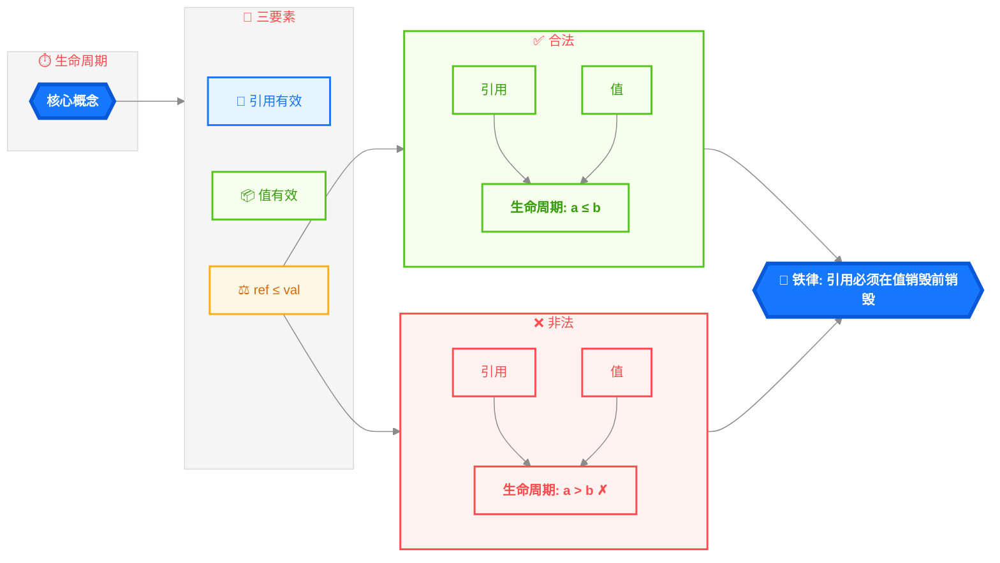
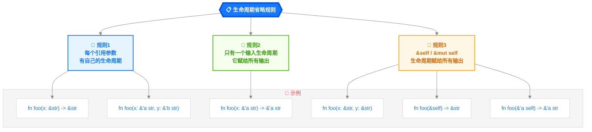
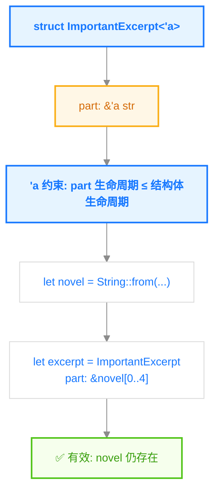
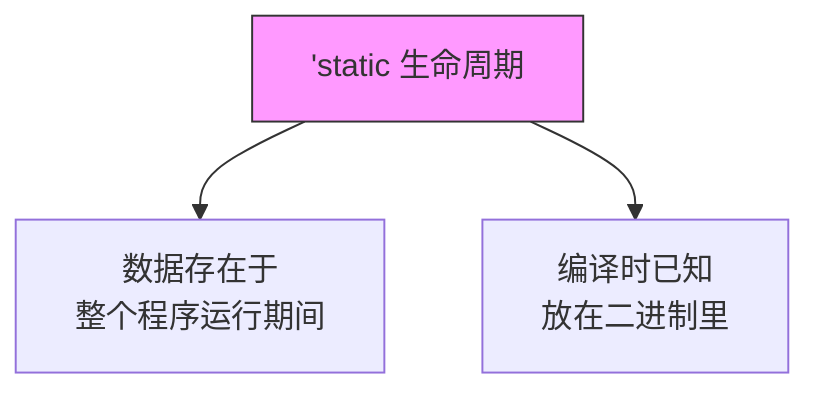
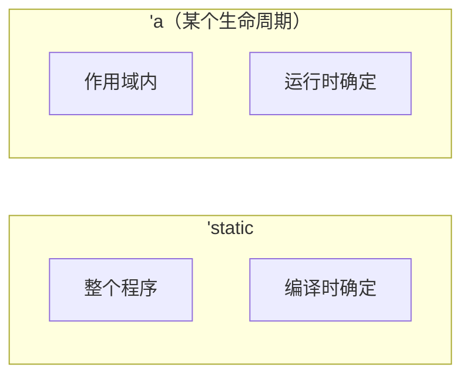
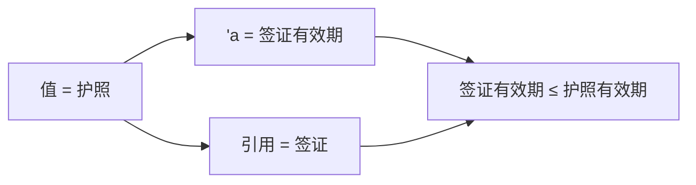

> **题记**：生命周期不是"让变量活得久一点"，而是**描述引用有效性的范围**。它告诉编译器：如果有引用，它引用的数据必须比引用本身活得更久。

## 写在开头

生命周期（Lifetime）是 Rust 最容易让人困惑的概念之一。很多初学者看到 `'a` 这样的语法就头疼。

但其实它的核心思想很简单：**引用不能比它引用的值活得更久**。



这一章会帮助你：

1. 理解什么是生命周期
2. 什么时候需要显式标注
3. 生命周期省略规则
4. 常见的生命周期模式

## 1. 什么是生命周期？

### 1.1 生命周期与作用域的区别

很多初学者把"生命周期"和"作用域"混为一谈。让我解释清楚：

| 概念 | 定义 | 运行时/编译时 |
|------|------|--------------|
| **作用域**（Scope） | `{ ... }` 块，变量存在的区域 | 运行时 |
| **生命周期**（Lifetime） | 引用有效的时期 | 编译时 |

```rust
fn main() {
    let x = 5;              // x 的作用域开始
    {                      
        let y = 10;        // y 的作用域开始
        println!("{}", x); // ✅ x 在这里有效
    }                      // y 的作用域结束
    // println!("{}", y);  // ❌ y 已经离开作用域
}                          // x 的作用域结束
```

### 1.2 生命周期的实际含义

当我说"引用的生命周期是 `'a`"，意思是：

> "这个引用在代码的某个范围内有效，这个范围被标记为 `'a`"

```rust
fn main() {
    let r: &i32;           // ─────────────────────────────────── r 的生命周期开始（未初始化）
    {                   //
        let x = 5;      // ── x 的生命周期开始      │
        r = &x;         // ── r = &x                    │
    }                   // ── x 在这里 drop          │
    println!("{}", r);  // ❌ r 引用了已 drop 的 x ── 错误！
}                      // ────────────────────────────────── r 的生命周期结束
```

**时间线可视化**：

```
代码行              │ x 的生命周期    │ r 的生命周期
────────────────────┼────────────────┼────────────────
let r: &i32;        │                │ 开始（未绑定）
{                   │                │
    let x = 5;      │ 有效           │
    r = &x;         │ 有效           │ 绑定到 x
}                   │ ▼ DROP         │
println!(r);        │ （已释放）     │ 有效但引用无效！
```

### 1.3 为什么需要生命周期？

生命周期注解是**给编译器的提示**，帮助它验证引用是否有效。

```rust
// 这个函数返回哪个引用的生命周期？
fn longest(x: &str, y: &str) -> &str {
    if x.len() > y.len() {
        x
    } else {
        y
    }
}
```

编译器需要知道：返回值是指向 `x` 还是 `y`？它的生命周期应该和哪个输入参数一样长？

**生命周期注解**回答了这个问题。

## 2. 生命周期标注

### 2.1 语法

```rust
fn longest<'a>(x: &'a str, y: &'a str) -> &'a str {
    if x.len() > y.len() { x } else { y }
}
```

`<'a>` 的意思是：

- "我引入了一个生命周期参数，叫它 `'a`"
- `'a` 会具体化到实际的引用生命周期上

### 2.2 生命周期的含义

```rust
fn longest<'a>(x: &'a str, y: &'a str) -> &'a str
//    ↑         ↑      ↑          ↑     ↑
//    │         │      │          │     └── 返回值的生命周期
//    │         │      │          └──────── y 的生命周期
//    │         │      └────────────────── x 的生命周期
//    │         └────────────────────────── 生命周期参数 'a
//    └─────────────────────────────────── 函数定义了一个生命周期参数
```

**实际含义**：

- 返回值的生命周期 = 输入参数中较短的那个
- 如果 x 有效 5 秒，y 有效 3 秒，返回值有效 3 秒

### 2.3 什么时候需要标注？

**情况1**：函数返回引用，且和输入引用有关联

```rust
// 需要标注：返回哪个输入的引用？
fn longest<'a>(x: &'a str, y: &'a str) -> &'a str {
    if x.len() > y.len() { x } else { y }
}
```

**不需要标注**：返回的是函数内部创建的引用

```rust
// 不需要：返回的是新创建的 String
fn first_word(s: &str) -> String {
    s.split_whitespace().next().unwrap_or("").to_string()
}
```

### 2.4 单参数的情况

```rust
// 这个函数返回一个引用，它的生命周期 = 输入引用的生命周期
fn first_word(s: &str) -> &str {  // 编译器可以推断
    s.split_whitespace().next().unwrap_or("")
}
```

但有时候需要显式标注：

```rust
// 显式标注
fn first_word<'a>(s: &'a str) -> &'a str {
    s.split_whitespace().next().unwrap_or("")
}
```

## 3. 生命周期省略规则

### 3.1 Rust 的生命周期省略规则

为了让代码不那么冗长，Rust 有一套**生命周期省略规则**。如果满足规则，编译器会自动推断生命周期。



### 3.2 应用示例

**示例1：单参数**

```rust
// 编译器自动推断
fn first_word(s: &str) -> &str
// 等价于
fn first_word<'a>(s: &'a str) -> &'a str
```

规则2应用：只有一个输入生命周期参数，所以它赋给返回值。

**示例2：多参数**

```rust
// 编译器推断
fn longest(x: &str, y: &str) -> &str
// 编译器报错！因为无法推断返回哪个
```

规则1应用：两个输入参数有两个生命周期，无法确定返回值用哪个。

**示例3：方法**

```rust
impl StrExt for str {
    fn first_word(&self) -> &str  // 编译器推断：返回 &'a str
}
```

规则3应用：`&self` 的生命周期赋给返回值。

### 3.3 省略后仍需要标注的情况

```rust
// 无法推断，因为有两个输入引用且没有 &self
fn longest<'a>(x: &'a str, y: &'a str) -> &'a str {
    if x.len() > y.len() { x } else { y }
}

// 结构体方法，返回结构体内部的引用
struct Excerpt<'a> {
    part: &'a str,
}

impl<'a> Excerpt<'a> {
    fn part(&self) -> &str {  // 应用规则3：&self 的生命周期赋给返回值
        self.part
    }
}
```

## 4. 结构体与生命周期

### 4.1 结构体中的引用

结构体如果包含引用，必须标注生命周期：

```rust
// 报错：missing lifetime specifier
struct ImportantExcerpt {
    part: &str,
}
```

**为什么？** 因为编译器需要知道这个引用活多久，才能验证它不会悬空。

### 4.2 正确的结构体定义

```rust
struct ImportantExcerpt<'a> {
    part: &'a str,  // 这个引用必须至少和结构体一样久
}

fn main() {
    let novel = String::from("Call me Ishmael...");
    let excerpt = ImportantExcerpt {
        part: &novel[0..4],  // "Call"
    };
    println!("{}", excerpt.part);
}
```



### 4.3 一个结构体的生命周期可以依赖另一个

```rust
struct Context<'a> {
    content: &'a str,
}

struct Parser<'a, 'b> {
    context: &'a Context<'b>,  // Parser 活得比 Context 久
}
```

## 5. 静态生命周期

### 5.1 `'static`

`'static` 是特殊的生命周期，表示"整个程序运行期间"：

```rust
// 字符串字面量是 'static
let s: &'static str = "I live forever!";
```



### 5.2 什么时候用 `'static`？

**1. 字符串字面量**

```rust
let s: &'static str = "Hello, world!";
```

**2. 全局常量**

```rust
static COUNTER: std::sync::atomic::AtomicI32 = std::sync::atomic::AtomicI32::new(0);
// 或者使用 lazy_static/crate
```

**注意**：使用`static mut`需要`unsafe`代码块，推荐使用原子类型或`Mutex`等线程安全类型。

**3. 错误信息**

```rust
fn get_error() -> &'static str {
    "Something went wrong"
}
```

### 5.3 `'static vs 'a`



**选择原则**：

- 字符串字面量 → `'static`
- 函数参数/返回值 → `'a`
- 不确定时问自己：这个引用会和程序一样久吗？

## 6. 生命周期子类型

### 6.1 什么是子类型？

如果 `'long` 比 `'short` 活得更久，那么 `'long: 'short`（`'long` 是 `'short` 的子类型）。


### 6.2 为什么要知道这个？

在某些情况下需要指定生命周期关系：

```rust
// context 必须和 excerpt 活得一样久
struct Parser<'a> {
    context: &'a str,
}

impl<'a> Parser<'a> {
    // 这里 'a 是 Parser 的生命周期
    // 返回值的生命周期 = 'a
    fn parse(&self) -> &str {
        self.context
    }
}
```

## 7. 常见错误解析

### 7.1 错误：返回局部变量的引用

```rust
fn dangle() -> &String {  // ❌ 编译错误！
    let s = String::from("hello");
    &s  // s 在函数结束时被 drop
}
```

**错误信息**：`missing lifetime specifier` 或 `borrowed value does not live long enough`

**解决方案**：返回所有权的值，而不是引用

```rust
fn dangle() -> String {  // ✅ 返回值
    let s = String::from("hello");
    s  // s 被移动出去，不会被 drop
}
```

### 7.2 错误：引用比值活得久

```rust
fn main() {
    let r: &i32;
    {
        let x = 5;
        r = &x;  // x 在这里被 drop
    }
    println!("{}", r);  // ❌ r 引用了已 drop 的 x
}
```

**错误信息**：``x`does not live long enough`

### 7.3 错误：省略规则无法推断

```rust
fn longest(x: &str, y: &str) -> &str {  // ❌ 编译错误！
    if x.len() > y.len() { x } else { y }
}
```

**错误信息**：`missing lifetime specifier`

**解决方案**：添加生命周期参数

```rust
fn longest<'a>(x: &'a str, y: &'a str) -> &'a str {
    if x.len() > y.len() { x } else { y }
}
```

## 8. 生命周期 vs 其他概念对比

### 8.1 生命周期 vs 作用域

| 特性 | 作用域 | 生命周期 |
|------|--------|----------|
| 本质 | 代码块 `{...}` | 引用有效的时期 |
| 编译/运行 | 运行时 | 编译时 |
| 标记 | 无 | `'a` |
| 作用 | 变量管理 | 引用有效性验证 |

### 8.2 Rust vs C++

| 特性 | C++ | Rust |
|------|-----|------|
| 悬空引用 | 可能 | 编译期阻止 |
| 生命周期 | 手动追踪 | 编译器追踪 |
| 表达力 | 隐式 | 显式（需要时） |

## 9. 理解生命周期的思维模型

### 9.1 类比：护照和签证



**规则**：签证（引用）不能比护照（值）有效期更长。

### 9.2 实际代码映射

```rust
let s: &String;          // 签证申请中（未绑定）
{
    let x = String::from("hello");  // 护照发放
    s = &x;              // 签证生效
}                        // 护照到期（x drop）
// s = 签证，但护照已失效！ ❌
```

## 10. 高级主题（扩展知识）

### 10.1 生命周期约束

有时需要指定生命周期之间的关系：

```rust
// 'a 必须比 'b 活得更久
struct Ref<'a, 'b: 'a> {
    r: &'a &'b i32,
}

// 在 trait bound 中指定生命周期
trait Processor<'a> {
    fn process(&self, data: &'a str) -> &'a str;
}
```

### 10.2 生命周期与 trait 对象

当使用 trait 对象时，生命周期变得重要：

```rust
trait Display {
    fn display(&self) -> String;
}

// 返回 trait 对象需要指定生命周期
fn get_display<'a>(s: &'a str) -> Box<dyn Display + 'a> {
    // 实现...
}
```

### 10.3 `'static` 在 trait 对象中的应用

```rust
// 可以转换为 'static trait 对象
fn to_static_trait<T: Display + 'static>(t: T) -> Box<dyn Display + 'static> {
    Box::new(t)
}
```

## 写在结尾

今天我们深入理解了：

1. **生命周期**：引用有效的时期，编译时概念
2. **生命周期标注**：`'a` 是生命周期的名字
3. **省略规则**：编译器自动推断大多数情况
4. **静态生命周期**：`'static` 表示整个程序运行期间
5. **结构体中的引用**：必须标注生命周期
6. **常见错误模式**：如何避免悬垂引用

**关键要点**：

- 生命周期是编译时概念，用于验证引用有效性
- 大多数情况下，生命周期可以自动推断
- 当函数返回引用且引用来源不确定时，需要显式标注
- 结构体包含引用时必须标注生命周期
- `'static` 生命周期用于整个程序运行期间有效的数据

**明天预告**：Struct、Enum、Trait、泛型——Rust 的抽象机制。

> **思考题**：Rust 的生命周期系统和 C++ 的"智能指针生存期"管理（shared_ptr/weak_ptr）有相似之处，但实现方式完全不同。C++ 靠引用计数运行时追踪，Rust 靠编译器静态分析。你认为这两种方式各有什么优缺点？在什么场景下你会选择其中一种？
