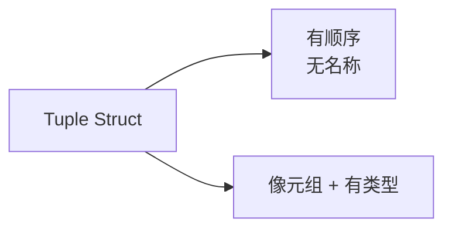
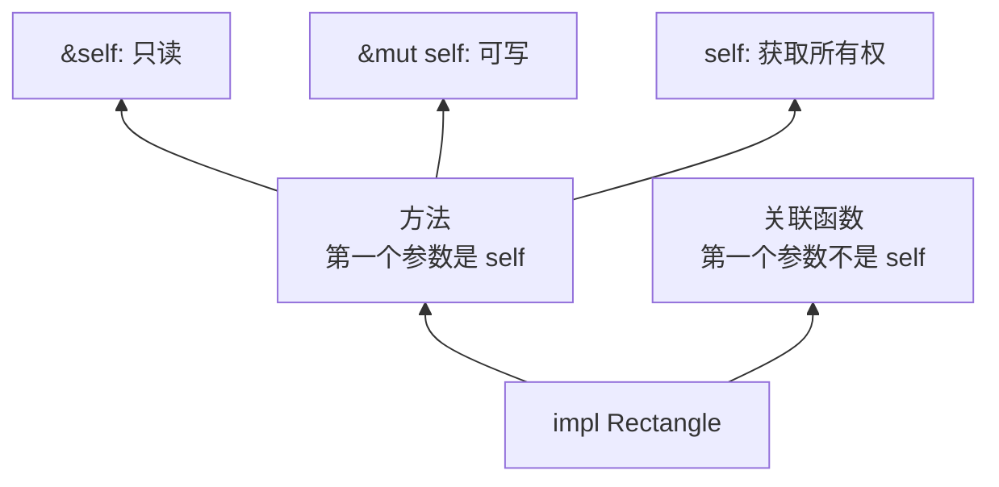
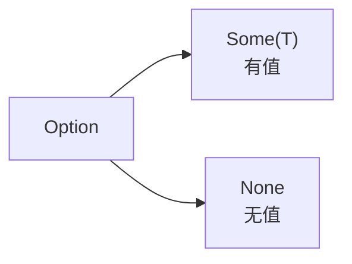
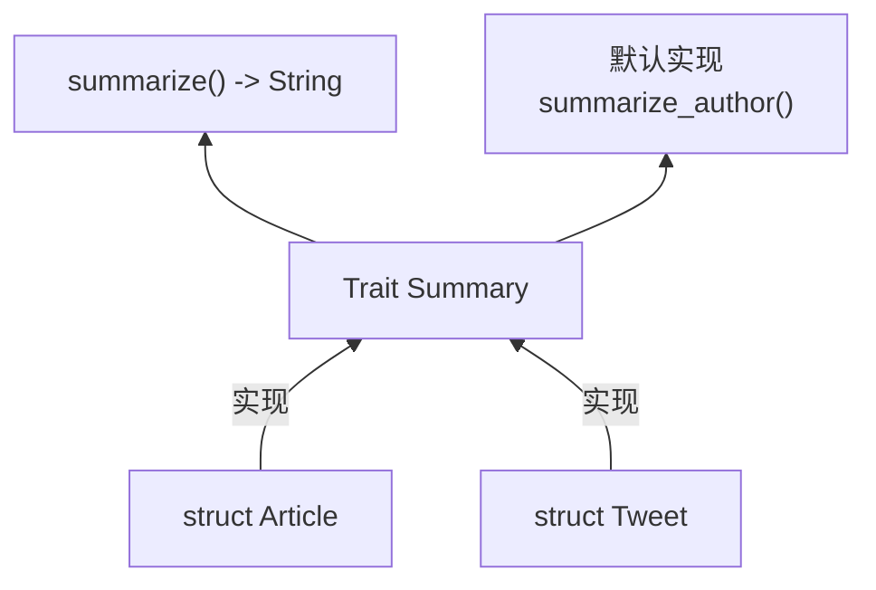
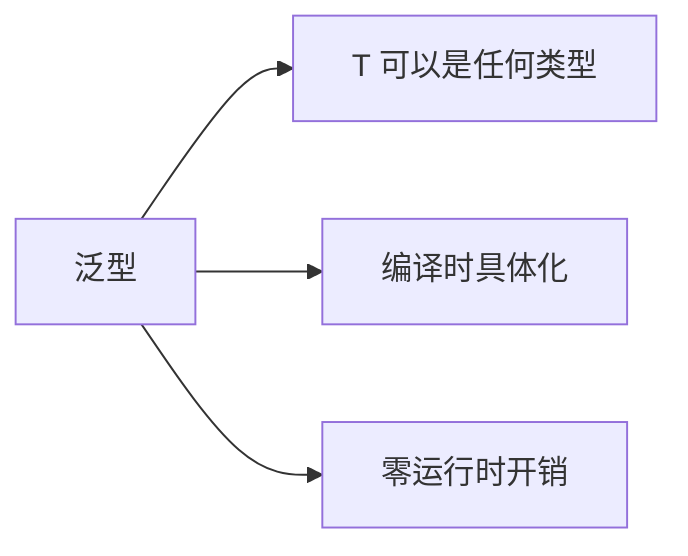

> **题记**：Rust 没有类，但它的抽象机制同样强大。Struct/Enum/Trait/泛型——这四个概念是 Rust 抽象的基石。单独看都不复杂，但组合起来，就构成了 Rust 强大的类型系统。

## 写在开头

在传统的面向对象语言中，"类"是数据和行为的封装单元。但在 Rust 中，数据和行为是分开的：

- **Struct/Enum**：专注数据组织
- **Trait**：专注行为定义
- **impl**：关联函数和方法

这种设计看似分离，实际上更灵活——你可以为任何类型实现任何 trait，不受"类继承"的限制。

## 1. Struct：数据的聚合

### 1.1 定义 Struct

Struct（结构体）是 Rust 中最常用的复合数据类型，用于将相关数据聚合在一起：

```rust
struct User {
    username: String,
    email: String,
    sign_in_count: u64,
    active: bool,
}

fn main() {
    let user1 = User {
        email: String::from("user@example.com"),
        username: String::from("alice"),
        active: true,
        sign_in_count: 1,
    };
    
    // 访问字段
    println!("{}", user1.email);
    
    // 如果需要修改，必须声明 mut
    let mut user2 = User {
        email: String::from("user2@example.com"),
        username: String::from("bob"),
        active: true,
        sign_in_count: 1,
    };
    user2.email = String::from("newemail@example.com");
}
```

### 1.2 Tuple Struct

有时候给字段命名太啰嗦，可以用 Tuple Struct：



```rust
struct Color(i32, i32, i32);
struct Point(i32, i32, i32);

fn main() {
    let black = Color(0, 0, 0);
    let origin = Point(0, 0, 0);
    
    // 通过索引访问
    let r = black.0;
    let x = origin.0;
    
    println!("R: {}, X: {}", r, x);
}
```

**使用场景**：当你需要给一组值一个"类型名"，但字段名没什么意义时。

### 1.3 Unit Struct

没有任何字段的 struct，用于实现 trait 或作为标记：

```rust
struct AlwaysEqual;

fn main() {
    let _always_equal = AlwaysEqual;
}
```

**使用场景**：

- 实现某个 trait 但不需要存储数据
- 作为某种"状态"的标记

### 1.4 Struct 方法

在 `impl` 块中定义方法：



```rust
struct Rectangle {
    width: u32,
    height: u32,
}

impl Rectangle {
    // 关联函数（类似静态方法）
    fn new(width: u32, height: u32) -> Self {
        Rectangle { width, height }
    }
    
    // 实例方法
    fn area(&self) -> u32 {
        self.width * self.height
    }
    
    // 判断是否能容纳另一个矩形（包含相等情况）
    fn can_hold(&self, other: &Rectangle) -> bool {
        self.width >= other.width && self.height >= other.height
    }
}

fn main() {
    let rect = Rectangle::new(30, 50);
    println!("Area: {}", rect.area());
    println!("Can hold 20x10: {}", rect.can_hold(&Rectangle::new(20, 10)));
    println!("Can hold 30x50: {}", rect.can_hold(&Rectangle::new(30, 50))); // true
}
```

### 1.5 使用 #[derive] 派生 trait

Rust 提供了 `#[derive]` 属性，可以自动为结构体生成常用 trait 的实现：

```rust
#[derive(Debug, Clone, PartialEq)]
struct Point {
    x: i32,
    y: i32,
}

fn main() {
    let p1 = Point { x: 1, y: 2 };
    let p2 = p1.clone(); // 使用 Clone trait
    
    println!("{:?}", p1); // 使用 Debug trait
    println!("Are equal? {}", p1 == p2); // 使用 PartialEq trait
}
```

常用派生 trait：`Debug`（调试打印）、`Clone`（克隆）、`Copy`（拷贝）、`PartialEq`（部分相等）、`Eq`（完全相等）、`PartialOrd`（部分排序）、`Ord`（完全排序）、`Hash`（哈希）。

## 2. Enum：相关类型的集合

### 2.1 定义 Enum

Enum（枚举）表示"相关类型的集合"：

```rust
enum Message {
    Quit,                       // 无数据
    Move { x: i32, y: i32 },   // 匿名结构体
    Write(String),              // 单个值
    ChangeColor(i32, i32, i32), // 多个值
}

fn main() {
    let q = Message::Quit;
    let m = Message::Move { x: 10, y: 20 };
    let w = Message::Write(String::from("hello"));
    let c = Message::ChangeColor(255, 0, 0);
}
```

**为什么用 Enum 而不是 Struct？** 当一个值可能是"几种相关情况之一"时，Enum 比 Struct 更合适。

### 2.2 Enum 与方法

Enum 也可以有方法：

```rust
impl Message {
    fn call(&self) {
        match self {
            Message::Quit => println!("Quit"),
            Message::Move { x, y } => println!("Move to ({}, {})", x, y),
            Message::Write(s) => println!("Write: {}", s),
            Message::ChangeColor(r, g, b) => println!("Color: {}, {}, {}", r, g, b),
        }
    }
}

fn main() {
    let m = Message::Write(String::from("hello"));
    m.call();
}
```

### 2.3 Option\<T>：标准库的 Enum

`Option<T>` 是 Rust 标准库定义的枚举，用于表示"值可能不存在"：



```rust
// 标准库中的定义（了解即可，无需手动定义）
// enum Option<T> {
//     None,
//     Some(T),
// }

fn main() {
    let some_number: Option<i32> = Some(5);
    let no_number: Option<i32> = None;
    
    // 使用 match 处理 Option
    match some_number {
        Some(value) => println!("Got value: {}", value),
        None => println!("Got nothing"),
    }
}
```

> **为什么要用 Option？** 在 Java/C++ 中，用 null 表示"没有值"，但 null 容易导致 NullPointerException。Rust 的 Option 强制你处理"没有值"的情况——编译器会检查你是否处理了 None。

### 2.4 Result<T, E>：标准库的 Enum

`Result<T, E>` 用于表示"操作可能失败"：

```rust
// 标准库中的定义（了解即可，无需手动定义）
// enum Result<T, E> {
//     Ok(T),    // 成功，值包装在 Ok 里
//     Err(E),   // 失败，错误信息包装在 Err 里
// }

fn divide(numerator: f64, denominator: f64) -> Result<f64, String> {
    if denominator == 0.0 {
        Err(String::from("Cannot divide by zero"))
    } else {
        Ok(numerator / denominator)
    }
}

fn main() {
    match divide(10.0, 2.0) {
        Ok(result) => println!("Result: {}", result),
        Err(err) => println!("Error: {}", err),
    }
}
```

## 3. Trait：行为的定义

### 3.1 什么是 Trait？

Trait（特征）定义了一组行为（方法），类型可以实现这些行为：



```rust
trait Summary {
    fn summarize(&self) -> String;
    
    // 默认实现
    fn summarize_author(&self) -> String {
        String::from("(Unknown)")
    }
}
```

### 3.2 实现 Trait

```rust
struct Article {
    title: String,
    author: String,
    content: String,
}

impl Summary for Article {
    fn summarize(&self) -> String {
        format!("{} by {}", self.title, self.author)
    }
    
    // 使用默认实现，无需重写 summarize_author
}

struct Tweet {
    username: String,
    content: String,
}

impl Summary for Tweet {
    fn summarize(&self) -> String {
        format!("@{}: {}", self.username, self.content)
    }
    
    fn summarize_author(&self) -> String {
        format!("@{}", self.username)
    }
}

fn main() {
    let article = Article {
        title: String::from("Rust Traits"),
        author: String::from("Alice"),
        content: String::from("..."),
    };
    
    let tweet = Tweet {
        username: String::from("rustacean"),
        content: String::from("Learning Rust is fun!"),
    };
    
    println!("Article: {}", article.summarize());
    println!("Tweet: {}", tweet.summarize());
    println!("Tweet author: {}", tweet.summarize_author());
}
```

### 3.3 Trait 作为参数

Trait 可以作为函数参数的类型：

```rust
// 方式1：impl Trait 语法
fn notify(item: &impl Summary) {
    println!("Breaking: {}", item.summarize());
}

// 方式2：Trait Bound 语法（更明确）
fn notify_generic<T: Summary>(item: &T) {
    println!("Breaking: {}", item.summarize());
}

fn main() {
    let tweet = Tweet {
        username: String::from("rustacean"),
        content: String::from("Hello Rust!"),
    };
    
    notify(&tweet);
    notify_generic(&tweet);
}
```

### 3.4 多个 Trait Bound

```rust
use std::fmt::Display;

// 为 Article 实现 Display
impl Display for Article {
    fn fmt(&self, f: &mut std::fmt::Formatter<'_>) -> std::fmt::Result {
        write!(f, "{} ({})", self.title, self.author)
    }
}

// 两个条件都用
fn notify_display(item: &(impl Summary + Display)) {
    println!("{}", item);
    println!("Summary: {}", item.summarize());
}

// 或用 where 子句（更清晰）
fn notify_where<T>(item: &T)
where
    T: Summary + Display,
{
    println!("{}", item);
    println!("Summary: {}", item.summarize());
}

fn main() {
    let article = Article {
        title: String::from("Rust Traits"),
        author: String::from("Alice"),
        content: String::from("..."),
    };
    
    notify_display(&article);
    notify_where(&article);
}
```

### 3.5 条件实现

可以为满足特定条件的类型实现 trait：

```rust
use std::fmt::Display;

struct Pair<T> {
    x: T,
    y: T,
}

impl<T> Pair<T> {
    fn new(x: T, y: T) -> Self {
        Pair { x, y }
    }
}

// 只有实现了 Display 和 PartialOrd 的类型才有这个方法
impl<T: Display + PartialOrd> Pair<T> {
    fn cmp_display(&self) {
        if self.x >= self.y {
            println!("The largest member is x = {}", self.x);
        } else {
            println!("The largest member is y = {}", self.y);
        }
    }
}

fn main() {
    let pair = Pair::new(5, 10);
    pair.cmp_display(); // 工作正常，因为 i32 实现了 Display 和 PartialOrd
    
    // 以下代码会编译错误，因为 &str 没有实现 PartialOrd
    // let pair_str = Pair::new("hello", "world");
    // pair_str.cmp_display();
}
```

### 3.6 Trait 对象（动态分发）

除了泛型的静态分发，Rust 还支持 trait 对象的动态分发：

```rust
fn print_summaries(items: &[&dyn Summary]) {
    for item in items {
        println!("{}", item.summarize());
    }
}

fn main() {
    let article = Article {
        title: String::from("Rust Traits"),
        author: String::from("Alice"),
        content: String::from("..."),
    };
    
    let tweet = Tweet {
        username: String::from("rustacean"),
        content: String::from("Hello Rust!"),
    };
    
    let items: Vec<&dyn Summary> = vec![&article, &tweet];
    print_summaries(&items);
}
```

**注意**：trait 对象使用 `dyn` 关键字，并且只能用于对象安全的 trait（即方法不返回 `Self`、不包含泛型参数等）。

## 4. 泛型：参数化的多态

### 4.1 什么是泛型？

泛型允许你编写可重用的代码，操作不同类型：



```rust
// 泛型函数 - 安全处理空切片
fn largest<T: PartialOrd>(list: &[T]) -> Option<&T> {
    if list.is_empty() {
        return None;
    }
    
    let mut largest = &list[0];
    
    for item in list {
        if item > largest {
            largest = item;
        }
    }
    
    Some(largest)
}

fn main() {
    let numbers = vec![34, 50, 25, 100, 65];
    match largest(&numbers) {
        Some(largest) => println!("Largest number: {}", largest),
        None => println!("Empty list"),
    }
    
    let chars = vec!['y', 'm', 'a', 'q'];
    match largest(&chars) {
        Some(largest) => println!("Largest char: {}", largest),
        None => println!("Empty list"),
    }
    
    let empty: Vec<i32> = vec![];
    match largest(&empty) {
        Some(_) => unreachable!(),
        None => println!("List is empty"),
    }
}
```

**零成本抽象**：Rust 的泛型在编译时会进行单态化（monomorphization），即为每个具体类型生成专用代码，运行时无额外开销。

### 4.2 泛型 Struct

```rust
struct Point<T> {
    x: T,
    y: T,
}

impl<T> Point<T> {
    fn x(&self) -> &T {
        &self.x
    }
}

fn main() {
    let p1 = Point { x: 5, y: 10 };
    let p2 = Point { x: 5.0, y: 10.0 };
    println!("p1.x = {}", p1.x());
    println!("p2.x = {}", p2.x());
}
```

### 4.3 多类型参数

```rust
struct Pair<T, U> {
    x: T,
    y: U,
}

impl<T, U> Pair<T, U> {
    fn mixup<V, W>(self, other: Pair<V, W>) -> Pair<T, W> {
        Pair {
            x: self.x,
            y: other.y,
        }
    }
}

fn main() {
    let p1 = Pair { x: 5, y: String::from("five") };
    let p2 = Pair { x: 'a', y: 3.14 };
    
    let p3 = p1.mixup(p2);
    println!("p3.x = {}, p3.y = {}", p3.x, p3.y); // 5, 3.14
}
```

### 4.4 泛型 Enum

`Option<T>` 和 `Result<T, E>` 就是泛型枚举：

```rust
// 自定义泛型枚举
enum Either<L, R> {
    Left(L),
    Right(R),
}

fn main() {
    let left: Either<i32, String> = Either::Left(42);
    let right: Either<i32, String> = Either::Right(String::from("hello"));
}
```

## 5. Trait Bound 的常用模式

### 5.1 简化写法

```rust
use std::fmt::{Debug, Display};

// 完整形式（可读性差）
fn some_function_verbose<T: Display + Clone, U: Clone + Debug>(t: &T, u: &U) -> i32 {
    println!("t: {}, u: {:?}", t, u);
    42
}

// where 子句形式（更清晰）
fn some_function<T, U>(t: &T, u: &U) -> i32
where
    T: Display + Clone,
    U: Clone + Debug,
{
    println!("t: {}, u: {:?}", t, u);
    42
}

fn main() {
    let result = some_function(&5, &"hello");
    println!("Result: {}", result);
}
```

### 5.2 使用 Trait Bound 返回

```rust
// 返回实现了某个 trait 的类型
fn returns_summarizable() -> impl Summary {
    Tweet {
        username: String::from("horse_ebooks"),
        content: String::from("of course, as you probably already know, people"),
    }
}

fn main() {
    let item = returns_summarizable();
    println!("{}", item.summarize());
}
```

### 5.3 关联类型

Trait 可以定义关联类型，作为 trait 的一部分：

```rust
trait Iterator {
    type Item; // 关联类型
    
    fn next(&mut self) -> Option<Self::Item>;
}

struct Counter {
    count: u32,
}

impl Iterator for Counter {
    type Item = u32;
    
    fn next(&mut self) -> Option<Self::Item> {
        if self.count < 5 {
            self.count += 1;
            Some(self.count)
        } else {
            None
        }
    }
}
```

## 6. 常见模式

### 6.1 策略模式

```rust
trait Drawable {
    fn draw(&self);
}

struct Circle;
struct Square;

impl Drawable for Circle {
    fn draw(&self) { println!("Drawing circle"); }
}

impl Drawable for Square {
    fn draw(&self) { println!("Drawing square"); }
}

// 使用泛型（静态分发）
fn render_all_static<T: Drawable>(items: &[T]) {
    for item in items {
        item.draw();
    }
}

// 使用 trait 对象（动态分发）
fn render_all_dynamic(items: &[&dyn Drawable]) {
    for item in items {
        item.draw();
    }
}

fn main() {
    let shapes: Vec<Box<dyn Drawable>> = vec![
        Box::new(Circle),
        Box::new(Square),
    ];
    
    for shape in &shapes {
        shape.draw();
    }
}
```

### 6.2 链式调用

```rust
struct Student {
    name: String,
    score: i32,
}

impl Student {
    fn new(name: &str) -> Self {
        Student {
            name: name.to_string(),
            score: 0,
        }
    }
    
    fn with_score(mut self, score: i32) -> Self {
        self.score = score;
        self
    }
}

fn main() {
    let s = Student::new("Alice")
        .with_score(95);
    
    println!("{}: {}", s.name, s.score);
}
```

## 7. 与其他语言对比

### 7.1 Rust Trait vs Java Interface

| 特性 | Java Interface | Rust Trait |
|------|----------------|------------|
| 默认方法 | Java 8+ 支持 | 支持 |
| 泛型约束 | 类型参数边界 | Trait Bound |
| 多实现 | 类可实现多个接口 | 类型可实现多个 trait |
| 继承 | 接口可继承接口 | trait 可继承其他 trait（supertrait） |
| 静态方法 | 不支持 | 关联函数（无 self 参数） |

### 7.2 Rust 泛型 vs C++ 模板

| 特性 | C++ 模板 | Rust 泛型 |
|------|----------|-----------|
| 编译时 | 编译时实例化 | 编译时单态化 |
| 约束 | 隐式（SFINAE/concepts） | 显式（Trait Bound） |
| 错误检查 | 模板实例化时 | 泛型定义时 |
| 编译速度 | 可能较慢 | 优化较好 |
| 代码膨胀 | 可能较大 | 可控（单态化） |

## 8. 重要规则与最佳实践

### 8.1 孤儿规则（Orphan Rule）

Rust 的孤儿规则规定：只有当 trait 或类型至少有一个定义在当前 crate 中时，才能为该类型实现该 trait。这避免了 trait 实现的冲突。

```rust
// 假设 String 定义在标准库，Display 也定义在标准库
// 以下代码会编译错误，因为 String 和 Display 都不在当前 crate
// impl Display for String {
//     // ...
// }
```

### 8.2 使用 where 子句提高可读性

当 trait bound 较多时，使用 `where` 子句：

```rust
fn complex_function<T, U, V>(t: T, u: U, v: V) -> String
where
    T: Display + Clone,
    U: Debug + PartialEq,
    V: Iterator<Item = i32>,
{
    format!("{} {:?} {}", t, u, v.count())
}
```

### 8.3 Self 关键字

在 trait 中，`Self` 指代实现该 trait 的具体类型：

```rust
trait Clone {
    fn clone(&self) -> Self; // 返回实现者的类型
}
```

## 写在结尾

今天我们学习了 Rust 的四大抽象机制：

1. **Struct**：数据的聚合，支持 tuple struct 和 unit struct
2. **Enum**：相关类型的集合，`Option` 和 `Result` 是标准库中的重要枚举
3. **Trait**：行为的定义，支持默认实现、trait bound、trait 对象
4. **泛型**：参数化的多态，零成本抽象，编译时单态化

**关键要点**：

- Rust 通过分离数据（struct/enum）和行为（trait）提供灵活的抽象
- 泛型与 trait bound 结合，提供类型安全的多态
- 孤儿规则确保 trait 实现的一致性
- `#[derive]` 属性可自动生成常用 trait 实现

**明天预告**：第一周复盘——Ownership 体系全景图。

> **思考题**：Rust 的 trait 系统和 Go 的接口设计有相似之处（都是隐式实现），但 Rust 的 trait 有默认实现、泛型约束等更强大的功能。你认为 Rust 的 trait 系统在设计模式上有什么优势？
