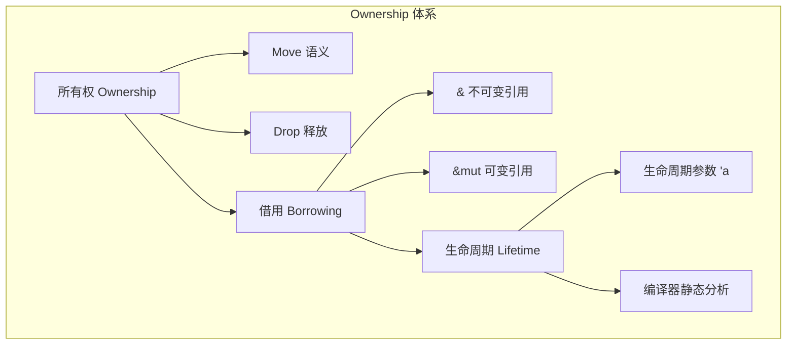
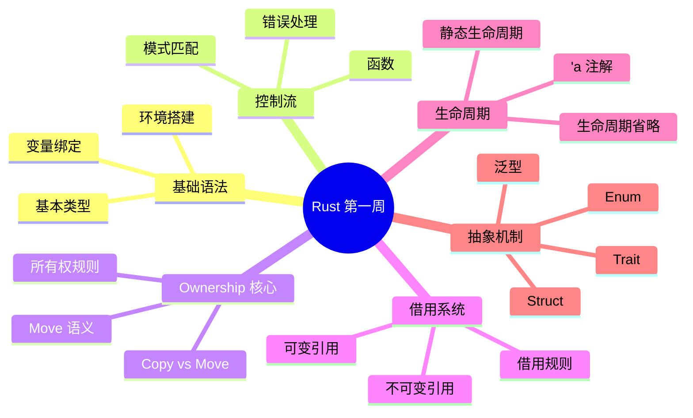

> **题记**：不会回头看的人，永远走不远。这一天，我们把前六天的知识串联成网。

## 写在开头

第一周，我们从 Rust 的基本语法出发，一路深入到了泛型与 Trait 的抽象世界。但真正的核心，只有四个字：**所有权系统**。

这一天的目标不是学习新知识，而是：

1. 绘制 Ownership 体系的全景地图
2. 找出自己的理解盲区
3. 建立知识之间的联系
4. 用费曼学习法检验是否真正理解

## 1. 第一周知识全景图

### 1.1 六天知识的脉络

学习编程就像搭建一座房子——我们需要先打地基（环境与类型），然后砌墙（函数与控制流），再安装核心管道系统（所有权）。前六天的内容就是这样一砖一瓦地构建起了 Rust 编程的基础框架。

```

Day 1: 环境搭建 + 基本类型 + 变量绑定
        ↓
Day 2: 函数 + 模式匹配 + 错误处理 (Result/Option)
        ↓
Day 3: 所有权与 Move 语义 (核心！)
        ↓
Day 4: 引用与借用 (核心！)
        ↓
Day 5: 生命周期 (核心！)
        ↓
Day 6: Struct/Enum/Trait/泛型 (抽象层)

```

### 1.2 Ownership 体系的三根支柱

如果我们把 Ownership 体系比作一座建筑，那么它由三根支柱支撑：所有权、借用、生命周期。这三者缺一不可，共同构成了 Rust 内存安全的基石。



下面这张表格帮助我们理解三种类型检查的区别：

| 类型 | 检查时期 | 检查内容 | 失败后果 |
|------|----------|----------|----------|
| **所有权** | 编译时 | 值的所有权归属 | 编译错误 |
| **借用** | 编译时 | 引用有效性规则 | 编译错误 |
| **生命周期** | 编译时 | 引用的有效范围 | 编译错误 |

## 2. 苏格拉底式自问自答

苏格拉底的教学法核心是“追问”。让我们通过一系列问题来检验对 Ownership 体系的理解深度。

### 2.1 关于所有权

> **问**：为什么 Rust 要设计所有权系统？

**答**：为了在编译期保证内存安全，而不需要垃圾回收器（GC）。传统语言靠 GC 或手动管理内存，各有代价——GC 有运行时开销，手动管理容易出错。Rust 选择了第三条路——编译时静态分析，让错误在编译阶段就被发现。

> **问**：赋值操作 `let x = y` 发生了什么？

**答**：这取决于 `y` 的类型。对于实现了 `Copy` trait 的类型（如 `i32`、`bool`、`f64`），编译器会生成复制操作，两个变量都独立存在；对于没有实现 `Copy` 的类型（如 `String`、`Vec`、`Box<T>`），所有权会转移给 `x`，`y` 在赋值后失效。

> **问**：一个值只能有一个 Owner 吗？

**答**：是的，这是所有权规则的核心。单一所有权保证了“谁负责清理”的确定性。但 Rust 提供了多种共享访问的方式：通过引用（`&`）共享访问权，或者通过 `Rc`/`Arc` 在堆层面共享所有权。

### 2.2 关于借用

> **问**：借用和所有权转移有什么区别？

**答**：借用是临时的访问许可，不转移所有权。你可以理解为“借用”一本书——书的所有权还在对方那里，你只是暂时阅读。使用完毕后，所有权还是原主人的。而 Move 则是把书“送给”别人，对方成为新的主人。

> **问**：为什么需要可变引用和不可变引用分开？

**答**：为了防止数据竞争（data race）。想象多人同时读一本地图，和一人在地图上画标记——前者可以多人同时进行，后者必须独占。Rust 的借用规则正是这个道理：不可变引用允许多个同时存在，可变引用只能有一个且不能与任何不可变引用共存。

> **问**：下面代码错在哪里？

```rust
let mut s = String::from("hello");
let r1 = &s;
let r2 = &s;
let r3 = &mut s;  // 这里出错！
println!("{} and {}", r1, r2);
```

**答**：问题在于 Rust 的借用规则要求**可变引用与不可变引用不能同时存在**。在创建 `r3` 时，`r1` 和 `r2` 仍然处于活跃状态（因为后面还要在 `println!` 中使用），因此编译器不允许创建可变引用。即使使用 NLL（Non‑Lexical Lifetimes）规则，只要后续还会使用不可变引用，它们就仍然被视为“活跃”，从而阻止可变引用的创建。

### 2.3 关于生命周期

> **问**：生命周期和作用域有什么区别？

**答**：这是一个非常好的问题，触及了 Rust 最核心的概念之一。**作用域**是运行时的概念，用花括号 `{ … }` 定义，描述的是代码执行的逻辑范围。**生命周期**是编译期概念，描述的是引用在内存中有效的时期。生命周期注解 `'a` 是给编译器的提示，用于在复杂场景下消除歧义，它不是运行时值。

> **问**：什么时候需要显式生命周期注解？

**答**：当函数返回引用，且输入引用和输出引用存在关联时。简单来说：**如果函数签名中没有引用，自然不需要；如果只有一个引用输入，可能不需要；如果有多个引用输入且返回其中一个，就必须标注**。

```rust
// 不需要显式注解：单个输入引用，输出引用，适用第一条省略规则
fn first_word(s: &str) -> &str { … }

// 不需要显式注解：多个输入引用，但返回其中一个，编译器可自动推导
fn longest(x: &str, y: &str) -> &str { x }  // Rust 2018+ 可省略

// 需要显式注解：多个输入引用，返回其中一个，且编译器无法自动确定关联
fn longest<'a>(x: &'a str, y: &'a str) -> &'a str {
    if x.len() > y.len() { x } else { y }
}
```

## 3. 与其他语言的对比复习

理解一门语言最好的方式，是把它和其他语言对比。下面我们从几个维度来看 Rust 与其他主流语言的差异。

### 3.1 所有权 vs C/C++

C/C++ 给了程序员最大的自由，但也把内存安全的责任完全交给了程序员。Rust 通过 Ownership 系统，在保留性能的同时，把这份责任转移给了编译器。

| 特性 | C/C++ | Rust |
|------|-------|------|
| 内存分配 | 手动 `malloc`/`free` 或 smart ptr | 自动 via ownership |
| 释放时机 | 手动控制 | RAII + Drop trait |
| 悬挂指针 | 可能（use‑after‑free） | 编译期阻止 |
| 双重释放 | 可能 | 编译期阻止 |
| 数据竞争 | 可能 | 借用规则阻止 |

### 3.2 所有权 vs Java/Python

Java 和 Python 选择通过 GC 来解决内存安全问题。这让开发变得简单，但带来了运行时开销和不确定性。Rust 的方案则是“编译时 GC”，既保证了安全，又没有运行时负担。

| 特性 | Java/Python | Rust |
|------|-------------|------|
| 内存管理 | GC | Ownership + 编译检查 |
| 空指针 | NullPointerException | Option\<T\> 强制处理 |
| 野指针 | 可能 | 不可能 |
| 确定性析构 | 一般没有 | 有 (Drop trait) |
| 性能 | 中等（GC 暂停） | 高（无 GC） |

### 3.3 借用规则 vs Go

Go 的并发模型基于 CSP（Communicating Sequential Processes），通过 channel 传递数据来避免共享。Rust 则选择了另一个方向——通过借用规则和类型系统来静态保证线程安全。

| 特性 | Go | Rust |
|------|-----|------|
| 并发安全 | channel 传递 | 借用规则 + type system |
| 内存安全 | GC | 编译期保证 |
| 指针操作 | 支持但受限制 | 受限，更安全 |
| 零值 | nil | Option\<T\> |

## 4. 常见错误模式分析

学习编程最重要的是从错误中学习。下面的错误模式都是 Rust 学习者常见的“坑”，理解它们能帮助你避免重蹈覆辙。

### 4.1 错误1：使用已移动的值

```rust
fn main() {
    let s1 = String::from("hello");
    let s2 = s1;  // s1 移动到 s2
    println!("{}", s1);  // ❌ 编译错误！s1 已失效
}
```

**错误原因**：`String` 没有实现 `Copy` trait，所以 `s1` 的所有权转移给了 `s2`。之后 `s1` 就“不存在”了，编译器不允许再使用它。

**解决方案**：

1. 使用 `clone()` 克隆（深拷贝，性能开销）
2. 使用引用借用（推荐）

```rust
// 方案一：克隆
let s2 = s1.clone();

// 方案二：借用
let s2 = &s1;
println!("{}", s1);  // ✅ OK
```

### 4.2 错误2：可变引用的别名问题

```rust
fn main() {
    let mut v = vec![1, 2, 3];
    let first = &v[0];  // 不可变引用
    v.push(4);  // 可变借用
    println!("{}", first);  // ❌ 可能出错！
}
```

**错误原因**：`push` 可能导致 vector 重新分配内存（扩容），此时 `first` 指向的旧内存可能失效。Rust 的借用检查器在编译时就发现了这个潜在危险。

**解决方案**：确保可变操作之前所有引用都已使用完毕。若元素类型实现了 `Copy`，也可以直接复制值而非引用：

```rust
let mut v = vec![1, 2, 3];
let first_val = v[0];  // 复制值（仅适用于实现 Copy 的类型）
v.push(4);
println!("{}", first_val);  // ✅ OK
```

### 4.3 错误3：返回局部变量的引用

```rust
fn longest(x: &str, y: &str) -> &str {  // ❌ 编译错误
    if x.len() > y.len() {
        x
    } else {
        y
    }
}
```

**错误原因**：编译器无法确定返回的引用指向哪个输入，也无法推断生命周期。

**解决方案**：添加生命周期参数让编译器知道引用的关系

```rust
fn longest<'a>(x: &'a str, y: &'a str) -> &'a str {
    if x.len() > y.len() { x } else { y }
}
```

## 5. 费曼学习法检验

费曼学习法的核心是：**如果你不能简单地解释一件事，你就还没有真正理解它**。

### 5.1 用一句话解释所有权

> **挑战**：用你自己的语言，不要用 Rust 术语，向一个非程序员解释为什么 Rust 不需要 GC。

**参考回答**：Rust 采用了“谁创建谁负责”的原则。每个数据都有一个“主人”，当主人离开房间（作用域）时，它必须清理掉自己创建的东西。这不是靠垃圾回收器在后台巡逻，而是编译时就能确定好的清理计划。

### 5.2 向初学者解释借用检查器

> **挑战**：如果初学者听完你的解释后能在不看代码的情况下判断这段代码能否编译，才算成功。

```rust
let mut data = vec![1, 2, 3];
let r1 = &data;
let r2 = &data;
let r3 = &mut data;  // 能编译吗？
```

**答案**：**不能**。因为 `r1` 和 `r2` 作为不可变引用还活着的时候，不允许创建可变引用 `r3`。

## 6. 本周思维导图



## 7. 下周预告

经过第一周的打磨，你已经掌握了 Rust 的核心机制。下周我们将进入更高级的主题：

- **Day 8**：智能指针与迭代器——Box、Rc、RefCell、Arc，以及惰性计算的迭代器
- **Day 9**：并发编程——线程、channel、Mutex，编译期保证的线程安全
- **Day 10**：Async/Await——异步编程模型，Tokio 运行时
- **Day 11**：模块系统与 Cargo——代码组织、依赖管理、工作空间
- **Day 12**：Unsafe Rust 与 FFI——突破边界，调用 C 代码
- **Day 13**：宏与性能优化——声明宏、过程宏、编译器优化
- **Day 14**：终极复盘——全局视角审视 Rust 知识体系

> **思考题**：如果让你向一个 C++ 程序员介绍 Rust 的所有权系统，你会怎么解释？请尝试用对比的方式写一段 200 字左右的说明。
