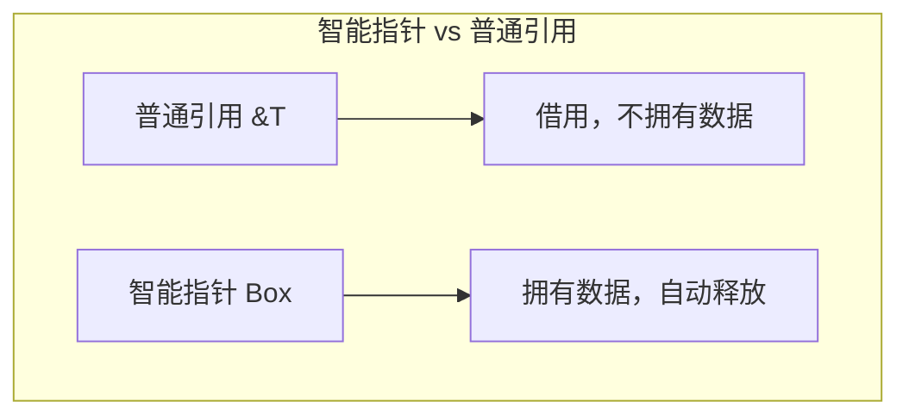
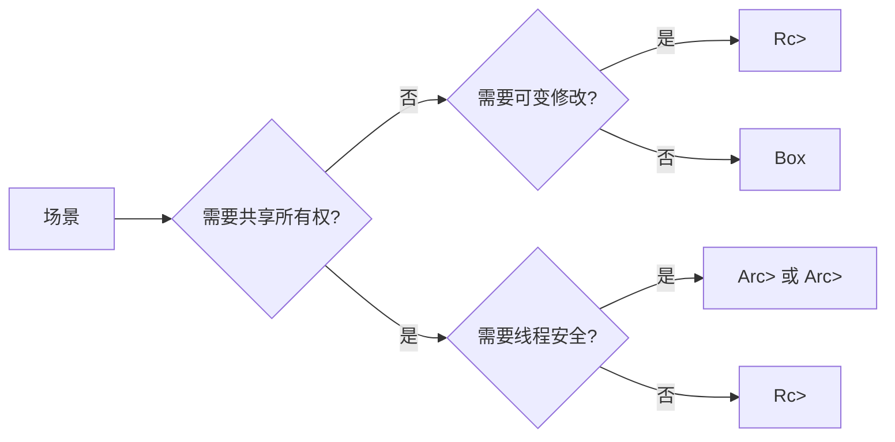
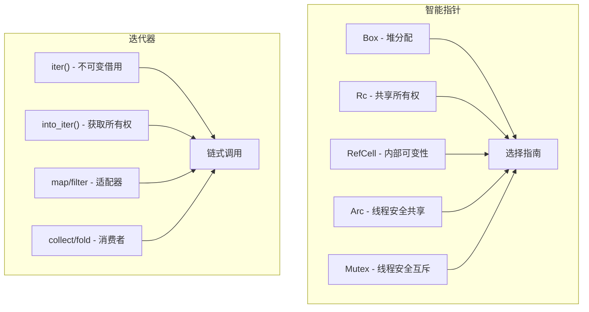

> **题记**：指针是地址，智能指针是披着指针外衣的管理器。迭代器是懒散的计算，只在你需要时工作。

**文档版本**：基于 Rust 1.75+ 稳定版

## 写在开头

今天的我们将学习两个重要主题：**智能指针**和**迭代器**。这两者都建立在 Rust 所有权系统之上，但提供了更高级的抽象。

在 Day 3-5 中，我们学习了所有权、借用和生命周期——这些是 Rust 的核心概念。但有时候，我们需要更灵活的所有权策略。智能指针就是来解决这个问题的。

迭代器则是 Rust 中遍历数据的惯用方式。与其他语言常见的 `for i = 0; i < len; i++` 循环不同，Rust 的迭代器是**惰性的**——它们只在被消费时才计算。

## 1. 智能指针初探

### 1.1 什么是智能指针？

要理解智能指针，先要理解普通引用。`&T` 和 `&mut T` 是**借用**现有值，它们不拥有数据。而智能指针（如 `Box<T>`、`Rc<T>`）是**拥有**数据的所有者，当它们离开作用域时，会自动释放堆上的内存。

智能指针通常通过两个 trait 实现：

- **Deref trait**：让智能指针像引用一样使用（通过 `*` 解引用）
- **Drop trait**：定义智能指针被释放时的行为



### 1.2 Box\<T>：堆上分配

`Box<T>` 是最基本的智能指针，它在**堆**上分配数据。想象一个盒子——你把东西放进去，盒子本身在栈上，但东西在堆上。

```rust
fn main() {
    // 在堆上创建一个 i32 值
    let b = Box::new(5);
    println!("Box value: {}", b);
    
    // Box 可以解引用，像普通引用一样使用
    let x = 5;
    let y = Box::new(5);
    assert_eq!(x, *y);  // Box 解引用后得到内部值
}
```

**使用场景**：

1. 在堆上分配大数据（栈空间有限）
2. 在递归类型中固定大小（递归类型需要已知大小的指针）
3. 作为 trait object 的容器（dyn Trait）

```rust
// 递归类型示例：链表
// 如果不用 Box，编译器不知道 List 需要多大内存
enum List {
    Cons(i32, Box<List>),  // Box 固定大小（一个指针的大小）
    Nil,
}

fn main() {
    use List::*;
    // 1 -> 2 -> 3 -> Nil
    let list = Cons(1, Box::new(Cons(2, Box::new(Cons(3, Box::new(Nil))))));
}
```

### 1.3 Box 与性能

`Box` 的性能开销主要来自堆分配，但解引用操作是零成本抽象。相比其他智能指针，`Box` 没有引用计数或同步开销。如果你需要极致的性能且所有权清晰，用 `Box` 是最佳选择。

## 2. Rc\<T>：引用计数（共享所有权）

### 2.1 为什么需要共享所有权？

单一所有权是 Rust 的默认策略，但有些场景确实需要多个"主人"。比如：

- 图结构：一个节点可能被多条边引用
- 观察者模式：多个观察者需要访问同一数据
- 共享配置：多个组件需要读取同一配置

这些场景下，`Rc<T>`（Reference Counting）提供了**引用计数**的解决方案。

```rust
use std::rc::Rc;

fn main() {
    // 创建共享数据，引用计数为 1
    let rc1 = Rc::new(String::from("shared data"));
    
    // 克隆（不真正复制数据），引用计数 +1
    let rc2 = Rc::clone(&rc1);
    
    // 查看当前引用计数
    println!("Count: {}", Rc::strong_count(&rc1));  // 2
    
    {
        // 在新作用域再克隆一次
        let rc3 = Rc::clone(&rc1);
        println!("Count in scope: {}", Rc::strong_count(&rc1));  // 3
    }
    
    // rc3 离开作用域被 drop，引用计数 -1
    println!("Count after scope: {}", Rc::strong_count(&rc1));  // 2
    
    // 原始数据仍然有效
    println!("Data: {}", rc1);
}
```

### 2.2 Rc\<T> 只能读，不能写

这是 `Rc<T>` 的重要限制：**它是不可变的**。如果尝试修改：

```rust
use std::rc::Rc;

fn main() {
    let data = Rc::new(String::from("hello"));
    // data.push_str(" world");  // ❌ 编译错误！Rc<T> 不支持可变借用
}
```

**为什么不能修改？** 因为 `Rc<T>` 允许多个引用共享数据，如果允许可变借用，就会出现数据竞争。Rust 的借用规则不允许这种情况。

如果需要可变的共享数据，有两个选择：

1. `RefCell<T>`：内部可变性（单线程）
2. `Rc<RefCell<T>>` 或 `Arc<Mutex<T>>`：组合使用

### 2.3 Weak\<T>：弱引用打破循环

`Rc` 有一个常见问题：循环引用导致内存泄漏。`Weak<T>`（弱引用）通过不增加强引用计数来解决这个问题：

```rust
use std::rc::{Rc, Weak};

struct Node {
    value: i32,
    parent: Option<Weak<Node>>,
    children: Vec<Rc<Node>>,
}

fn main() {
    let leaf = Rc::new(Node {
        value: 3,
        parent: None,
        children: vec![],
    });
    
    let branch = Rc::new(Node {
        value: 5,
        parent: None,
        children: vec![Rc::clone(&leaf)],
    });
    
    // 使用 Weak 避免循环引用
    leaf.parent = Some(Rc::downgrade(&branch));
}
```

## 3. RefCell\<T>：内部可变性

### 3.1 什么是内部可变性？

**内部可变性**（Interior Mutability）是一种设计模式：**即使在不可变引用的地方，也能修改数据**。这听起来像是违反了借用规则，但 `RefCell<T>` 通过**运行时借用检查**来实现这个能力。

```rust
use std::cell::RefCell;

fn main() {
    let data = RefCell::new(String::from("hello"));
    
    // 通过 borrow_mut() 获取可变引用
    data.borrow_mut().push_str(" world");
    
    // 通过 borrow() 获取不可变引用
    println!("{}", data.borrow());
}
```

### 3.2 运行时借用检查

`RefCell<T>` 的借用规则和普通引用一样，但检查发生在**运行时**而非编译时：

```rust
use std::cell::RefCell;

fn main() {
    let data = RefCell::new(vec![1, 2, 3]);
    
    let r1 = data.borrow();  // 不可变借用
    let r2 = data.borrow();  // 另一个不可变借用 ✅ OK
    
    println!("{:?} {:?}", r1, r2);
    // r1 和 r2 在这里仍然有效
    
    // let r3 = data.borrow_mut();  // ❌ 运行时 panic！
    // 因为已经有不可变借用存在
}
```

**关键区别**：

| 类型 | 借用检查 | 失败时机 | 失败后果 |
|------|----------|----------|----------|
| `&T / &mut T` | 编译时 | 编译期 | 编译错误 |
| `RefCell<T>` | 运行时 | 执行期 | panic |

**安全警告**：`RefCell` 在运行时 panic 可能导致程序崩溃，仅在不变量可在逻辑上保证时使用。

### 3.3 Rc\<RefCell\<T>>：组合拳

这是 Rust 中非常流行的模式——**多个 owner + 可变修改**：

```rust
use std::cell::RefCell;
use std::rc::Rc;

fn main() {
    // 创建共享的 RefCell
    let shared = Rc::new(RefCell::new(String::from("hello")));
    
    // 克隆给多个 owner
    let s1 = Rc::clone(&shared);
    let s2 = Rc::clone(&shared);
    
    // 三个 owner 都可以修改（注意修改顺序影响结果）
    shared.borrow_mut().push_str("!");
    s1.borrow_mut().push_str("?");
    s2.borrow_mut().push_str("...");
    
    println!("shared: {:?}", shared.borrow());
    println!("s1: {:?}", s1.borrow());
    println!("s2: {:?}", s2.borrow());
    
    // 输出：hello!?... （取决于执行顺序）
}
```

### 3.4 Cell\<T>：Copy 类型的内部可变性

对于 `Copy` 类型（如整数、布尔值），`Cell<T>` 提供更轻量的内部可变性：

```rust
use std::cell::Cell;

fn main() {
    let counter = Cell::new(0);
    
    // 直接修改值，无需借用
    counter.set(counter.get() + 1);
    
    println!("Counter: {}", counter.get());
}
```

### 3.5 何时用 RefCell/Cell？

- **`Cell<T>`**：`T` 实现 `Copy`，无需运行时检查
- **`RefCell<T>`**：`T` 未实现 `Copy`，需要运行时借用检查
- 只需要单线程场景
- 需要在不可变环境中修改数据
- 确信借用冲突不会发生（且愿意承担运行时 panic 风险）

## 4. Arc\<T>：原子引用计数（线程安全）

### 4.1 多线程共享数据

`Rc<T>` 不是线程安全的。对于多线程场景，使用 `Arc<T>`（Atomic Reference Counting）：

```rust
use std::sync::Arc;
use std::thread;

fn main() {
    let data = Arc::new(vec![1, 2, 3]);
    
    let mut handles = vec![];
    
    for i in 0..3 {
        let data_clone = Arc::clone(&data);
        let handle = thread::spawn(move || {
            println!("Thread {}: {:?}", i, data_clone);
        });
        handles.push(handle);
    }
    
    for handle in handles {
        handle.join().unwrap();
    }
}
```

### 4.2 Arc\<Mutex\<T>> 和 Arc\<RwLock\<T>>

多线程下的可变共享需要同步原语：

```rust
use std::sync::{Arc, Mutex};
use std::thread;

fn main() {
    let counter = Arc::new(Mutex::new(0));
    let mut handles = vec![];
    
    for _ in 0..10 {
        let counter = Arc::clone(&counter);
        let handle = thread::spawn(move || {
            let mut num = counter.lock().unwrap();
            *num += 1;
        });
        handles.push(handle);
    }
    
    for handle in handles {
        handle.join().unwrap();
    }
    
    println!("Result: {}", *counter.lock().unwrap());
}
```

### 4.3 智能指针对比

面对不同的场景，选择合适的智能指针是关键：



| 类型 | 所有权 | 可变性 | 借用检查 | 线程安全 | 性能开销 | 适用场景 |
|------|--------|--------|----------|----------|----------|----------|
| `Box<T>` | 唯一 | 由 T 决定 | 编译时 | ❌ | 最低 | 堆分配、递归类型、trait对象 |
| `Rc<T>` | 共享 | 不可变 | 编译时 | ❌ | 低 | 单线程共享只读数据 |
| `Weak<T>` | 弱引用 | 不可变 | 编译时 | ❌ | 低 | 打破循环引用 |
| `RefCell<T>` | 唯一 | 内部可变 | 运行时 | ❌ | 低 | 单线程内部可变性 |
| `Cell<T>` | 唯一 | 内部可变 | 无 | ❌ | 最低 | `Copy`类型的内部可变性 |
| `Arc<T>` | 共享 | 不可变 | 编译时 | ✅ | 中等 | 多线程共享只读数据 |
| `Mutex<T>` | 共享 | 可变 | 运行时锁 | ✅ | 中等 | 多线程互斥访问 |
| `RwLock<T>` | 共享 | 可变 | 运行时锁 | ✅ | 中等 | 多线程读写锁 |

## 5. 迭代器基础

### 5.1 什么是迭代器？

迭代器是产生序列值的对象。在 Rust 中，迭代器是**惰性**的——创建迭代器不会执行任何计算，只有调用 `next()` 或消费迭代器时才会产生值。

```rust
fn main() {
    let v = vec![1, 2, 3];
    
    // 创建迭代器（此时什么都没发生）
    let mut iter = v.iter();
    
    // 每次调用 next() 产生一个元素
    assert_eq!(iter.next(), Some(&1));  // 返回 Option<&T>
    assert_eq!(iter.next(), Some(&2));
    assert_eq!(iter.next(), Some(&3));
    assert_eq!(iter.next(), None);      // 迭代完毕
}
```

**迭代器的本质**是一个 `next()` 方法：

```rust
pub trait Iterator {
    type Item;  // 迭代器产生的元素类型
    
    fn next(&mut self) -> Option<Self::Item>;
    
    // 其他默认方法...
}
```

### 5.2 三种迭代器

根据所有权和引用级别的不同，Rust 提供了三种创建迭代器的方式：

```rust
fn main() {
    let v = vec![1, 2, 3];
    
    // iter() - 不可变引用的迭代
    // 产生 &i32
    for val in v.iter() {
        println!("iter: {}", val);
    }
    // v 仍然有效
    
    // iter_mut() - 可变引用的迭代
    // 产生 &mut i32
    let mut v2 = vec![1, 2, 3];
    for val in v2.iter_mut() {
        *val *= 2;  // 可以修改
    }
    println!("{:?}", v2);  // [2, 4, 6]
    
    // into_iter() - 获取所有权的迭代
    // 产生 T（移动走了）
    let v3 = vec![1, 2, 3];
    for val in v3.into_iter() {
        println!("into_iter: {}", val);
    }
    // v3 已经移动，不能再使用
}
```

**简化写法**：

- `for val in &v` 等价于 `for val in v.iter()`
- `for val in &mut v` 等价于 `for val in v.iter_mut()`
- `for val in v` 等价于 `for val in v.into_iter()`

### 5.3 迭代器适配器

迭代器的强大之处在于**适配器**（Adapter）。适配器把一个迭代器转换成另一个迭代器，它们是惰性的——不消费迭代器，只是产生新的迭代器。

```rust
fn main() {
    let v = vec![1, 2, 3, 4, 5];
    
    // map - 转换每个元素（明确解引用）
    let doubled: Vec<i32> = v.iter().map(|&x| x * 2).collect();
    
    // filter - 过滤元素
    let evens: Vec<i32> = v.iter().filter(|&&x| x % 2 == 0).copied().collect();
    
    // take - 取前 n 个
    let first_three: Vec<&i32> = v.iter().take(3).collect();
    
    // skip - 跳过前 n 个
    let last_two: Vec<&i32> = v.iter().skip(3).collect();
    
    // chain - 连接两个迭代器
    let a = vec![1, 2];
    let b = vec![3, 4];
    let combined: Vec<&i32> = a.iter().chain(b.iter()).collect();
    
    // enumerate - 带索引
    let names = vec!["Alice", "Bob", "Charlie"];
    for (i, name) in names.iter().enumerate() {
        println!("{}: {}", i, name);
    }
    
    // zip - 两个迭代器配对
    let ids = vec![1, 2, 3];
    let names = vec!["Alice", "Bob", "Charlie"];
    for (id, name) in ids.iter().zip(names.iter()) {
        println!("{}: {}", id, name);
    }
}
```

### 5.4 消费适配器

消费适配器（Consumer）会消耗迭代器并产生最终结果：

```rust
fn main() {
    let v = vec![1, 2, 3, 4, 5];
    
    // collect - 收集到集合
    let vec: Vec<i32> = v.iter().map(|&x| x * 2).collect();
    
    // fold - 累计计算
    let sum = v.iter().fold(0, |acc, &x| acc + x);  // 15
    let product = v.iter().fold(1, |acc, &x| acc * x);  // 120
    
    // sum / product - 专门用于数值
    let sum: i32 = v.iter().copied().sum();
    let product: i32 = v.iter().copied().product();
    
    // find - 找第一个满足条件的
    let found = v.iter().find(|&&x| x > 3);  // Some(&4)
    
    // position - 找第一个满足条件的索引
    let pos = v.iter().position(|&x| x == 3);  // Some(2)
    
    // any / all - 断言
    let has_even = v.iter().any(|&&x| x % 2 == 0);  // true
    let all_positive = v.iter().all(|&&x| x > 0);   // true
    
    // count - 计数
    let count = v.iter().filter(|&&x| x > 2).count();  // 3
    
    // max / min
    let max = v.iter().max();  // Some(&5)
    let min = v.iter().min();  // Some(&1)
}
```

### 5.5 迭代器的威力：链式调用

迭代器最强大的地方在于可以链式调用，创造出表达力极强的代码：

```rust
fn main() {
    // 计算 1-100 中所有偶数的平方和
    let result: i32 = (1..=100)
        .filter(|x| x % 2 == 0)      // 过滤偶数
        .map(|x| x * x)              // 平方
        .fold(0, |acc, x| acc + x);  // 求和
    
    println!("Sum of squares of evens 1-100: {}", result);
    
    // 找第一个名字以 'A' 开头且长度大于 5 的
    let names = vec!["Alice", "Bob", "Amanda", "Alex", "Andrew"];
    let found = names
        .iter()
        .filter(|name| name.starts_with('A'))
        .filter(|name| name.len() > 5)
        .next();  // 使用 next() 而不是 find()，因为已过滤
    
    println!("{:?}", found);  // Some(&"Amanda")
}
```

**为什么迭代器更好？**

1. **表达力**：链式调用让代码意图清晰
2. **性能**：迭代器是零成本抽象，编译器会优化成手写循环
3. **惰性**：只在需要时计算，不浪费资源
4. **安全性**：避免索引越界错误

## 6. 自定义迭代器

实现 `Iterator` trait 创建自定义迭代器：

```rust
struct Counter {
    count: u32,
    max: u32,
}

impl Counter {
    fn new(max: u32) -> Counter {
        Counter { count: 0, max }
    }
}

impl Iterator for Counter {
    type Item = u32;
    
    fn next(&mut self) -> Option<Self::Item> {
        if self.count < self.max {
            self.count += 1;
            Some(self.count)
        } else {
            None
        }
    }
}

fn main() {
    let mut counter = Counter::new(5);
    
    assert_eq!(counter.next(), Some(1));
    assert_eq!(counter.next(), Some(2));
    // ...
    assert_eq!(counter.next(), Some(5));
    assert_eq!(counter.next(), None);
}
```

## 7. 与其他语言的对比

### 7.1 智能指针 vs C++ smart ptr

| 特性 | C++ | Rust | 说明 |
|------|-----|------|------|
| 堆分配 | `std::make_unique` | `Box::new` | 类似unique_ptr |
| 引用计数 | `std::shared_ptr` | `Rc` / `Arc` | Rc单线程，Arc多线程 |
| 弱引用 | `std::weak_ptr` | `Weak<T>` | 打破循环引用 |
| 内部可变性 | `mutable`成员 | `RefCell<T>` | C++的mutable与RefCell机制不同 |
| 线程安全引用计数 | `std::shared_ptr` | `Arc<T>` | 都需要原子操作 |

### 7.2 迭代器 vs Python/Java

| 特性 | Python | Java | Rust | 优势 |
|------|--------|------|------|------|
| 惰性求值 | 生成器 | Stream API | 迭代器适配器 | Rust零成本 |
| 链式调用 | 内置 | 流式 API | 链式方法 | Rust编译时优化 |
| 编译时检查 | 运行时 | 运行时 | 编译时 | Rust更安全 |
| 性能 | 解释执行 | JIT | 零成本抽象 | Rust最快 |
| 内存安全 | GC | GC | 所有权系统 | Rust无GC暂停 |

## 8. 苏格拉底式自问自答

### 关于智能指针

> **问**：`Box<T>` 和 `Vec<T>` 有什么区别？

**答**：`Vec<T>` 是动态数组，可以自动增长和收缩；`Box<T>` 是单个堆分配的值。如果你需要一个可变长度的集合，用 `Vec`；如果只是要在堆上分配一个固定大小的值，用 `Box`。`Vec` 内部使用 `Box`（或类似机制）管理堆内存。

> **问**：什么时候应该用 `Rc<T>` 而不是 `Box<T>`？

**答**：当你需要**多个 owner** 共享同一份数据时。如果只需要一个 owner，用 `Box` 更高效。注意 `Rc` 只能用于单线程，多线程用 `Arc`。

> **问**：`Rc<RefCell<T>>` 的使用场景是什么？

**答**：当你需要**多个 owner + 可变修改**时。例如观察者模式中，多个观察者需要修改同一个数据源。但要注意运行时 panic 风险。

### 关于迭代器

> **问**：为什么不使用传统的 `for i in 0..v.len()` 循环？

**答**：因为迭代器更安全、更表达、更高效。索引访问需要边界检查（性能开销），而迭代器由编译器优化掉这些检查。迭代器也避免了下标越界错误。

> **问**：迭代器的惰性意味着什么？

**答**：意味着创建迭代器适配器不会执行任何计算。例如 `v.iter().map(f).filter(g)` 不会调用 `f` 或 `g`，只有最终消费迭代器时才会执行。这允许构建复杂的数据处理管道而不立即计算。

## 9. 实战练习

### 练习 1：实现一个简单的链表

```rust
// 使用 Box 实现一个链表
#[derive(Debug)]
enum List {
    Cons(i32, Box<List>),
    Nil,
}

fn main() {
    use List::*;
    let list = Cons(1, Box::new(Cons(2, Box::new(Cons(3, Box::new(Nil))))));
    println!("{:?}", list);
}
```

### 练习 2：使用迭代器处理数据

```rust
fn main() {
    let temperatures = vec![22.5, 23.1, 21.8, 25.0, 24.3, 22.9];
    
    // 计算平均温度（保留一位小数）
    let avg: f64 = temperatures.iter()
        .sum::<f64>() / temperatures.len() as f64;
    
    // 找出超过平均温度的天数
    let hot_days = temperatures.iter()
        .filter(|&&t| t > avg)
        .count();
    
    println!("平均温度: {:.1}°C", avg);
    println!("超过平均温度的天数: {}", hot_days);
}
```

### 练习 3：使用 Arc 和 Mutex 实现线程安全计数器

```rust
use std::sync::{Arc, Mutex};
use std::thread;

fn main() {
    let counter = Arc::new(Mutex::new(0));
    let mut handles = vec![];
    
    for i in 0..10 {
        let counter = Arc::clone(&counter);
        let handle = thread::spawn(move || {
            let mut num = counter.lock().unwrap();
            *num += i;
        });
        handles.push(handle);
    }
    
    for handle in handles {
        handle.join().unwrap();
    }
    
    println!("Final counter: {}", *counter.lock().unwrap());
}
```

## 10. 总结

今天我们学习了两个强大的抽象：



**关键要点**：

1. 智能指针基于 Deref 和 Drop trait，提供自动内存管理
2. `Box<T>` 用于堆分配和递归类型
3. `Rc<T>` 提供共享所有权，但只能读
4. `RefCell<T>` 提供运行时借用检查的内部可变性
5. `Arc<T>` 提供线程安全的引用计数
6. `Mutex<T>`/`RwLock<T>` 提供线程安全的可变访问
7. 迭代器是惰性的，通过适配器链式调用
8. 迭代器是零成本抽象，编译器会优化成高效代码
9. 根据场景选择合适的智能指针和迭代器模式

> **思考题**：设计一个数据结构，用于存储一个"文件夹-文件"树形结构，其中文件夹可以包含多个子文件夹和文件。使用哪种智能指针组合最合适？为什么？

**建议方案**：使用 `Rc<RefCell<Node>>` 或 `Rc<RefCell<Folder>>`，因为：

1. 树形结构需要共享所有权（子节点被父节点引用）
2. 需要修改能力（添加/删除文件/文件夹）
3. 通常是单线程操作（文件系统操作）
4. 使用 `Weak` 引用避免循环引用（子节点引用父节点）

```rust
use std::rc::{Rc, Weak};
use std::cell::RefCell;

struct File {
    name: String,
    size: u64,
}

struct Folder {
    name: String,
    files: Vec<File>,
    subfolders: Vec<Rc<RefCell<Folder>>>,
    parent: Option<Weak<RefCell<Folder>>>,
}
```
