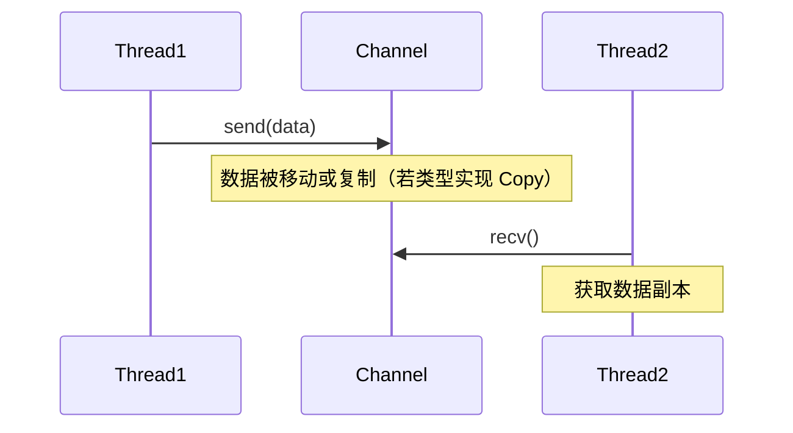
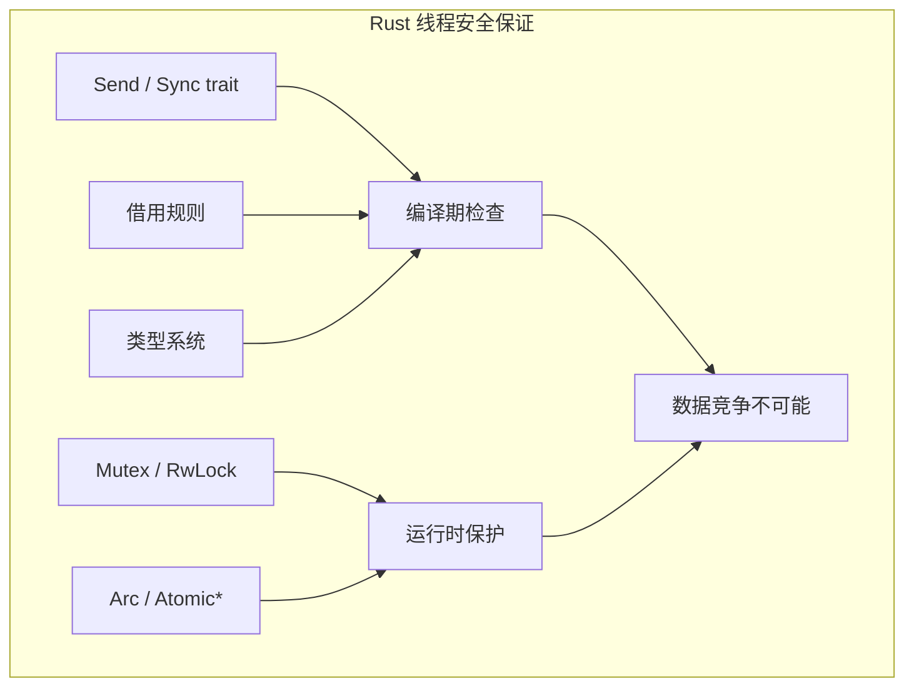
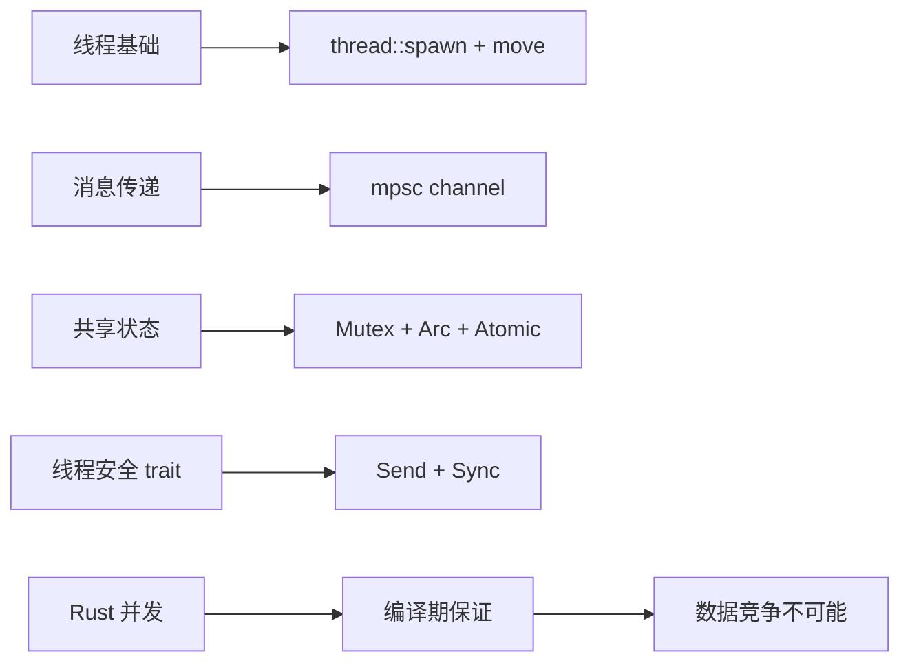

> **题记**：并发是噩梦，Rust 让噩梦变得安全。借用检查器 + 类型系统 = 编译期数据竞争检测。

## 写在开头

并发编程是计算机科学中最困难的问题之一。当多个线程同时访问共享数据时，会产生各种微妙而危险的错误——数据竞争、死锁、竞态条件。传统语言把这些问题留给运行时（GC）或程序员（小心！），而 Rust 的目标是：**让错误在编译时被捕获，而不是在运行时崩溃**。

这一天的内容将围绕四个核心主题展开：

1. **线程基础**：如何创建和管理线程
2. **消息传递**：通过 channel 安全地在线程间传递数据
3. **共享状态**：Mutex、RwLock 和 Atomic 的正确使用
4. **Send 和 Sync trait**：Rust 线程安全的基石

## 1. 线程基础

### 1.1 为什么需要多线程？

在单核 CPU 时代，多线程主要用于**响应性**——一个线程处理 UI，另一个处理计算。但现在我们有多核 CPU，多线程可以真正实现**并行计算**，大幅提升性能。

然而，多线程也是双刃剑。Rust 的目标是在提供高性能的同时，通过类型系统防止你犯错的。

### 1.2 创建线程

`std::thread::spawn` 是创建线程的基本方式。它接受一个闭包作为线程要执行的代码：

```rust
use std::thread;
use std::time::Duration;

fn main() {
    // spawn 返回一个 JoinHandle，可以用来等待线程结束
    let handle = thread::spawn(|| {
        for i in 1..=5 {
            println!("spawned thread: {}", i);
            thread::sleep(Duration::from_millis(100));  // 模拟耗时操作
        }
    });
    
    // 主线程继续执行
    for i in 1..=3 {
        println!("main thread: {}", i);
        thread::sleep(Duration::from_millis(100));
    }
    
    // 等待 spawned 线程完成
    handle.join().unwrap();
    println!("All threads done!");
}
```

**运行结果示例**：

```
spawned thread: 1
main thread: 1
spawned thread: 2
main thread: 2
spawned thread: 3
main thread: 3
spawned thread: 4
spawned thread: 5
All threads done!
```

注意输出顺序不是固定的——这正是并发编程的特点。

### 1.3 线程与借用

闭包能否捕获环境中的变量，取决于它是否需要拥有所有权。但要注意：`thread::spawn` 要求闭包满足 `'static` 生命周期，即不能借用局部变量。因此，在线程中使用外部数据时，通常需要使用 `move` 关键字获取所有权：

```rust
fn main() {
    let data = vec![1, 2, 3];
    
    // 使用 move 关键字将 data 的所有权移动到闭包中
    let handle = thread::spawn(move || {
        println!("{:?}", data);  // ✅ OK：data 已移动进线程
    });
    
    // println!("main: {:?}", data);  // ❌ 编译错误！data 已移动
    
    handle.join().unwrap();
}
```

如果需要在主线程和子线程中都使用数据，可以考虑使用 `Arc`（原子引用计数）共享所有权（见 3.3 节）。

### 1.4 move 闭包

`move` 关键字强制闭包获取捕获变量的所有权：

```rust
fn main() {
    let data = vec![1, 2, 3];
    
    // move 闭包获取 data 的所有权
    let handle = thread::spawn(move || {
        println!("moved: {:?}", data);  // data 移动进线程
        // 线程结束时，data 被 drop
    });
    
    // println!("{:?}", data);  // ❌ 编译错误！data 已移动
    
    handle.join().unwrap();
}
```

**何时使用 move？** 当你需要在线程中使用主线程的数据，且确保数据在线程运行期间不会被主线程回收时。

### 1.5 线程返回值

线程也可以返回值，通过 `join()` 获取：

```rust
fn main() {
    // spawn 一个返回值的线程
    let handle = thread::spawn(|| {
        42  // 线程返回值
    });
    
    // join() 返回 Result，unwrap 获取内部值
    let result = handle.join().unwrap();
    println!("Thread result: {}", result);  // 42
}
```

### 1.6 安全借用局部变量：`std::thread::scope`

Rust 1.63 引入了 `std::thread::scope`，它允许线程安全地借用局部变量，而无需 `'static` 生命周期。`scope` 会等待所有线程结束才返回，确保被借用的变量不会提前释放。

```rust
use std::thread;

fn main() {
    let data = vec![1, 2, 3];

    thread::scope(|s| {
        // 可以安全地借用 data，因为 scope 保证 data 在所有线程完成前有效
        s.spawn(|| {
            println!("thread 1: {:?}", data);
        });
        s.spawn(|| {
            println!("thread 2: {:?}", data);
        });
    }); // 等待所有线程结束

    // data 仍然可用
    println!("main: {:?}", data);
}
```

`scope` 是编写多线程程序时更安全、更便捷的方式，尤其当需要多个线程访问同一数据时。

## 2. 消息传递（Channel）

### 2.1 为什么选择消息传递？

**"不要通过共享内存来通信；应该通过通信来共享内存"** —— 这是 Go 语言的格言，也是 Rust 推崇的并发哲学。

消息传递的核心思想是：**不共享数据，而是复制数据**。发送线程把数据放进 channel，接收线程从 channel 取出数据。发送和接收是独立的操作，不需要锁。



### 2.2 创建 Channel

Rust 的 `mpsc`（多生产者，单消费者）channel 是标准库提供的消息传递机制：

```rust
use std::sync::mpsc;
use std::thread;

fn main() {
    // 创建 channel，返回 (发送端, 接收端)
    let (tx, rx) = mpsc::channel();
    
    // 发送端移动到新线程
    thread::spawn(move || {
        tx.send(42).unwrap();  // send 返回 Result，可处理错误
    });
    
    // 接收端在主线程
    let received = rx.recv().unwrap();  // recv 阻塞直到收到消息
    println!("Received: {}", received);
}
```

### 2.3 发送多条消息

```rust
use std::sync::mpsc;
use std::thread;

fn main() {
    let (tx, rx) = mpsc::channel();
    
    thread::spawn(move || {
        for i in 0..5 {
            tx.send(i).unwrap();
        }
        // tx 在这里被 drop，channel 关闭
        // 这很重要：接收端知道没有更多数据了
    });
    
    // recv() 会阻塞直到：
    // 1. 收到消息 -> Ok(msg)
    // 2. channel 关闭 -> Err
    while let Ok(msg) = rx.recv() {
        println!("Received: {}", msg);
    }
    println!("Channel closed, no more messages");
}
```

**输出**：

```
Received: 0
Received: 1
Received: 2
Received: 3
Received: 4
Channel closed, no more messages
```

### 2.4 多个生产者

通过克隆发送端，可以创建多个生产者：

```rust
use std::sync::mpsc;
use std::thread;

fn main() {
    let (tx, rx) = mpsc::channel();
    
    // 克隆 tx 创建多个发送者
    let tx1 = tx.clone();
    let tx2 = tx.clone();
    
    thread::spawn(move || {
        tx1.send("from tx1").unwrap();
    });
    
    thread::spawn(move || {
        tx2.send("from tx2").unwrap();
    });
    
    // 只保留一个 rx
    drop(tx);  // 显式 drop 原始 tx
    
    // 接收所有消息
    for msg in rx {
        println!("Received: {}", msg);
    }
}
```

### 2.5 rx 作为迭代器

`Receiver` 实现了 `Iterator` trait，可以直接用 `for` 循环消费：

```rust
use std::sync::mpsc;
use std::thread;

fn main() {
    let (tx, rx) = mpsc::channel();
    
    thread::spawn(move || {
        for i in 0..5 {
            tx.send(i).unwrap();
        }
    });
    
    // rx 可以直接迭代
    for msg in rx {
        println!("Received: {}", msg);
    }
}
```

### 2.6 有界 Channel（sync_channel）

`mpsc::channel()` 创建的是无界 channel，发送者可以无限发送，消息缓存在队列中。如果生产者速度远大于消费者，可能导致内存耗尽。此时可以使用 `mpsc::sync_channel(n)` 创建有界 channel，指定缓冲区大小。当缓冲区满时，`send()` 会阻塞直到有空间。

```rust
use std::sync::mpsc;
use std::thread;

fn main() {
    // 缓冲区大小为 3 的有界 channel
    let (tx, rx) = mpsc::sync_channel(3);
    
    thread::spawn(move || {
        for i in 0..5 {
            tx.send(i).unwrap();  // 发送 0、1、2 立即成功，发送 3 时阻塞直到消费者取走
            println!("sent {}", i);
        }
    });
    
    thread::sleep(std::time::Duration::from_millis(1000));  // 让发送者先发送
    for msg in rx {
        println!("received {}", msg);
        thread::sleep(std::time::Duration::from_millis(500));  // 慢消费
    }
}
```

## 3. 共享状态（Mutex、RwLock、Atomic）

### 3.1 什么是 Mutex？

`Mutex`（互斥锁）的思想是：**同一时间只允许一个线程访问数据**。线程想访问数据时，必须"抢锁"——如果锁被其他线程持有，就等待。

这就像厕所的锁——一个人进去后锁上，用完后出来解锁，下一个人才能进去。

```rust
use std::sync::{Arc, Mutex};
use std::thread;

fn main() {
    // 使用 Arc 共享 Mutex 的所有权
    let counter = Arc::new(Mutex::new(0));
    
    // 克隆 Arc 用于线程
    let counter_for_thread = Arc::clone(&counter);
    let handle = thread::spawn(move || {
        let mut num = counter_for_thread.lock().unwrap();
        *num += 1;
    });
    
    handle.join().unwrap();
    
    println!("Result: {}", *counter.lock().unwrap());  // 1
}
```

### 3.2 MutexGuard 的自动释放

`MutexGuard` 实现了 `Drop` trait，保证锁在离开作用域时自动释放：

```rust
use std::sync::Mutex;

fn main() {
    let counter = Mutex::new(0);
    
    {
        // 获取锁
        let mut num = counter.lock().unwrap();
        *num += 1;
        // 锁在这里自动释放，即使 panic 也会释放
    }
    
    // 锁已释放，可以再次获取
    let mut num = counter.lock().unwrap();
    *num += 1;
}
```

**关于锁中毒**：如果持有锁的线程 panic 了，Rust 默认会让锁进入"中毒"状态，防止其他线程使用可能损坏的数据。`lock()` 返回 `Result` 让你决定如何处理中毒的锁（可以调用 `unwrap()` 传播错误，或使用 `unwrap_or_else()` 恢复）。

### 3.3 Arc：线程安全的引用计数

`Rc<T>` 不是线程安全的。如果在多线程环境中使用 `Rc`：

```rust
// 这段代码无法编译！
use std::rc::Rc;
use std::thread;

fn main() {
    let data = Rc::new(vec![1, 2, 3]);
    
    thread::spawn(move || {
        println!("{:?}", data);  // ❌ 编译错误
    });
}
```

**错误信息**：`Rc<Vec<i32>>` 不能在线程间发送，因为 `Rc` 的引用计数不是原子操作。

解决方案是使用 `Arc<T>`（Atomic Rc）：

```rust
use std::sync::Arc;
use std::sync::Mutex;
use std::thread;

fn main() {
    // Arc = 原子引用计数（线程安全）
    let counter = Arc::new(Mutex::new(0));
    let mut handles = vec![];
    
    for _ in 0..10 {
        // 每个线程都需要 clone 以增加引用计数
        let counter = Arc::clone(&counter);
        let handle = thread::spawn(move || {
            let mut num = counter.lock().unwrap();
            *num += 1;
        });
        handles.push(handle);
    }
    
    // 等待所有线程完成
    for handle in handles {
        handle.join().unwrap();
    }
    
    println!("Result: {}", *counter.lock().unwrap());  // 10
}
```

### 3.4 RwLock：读写锁

`Mutex` 是互斥锁，任何时候只允许一个线程访问。如果读多写少，用 `RwLock` 更高效：

```rust
use std::sync::{Arc, RwLock};
use std::thread;

fn main() {
    // 使用 Arc 包装 RwLock 以共享所有权
    let data = Arc::new(RwLock::new(vec![1, 2, 3]));
    
    // 克隆 Arc 用于读线程
    let data_for_reader = Arc::clone(&data);
    let r1 = thread::spawn(move || {
        let read = data_for_reader.read().unwrap();
        println!("Reader 1: {:?}", read);
    });
    
    // 克隆 Arc 用于写线程
    let data_for_writer = Arc::clone(&data);
    let w = thread::spawn(move || {
        let mut write = data_for_writer.write().unwrap();
        write.push(4);
    });
    
    r1.join().unwrap();
    w.join().unwrap();
}
```

**读写锁 vs 互斥锁**：

| 操作 | Mutex | RwLock |
|------|-------|--------|
| 读 | 独占 | 共享（多个同时） |
| 写 | 独占 | 独占 |
| 复杂度 | 简单 | 稍复杂 |
| 适用场景 | 写多读少 | 读多写少 |

**注意**：`RwLock` 可能出现写者饥饿问题（读者持续获取锁，导致写者无法获取）。Rust 的 `RwLock` 实现不保证公平性，如需公平访问可考虑其他同步原语。

### 3.5 原子类型（Atomic）

对于简单的整数或布尔值，使用 `Mutex` 可能开销过大。Rust 提供了原子类型（如 `AtomicBool`、`AtomicUsize`、`AtomicIsize` 等），它们通过 CPU 原子指令实现无锁同步。

```rust
use std::sync::atomic::{AtomicUsize, Ordering};
use std::sync::Arc;
use std::thread;

fn main() {
    let counter = Arc::new(AtomicUsize::new(0));
    let mut handles = vec![];

    for _ in 0..10 {
        let counter = Arc::clone(&counter);
        let handle = thread::spawn(move || {
            // 原子地增加计数
            counter.fetch_add(1, Ordering::SeqCst);
        });
        handles.push(handle);
    }

    for handle in handles {
        handle.join().unwrap();
    }

    println!("Result: {}", counter.load(Ordering::SeqCst));  // 10
}
```

`Ordering` 参数指定内存顺序，通常使用 `Ordering::SeqCst`（顺序一致性）即可。原子类型适用于计数器、标志位等简单场景。

## 4. Send 和 Sync trait

### 4.1 Rust 线程安全的秘密

Rust 的线程安全不是靠运行时检查，而是靠**类型系统**。两个关键的 trait：

- **`Send`**：类型可以在线程间传递（所有权可以转移）
- **`Sync`**：类型可以在线程间共享引用（`&T` 是 `Send`）

如果一个类型是 `Send`，它的值可以安全地发送到另一个线程。如果一个类型是 `Sync`，它的引用可以安全地共享给另一个线程。

```rust
// 大多数基本类型是 Send + Sync
impl Send for i32 {}
impl Sync for i32 {}

// Rc 不是线程安全的
// impl Send for Rc<T> {}  // 没有实现 Send

// Arc 是线程安全的
impl<T: Send + ?Sized> Send for Arc<T> {}
impl<T: Send + Sync + ?Sized> Sync for Arc<T> {}
```

### 4.2 手动实现 Send/Sync

对于自定义类型，默认情况下：

- 如果所有字段都是 `Send`，类型自动是 `Send`
- 如果所有字段都是 `Sync`，类型自动是 `Sync`

但裸指针 `*const T` 和 `*mut T` 不是 `Send`（因为它们可以绕过借用规则）：

```rust
// 裸指针的实现
// impl<T: ?Sized> Send for *const T {}
// impl<T: ?Sized> Send for *mut T {}
// 注意：它们没有实现 Sync
```

**自动推导规则**：如果一个结构体的所有字段都实现了 `Send`，那么该结构体自动实现 `Send`；`Sync` 同理。如果要手动实现 `Send` 或 `Sync`，必须使用 `unsafe` 代码，并确保类型满足线程安全要求。

## 5. 与其他语言的对比

### 5.1 Rust vs Go 的并发模型

Go 使用 **CSP 模型**（Communicating Sequential Processes），一切都通过 channel 传递。Rust 则更灵活，同时支持两种模型：

| 特性 | Go | Rust |
|------|-----|------|
| 并发原语 | goroutine + channel | thread + mpsc channel |
| 共享内存 | 不推荐 | 支持（Mutex/RwLock） |
| 轻量级 | goroutine（初始 2KB 栈，可动态增长） | 线程（默认 2MB 栈） |
| 调度 | 运行时调度 | 操作系统调度 |

### 5.2 Rust vs Java 线程安全

Java 的线程安全靠 `synchronized` 和各种并发类库。Rust 在编译时就保证线程安全：

| 特性 | Java | Rust |
|------|-----|------|
| 线程创建 | `new Thread()` / ExecutorService | `thread::spawn` |
| 锁 | `synchronized` / `ReentrantLock` | `Mutex` |
| 原子操作 | `java.util.concurrent.atomic` | `Atomic*` 类型 |
| 线程安全保证 | 运行时 + 文档 | 编译期类型系统 |

### 5.3 Rust 并发安全图解



## 6. 苏格拉底式自问自答

### 关于线程基础

> **问**：`thread::spawn(move || { ... })` 中的 `move` 是什么意思？

**答**：`move` 关键字让闭包获取捕获变量的所有权。在多线程场景中，这是必须的——如果闭包只是借用数据，而原线程在子线程使用期间修改或释放了数据，就会出问题。

> **问**：为什么需要 `join()`？

**答**：`spawn` 创建的线程是**异步**的——主线程不会等待它完成。如果主线程提前结束，整个程序就会退出（不管子线程是否完成）。`join()` 确保子线程完成后才继续。

### 关于 Channel

> **问**：为什么叫"多生产者，单消费者"（mpsc）？

**答**：一个 channel 可以有多个发送端（通过克隆 `tx`），但只能有一个接收端。这是因为多个消费者会导致"谁该收到这条消息"的问题。

> **问**：`send()` 返回 `Result` 有什么用？

**答**：`send()` 可能失败——比如接收端已经被 drop 了（没有人等消息了）。处理这个错误让你的程序更健壮。

### 关于 Mutex

> **问**：为什么 `lock()` 返回 `Result`？

**答**：因为锁可能"中毒"。如果持有锁的线程 panic 了，Rust 默认会让锁进入"中毒"状态，防止数据损坏。`lock()` 返回 `Result` 让你决定如何处理。

> **问**：`Arc<Mutex<T>>` vs `RwLock<T>` 怎么选？

**答**：如果读远多于写，用 `RwLock`；如果读写差不多，用 `Mutex`；如果只有一个线程会访问，用 `Mutex`（不需要原子操作，开销更小）。对于简单计数器，考虑使用 `Atomic` 类型。

## 7. 实战练习

### 练习 1：生产者-消费者

```rust
use std::sync::mpsc;
use std::thread;
use std::time::Duration;

fn main() {
    let (tx, rx) = mpsc::channel();
    
    // 生产者线程
    let producer1_tx = tx.clone();
    thread::spawn(move || {
        for i in 0..5 {
            producer1_tx.send(format!("Product {}", i)).unwrap();
            thread::sleep(Duration::from_millis(100));
        }
    });
    
    // 另一个生产者
    let producer2_tx = tx;
    thread::spawn(move || {
        for i in 0..5 {
            producer2_tx.send(format!("Item {}", i)).unwrap();
            thread::sleep(Duration::from_millis(50));
        }
    });
    
    // 消费者
    for received in rx {
        println!("Got: {}", received);
    }
}
```

### 练习 2：并行计算

```rust
use std::sync::Arc;
use std::thread;

fn parallel_sum(data: &[i32], num_threads: usize) -> i64 {
    assert!(num_threads > 0, "num_threads must be greater than 0");
    let data = Arc::new(data.to_vec());
    let chunk_size = data.len() / num_threads;
    let mut handles = vec![];
    
    for i in 0..num_threads {
        let data = Arc::clone(&data);
        let handle = thread::spawn(move || {
            let start = i * chunk_size;
            let end = if i == num_threads - 1 {
                data.len()
            } else {
                start + chunk_size
            };
            data[start..end].iter().map(|&x| x as i64).sum::<i64>()
        });
        handles.push(handle);
    }
    
    handles.into_iter()
        .map(|h| h.join().unwrap())
        .sum()
}

fn main() {
    let data: Vec<i32> = (1..=1000).collect();
    let sum = parallel_sum(&data, 4);
    println!("Sum: {}", sum);  // 500500
}
```

## 8. 总结



**关键要点**：

1. **线程创建**：`thread::spawn(move || { ... })` 创建异步线程，或使用 `thread::scope` 安全借用局部变量
2. **Channel**：`mpsc::channel()` 提供消息传递，`sync_channel` 提供有界缓冲区
3. **Mutex**：`Mutex<T>` 保护共享数据，`lock` 返回 Guard 自动释放，注意锁中毒
4. **RwLock**：读写锁，读多写少时更高效，注意写者饥饿问题
5. **Atomic**：原子类型，适用于简单计数器、标志位
6. **Arc**：`Arc<T>` 是线程安全的引用计数，配合 Mutex/RwLock 使用
7. **Send/Sync**：这两个 trait 是 Rust 线程安全的基石，类型系统在编译期保证安全

> **思考题**：设计一个并发程序，模拟"哲学家就餐问题"——5 个哲学家围坐圆桌，每人左右各有一把叉子，只能用左右两把叉子才能吃饭。请用 Rust 的并发原语实现，并确保不会死锁。
