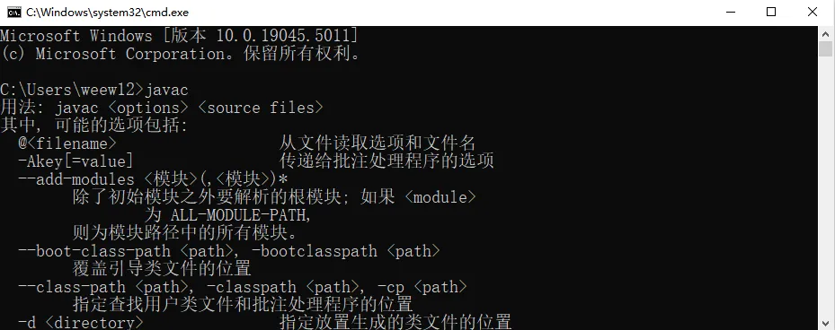
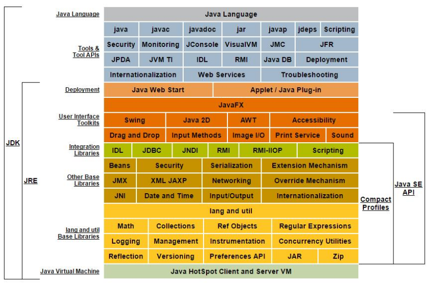

## 编译与执行环境安装

### JDK下载

下载地址：[www.oracle.com](https://www.oracle.com)  

### 配置Path环境变量

配置目的（以 windows 为例子）：让操作系统能够在全局找到 JDK 所需的一些脚本，执行时直接输入相关程序名字即可，无需使用程序的全部绝对路径

::: center

:::

### 初步开发尝试

开发步骤:

- 编写程序

    ```java
    public class HelloWorld {
        public static void main(String[] args) {
            System.out.println("HelloWorld!");
        }
    }
    ```

- 编译程序

    ```shell
    javac HelloWorld.java
    ```

- 运行程序

    ```shell
    java HelloWorld
    ```

从编写、编译再到执行的整体流程：
::: center

:::

### 可能得错误以及注意事项

- 代码拼写错误
- 编译、运行路径问题
- 语法问题
- 其他  
  - **声明为`public`的类应该与文件名一致，否则会编译失败**
  - 编译失败后注意错误出现的行数，从而定位到具体的错误
  - 注意**字符编码问题（中文显示异常），结合操作系统和程序使用的默认编码**
  - 注意代码格式规范，方便维护
  - Java程序的入口是`main`方法
  - 源文件与类名
    - **如果定义的类是`public`类，那么要求源文件名必须和类名一致，否则编译出错**
    - 一个源文件可以有多个类，**编译后会生成多个字节码文件`.class`**，但是**只能有一个`public`类**
  - 代码注释
    - 单行注释

        ```java
        int a = 10; // 这是一个变量a，初始值为10
        ```

    - 多行注释

        ```java
        /*
        这是一个多行注释的示例
        这里可以写很多行说明
        甚至可以包含代码片段
        */
        int b = 20;
        ```

    - 文档注释

        ```java
        /**
         * 这是一个计算两个整数之和的方法
        * @param a 第一个整数
        * @param b 第二个整数
        * @return 两个整数的和
        */
        public int add(int a, int b) {
            return a + b;
        }
        ```

## 相关补充

### 常用的DOS命令

列出当前目录 `dir`  
切换目录 `cd`  
返回上一级 `cd ..`  
返回到盘符目录 `cd \ 或 cd /`

创建目录 `md 文件目录名`  
删除目录 `rd 文件目录名`

清屏 `cls`  
退出命令行窗口 `exit`

### 几个比较重要的JDK版本

#### Java 5.0

Java 8.0 继 5.0 之后变化最大的版本，是长期支持的版本

#### Java 11.0

JDK安装包取消独立JRE安装包，是长期支持的版本

#### Java 17.0

版本号21.9，是长期支持的版本

### Java SE、Java EE、Java ME 三个的区别

- Java SE(Java Standard Edition)  
支持**面向桌面级应用**的 Java平台，包括用户界面接口AWT/SWing

- Java EE(Java Enterprise Edition)  
为**开发企业环境下的应用程序**提供的一套解决方案，定位在服务器的Web应用开发

- Java ME(Java Micro Edition)  
支持Java程序运行在**移动终端**(手机、机顶盒)上的平台，定位在消费性电子产品的应用开发

::: center

:::

### 什么是JDK、JRE

#### JDK

JDK(Java Development Kit)是**Java程序开发工具包**，**包含JRE和开发人员使用的工具**

#### JRE

JRE(Java Runtime Environment)是**Java程序的运行时环境，包含JVM和运行时所需的核心类库**  

::: center

:::

::: center

:::

### 总结

`JDK` = `JRE` + 开发工具集 (例如：Javac编译工具)  
`JRE` = `JVM` + `JavaSE`标准类库

### Java语言的特性

- 优点  
  - 跨平台(基于JVM)
  - 面向对象
  - 健壮
  - 简单

## JVM功能说明

JVM(Java Virtual Machine) 即：**Java虚拟机**，是一个虚拟机的计算机，**是Java程序的运行环境。

**JVM具**有自己的指令集**并使用不同的存储区域**，它**负责执行指令、管理数据、管理内存、寄存器**等。

::: center

:::

- 实现Java程序的跨平台性  
Java程序都运行在JVM之上，正是有了JVM，才使得Java程序具备了跨平台性。

::: center

:::

使用JVM前后对比：

::: center

:::

- 自动内存管理 (**内存分配、内存回收**)  
  - Java程序在运行过程中，涉及到运算的数据的分配、存储等都由JVM来完成  
  - Java消除了程序员回收无用内存空间的职责。提供了一种系统级线程跟踪存储空间的分配情况, 在内存空间达到相应阈值时，检查并释放可被释放的存储器空间。  
  - GC的自动回收，提高了内存空间的利用效率，也提高了编程人员的效率，很大程度上减少了因为没有释放空间而导致的内存泄漏。
